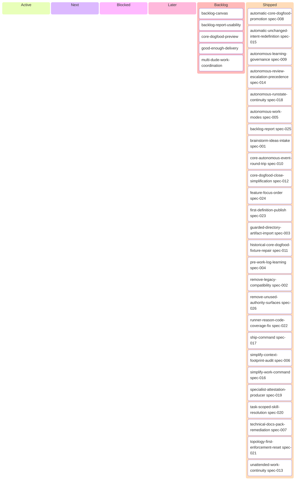

# Backlog

_Generated 2026-08-08 01:02 UTC, source 51a77b2. A derived projection, never authoritative._

## Active

_(none)_

## Next

_(none)_

## Blocked

_(none)_

## Later

_(none)_

## Backlog

- backlog-canvas
- backlog-report-usability
- core-dogfood-preview
- good-enough-delivery
- multi-dude-work-coordination

## Shipped

- automatic-core-dogfood-promotion (spec-008)
- automatic-unchanged-intent-redefinition (spec-015)
- autonomous-learning-governance (spec-009)
- autonomous-review-escalation-precedence (spec-014)
- autonomous-runstate-continuity (spec-018)
- autonomous-work-modes (spec-005)
- backlog-report (spec-025)
- brainstorm-ideas-intake (spec-001)
- core-autonomous-event-round-trip (spec-010)
- core-dogfood-close-simplification (spec-012)
- feature-focus-order (spec-024)
- first-definition-publish (spec-023)
- guarded-directory-artifact-import (spec-003)
- historical-core-dogfood-fixture-repair (spec-011)
- pre-work-log-learning (spec-004)
- remove-legacy-compatibility (spec-002)
- remove-unused-authority-surfaces (spec-026)
- runner-reason-code-coverage-fix (spec-022)
- ship-command (spec-017)
- simplify-context-footprint-audit (spec-006)
- simplify-work-command (spec-016)
- specialist-attestation-producer (spec-019)
- task-scoped-skill-resolution (spec-020)
- technical-docs-pack-remediation (spec-007)
- topology-first-enforcement-reset (spec-021)
- unattended-work-continuity (spec-013)

## Board

