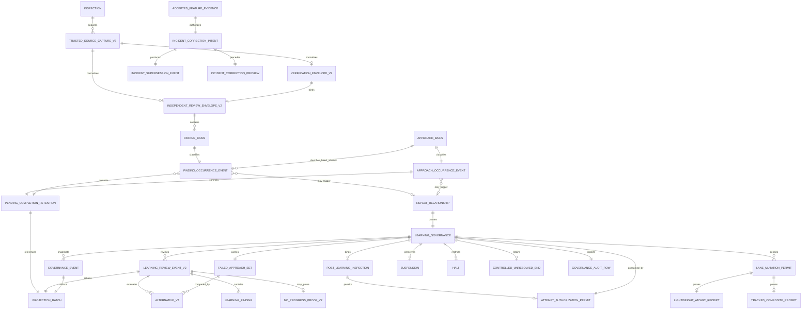
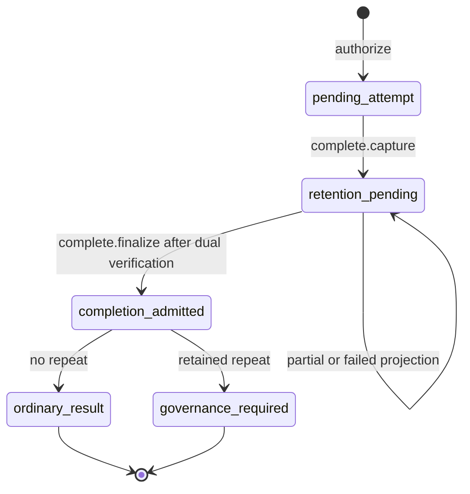
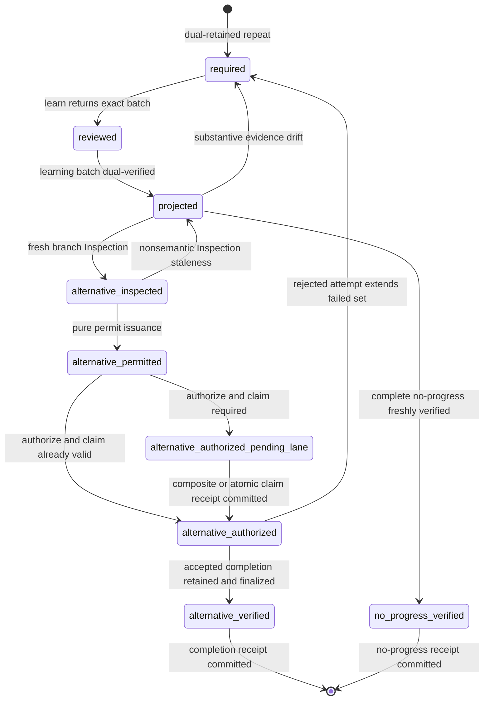
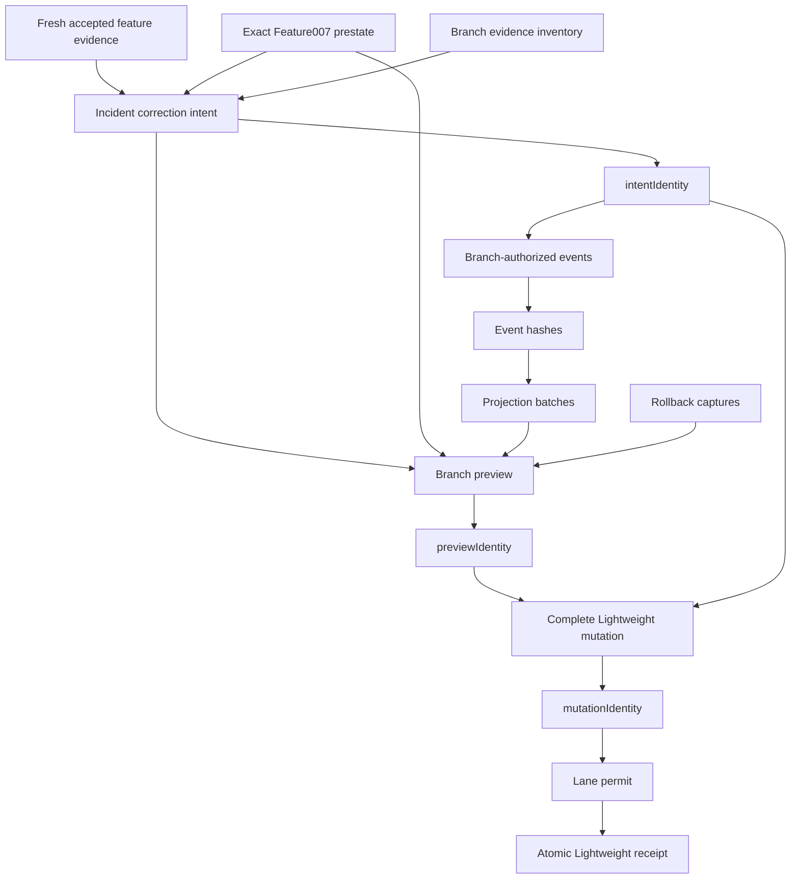

# Data Model: Autonomous Learning Governance

## Model Boundary

The model extends existing recovery targets, Inspection evidence, RunState, completion, projection, optional objective compatibility, Feature 005 scheduling, Lightweight and tracked lane history, and audit records.

It adds:

- trusted verification and independent-review normalization;
- immutable approach and finding occurrence events;
- retention-first completion state;
- exact response-carried event batches;
- one target-scoped learning-governance case;
- a complete failed-approach set;
- acyclic attempt and lane permits;
- a dedicated bounded canonical lane event record;
- exact lane-specific mutation objects;
- atomic Lightweight and composite tracked receipts;
- accepted feature evidence;
- an acyclic incident correction intent, event, batch, preview, and mutation graph; and
- append-only incident supersession.

Current-run evidence and authoritative lane history remain the only durable runtime evidence surfaces. No new ledger, persistent recovery store, external service, lane, scheduler, or concurrency mechanism is introduced.

The Feature 009 definition is immutable during execution. No implementation task writes a Feature 009 definition artifact. Coordinator-owned Lightweight glyph and blocker metadata remain lane state and cannot change task identity, text, dependencies, phases, source declaration, or supporting contracts. A normative mismatch requires redefinition.

Feature 009 has no active ObjectiveRegistry. An optional existing uniquely matched objective may contribute evidence, but runtime never creates or repairs a registry, objective, sequence, or objective identity.

## Common Identity Rules

- `CJ(value)` is the existing canonical JSON serialization.
- `Hash` is lowercase SHA-256.
- Every derivable identity is recomputed by the authority that consumes it.
- Set-like arrays are sorted and duplicate-free unless an explicit chronology order applies.
- All new records are closed; unknown, duplicate, sparse, accessor-backed, non-data, noncanonical, missing, or conditionally forbidden fields reject.
- `ShortText` remains a control-free string of 1 through 1,024 UTF-8 bytes.
- `EventLineText` is a distinct type and is not constrained by `ShortText`.
- Each authoritative event is at most 16,384 UTF-8 bytes as `CJ(event)`.
- One normal completion batch contains exactly one approach event followed by zero through sixteen finding events.
- One incident-evidence batch contains exactly two finding events and no approach event.
- One learning review contains at most 16 findings, 8 alternatives, and 16 failed approach bases.
- `CJ(RunState.learningGovernance)` is at most 32,768 UTF-8 bytes.
- `TrackedDispatchRecoveryPayloadV1` is transient response/request transport only. It is forbidden in RunState and persistent history. The payload, pending response, and each recovery request MUST remain within existing aggregate and CLI byte limits.

## Entity Catalog

| Entity | Identity and purpose | Cardinality |
|---|---|---|
| Affected Target | Existing canonical Lightweight task or tracked issue target. | Exactly one per completion or governance case. |
| Immutable Definition Commitment | Binds Feature 009 definition artifact bytes and immutable task contract. | Exactly one per accepted Feature 009 revision. |
| Trusted Source Capture v2 | Fresh Inspection-acquired bytes plus verification or independent-review authority identity. | Many per Inspection; selected by identity. |
| Verification Envelope v2 | Normalized target-, attempt-, source-, result-, Inspection-, and check-bound verification evidence. | Exactly one per autonomous completion capture. |
| Independent Review Envelope v2 | Normalized target-, attempt-, result-, verification-, verdict-, chronology-, and finding-bound review evidence. | Exactly one per autonomous completion capture. |
| Finding Basis | Stable equivalence basis containing target, expectation or rule, subjects, failure class, and check definition. | One per normalized review finding. |
| Finding Occurrence Event | Immutable event binding one basis to one attempt, its approach basis, review evidence, finding, observation, and chronology. | Zero through sixteen per normal completion; exactly two per exact incident correction. |
| Approach Basis | Runtime-derived material method: action, inputs, mechanisms, assumptions, evidence acquisition, and validation plan. | One per authorized attempt. |
| Approach Occurrence Event | Immutable event binding one approach basis to authorization, attempt, result, disposition, envelopes, and chronology. | Exactly one per normal completion batch. |
| Pending Completion Retention | Hash-only RunState commitment between capture and finalize. | Zero or one per RunState. |
| Repeat Relationship | Earliest qualifying pair of distinct dual-retained occurrences sharing one basis in one channel. | Exactly one trigger per governance case. |
| Projection Batch | Exact ordered event bodies and matching commitments returned by a command. | One transient batch per projection operation. |
| Projection Commitment | Batch identity and ordered event hashes retained without event bodies. | Zero or one pending commitment per applicable state slot. |
| Event Line Text | Canonical v2 lane line without LF. | One per projected event. |
| Event Line Record | Exact Event Line Text followed by one LF byte. | One per projected event. |
| Failed Approach Set | Complete bounded cumulative failed approach bases and supporting event hashes. | Exactly one per governance case. |
| Learning Governance | Target-bound RunState case tracking trigger, failed set, phase, projection, branch, permits, receipts, halt, suspension, and end. | Zero or one per RunState. |
| Learning Finding | Bounded semantic explanation grounded in fresh evidence and assumptions. | One through sixteen per learning review. |
| Alternative v2 | Closed credible-material or rejected candidate record compared with every failed basis. | Zero through eight per learning review. |
| No-Progress Proof v2 | Complete failed-set, alternative-set, assumption, and no-new-evidence proof. | Required only for no-progress. |
| Learning Review Event v2 | Immutable authorizing learning result. | One per reviewed governance revision. |
| Governance Event | Immutable snapshot of one governance revision. | One or more append-only revisions per case. |
| Post-Learning Inspection Binding | Fresh binding between verified projection, current evidence, and selected branch. | Required before alternative authorization or no-progress verification. |
| Attempt Authorization Permit | Pure permit binding unchanged inspected RunState to one exact attempt authorization. | One per proposed Work attempt. |
| Projection Permit | Permit binding one event, exact projection mutation, mapping, state, and lane prestate. | One per lane event projection. |
| Lane Mutation Permit | Permit binding one exact closed lane mutation to post-authorization or terminal state. | One per protected lane transition. |
| Lightweight Atomic Receipt | Poststate proof over tasks, task-state, and owner bytes after one all-or-restored operation. | One per successful Lightweight operation. |
| Tracked Operation Evidence | Proof that one exact tracked operation was dispatched before poststate is known. | One per dispatched tracked operation. |
| Tracked Lane Commit Receipt | Proof of one exact tracked issue/history commit. | One per successful tracked lane commit. |
| Owner Log Commit Receipt | Proof of exact owner-log compare-and-append or unchanged-owner verification. | One per tracked lane commit. |
| Tracked Composite Receipt | Binding of tracked lane and owner-log receipts. | Exactly one before tracked governance advances. |
| Suspension | Evidence that the governed target remained unchanged while Feature 005 selected one disjoint target. | Optional by governance revision. |
| Halt | Authoritatively scoped target or run stop that preserves unresolved governance. | Optional by governance revision. |
| Controlled Unresolved End | Invocation outcome retaining an unchanged unresolved target. | Optional and never a target disposition. |
| Governance Audit Row | Conditional history-derived account of one governance case. | One per governance identity. |
| Accepted Feature Evidence | Standard or Feature 008 core-close acceptance record. | Exactly one accepted identity per incident correction intent. |
| Incident Correction Intent | Pre-event exact or evidence-incomplete incident decision. | Exactly one per correction attempt. |
| Incident Supersession Event | Intent-bound append-only proof that a prior unauthorized disposition is superseded. | Exactly one per accepted correction branch. |
| Incident Correction Preview | Fresh branch plan binding intent, events, batches, mutation core, and rollback bytes. | Exactly one immediately before correction. |

## High-Level Relationships



## Immutable Definition Commitment

The immutable definition commitment binds the exact bytes of:

- `spec.md`;
- `plan.md`;
- `research.md`;
- `data-model.md`;
- `contracts/schemas.md`;
- `quickstart.md`;
- `checklists/test.md`;
- `checklists/security.md`; and
- the immutable task contract in `tasks.md`.

The task contract includes canonical task keys, story markers, descriptions, phases, dependencies, and T009 source declaration. Only coordinator-owned live glyph and blocker metadata are excluded from immutable meaning.

```text
DefinitionArtifactDescriptorV1 = {
  path: CanonicalFeature009ArtifactPath,
  sha256: Hash,
  byteLength: NonnegativeSafeInteger
}

ImmutableTaskContractV1 = {
  version: 1,
  specPath: ".dude/specs/009-autonomous-learning-governance/spec.md",
  taskContractIdentity: Hash,
  terminalTaskKey: "T009@696e6369",
  declaredSourcePaths: NormalizedWorkspacePath[10],
  directDependencyKeys: TaskKey[8]
}

DefinitionContractCommitmentV1 = {
  version: 1,
  featureSpecPath: ".dude/specs/009-autonomous-learning-governance/spec.md",
  artifacts: DefinitionArtifactDescriptorV1[8],
  taskContract: ImmutableTaskContractV1,
  definitionContractIdentity: Hash
}
```

Any immutable artifact or task-contract drift stops execution for redefinition.

## Trusted Source Model

```text
TrustedSourceCaptureV2 = {
  target: AffectedTarget,
  state: "complete",
  outcomeHash: Hash,
  authority: {
    kind: "verification" | "independent-review",
    authorityIdentity: Hash,
    invocationIdentity: Hash
  },
  bytes: CanonicalByteEnvelope
}
```

The Work host acquires this record through existing Inspection source authority. Supplying bytes does not create authority. Runtime validates complete source state, target, authority kind and identity, invocation identity, source outcome, canonical byte envelope, and freshness.

### Verification Envelope

```text
CheckEvidenceV2 = {
  checkIdentity: Hash,
  definitionIdentity: Hash,
  outcome: "passed" | "failed",
  evidenceIdentity: Hash
}

VerificationEnvelopeV2 = {
  type: "verification-envelope",
  version: 2,
  envelopeIdentity: Hash,
  target: AffectedTarget,
  attemptIdentity: Hash,
  sourceRevisionIdentity: Hash,
  inspectedEvidenceHash: Hash,
  resultIdentity: Hash,
  checks: CheckEvidenceV2[1..16]
}
```

Checks are sorted by `checkIdentity`. The envelope identity hashes the complete closed envelope without its identity field.

### Independent Review Envelope

```text
IndependentReviewFindingV2 = {
  version: 2,
  findingIdentity: Hash,
  basis: FindingBasisV1,
  basisIdentity: Hash,
  observation: {
    kind: "observed-evidence" | "check-result",
    identity: Hash
  }
}

IndependentReviewEnvelopeV2 = {
  type: "independent-review-envelope",
  version: 2,
  envelopeIdentity: Hash,
  target: AffectedTarget,
  attemptIdentity: Hash,
  attemptOrdinal: PositiveInteger,
  reviewOrdinal: PositiveInteger,
  reviewerAuthorityIdentity: Hash,
  reviewInvocationIdentity: Hash,
  sourceRevisionIdentity: Hash,
  inspectedEvidenceHash: Hash,
  resultIdentity: Hash,
  verificationEnvelopeIdentity: Hash,
  verdict: "accepted" | "rejected",
  findings: IndependentReviewFindingV2[0..16]
}
```

An accepted review has no unresolved findings. A rejected review has at least one. Every check-result observation identifies a check in the bound verification envelope and uses the same check definition as its finding basis. Runtime derives the complete finding set; the semantic completion caller supplies identity references only.

## Identity Separation

### Finding Channel

```text
FindingBasisV1 = {
  version: 1,
  target: AffectedTarget,
  expectation: {
    kind: "governing-rule" | "expected-condition",
    identity: Hash
  },
  subjects: SubjectIdentity[1..16],
  failureClass: Identifier,
  checkDefinitionIdentity: Hash
}
```

The basis excludes attempt identity, review invocation, evidence occurrence, observation, result, chronology, timestamp, severity, rationale, summary, and wording.

```text
FindingOccurrenceV1 = {
  version: 1,
  basisIdentity: Hash,
  attemptIdentity: Hash,
  attemptApproachBasisIdentity: Hash,
  reviewEnvelopeIdentity: Hash,
  findingIdentity: Hash,
  observation: {
    kind: "observed-evidence" | "check-result",
    identity: Hash
  },
  chronology: {
    attemptOrdinal: PositiveInteger,
    reviewOrdinal: PositiveInteger
  }
}

FindingOccurrenceEventV1 = {
  type: "finding-occurrence",
  version: 1,
  eventHash: Hash,
  occurrenceIdentity: Hash,
  target: AffectedTarget,
  basis: FindingBasisV1,
  occurrence: FindingOccurrenceV1,
  sourceCaptureIdentity: Hash
}
```

Two retained finding events establish repetition only when basis identities are equal, attempts and occurrence identities are distinct, chronology is strictly ordered, target and trusted-source bindings remain valid, and exact bytes occur on both authoritative surfaces. Two reviews of one attempt do not establish repetition.

### Approach Channel

```text
ApproachBasisV1 = {
  version: 1,
  target: AffectedTarget,
  action: Identifier,
  materialInputs: MaterialInputsV1,
  mechanismIdentities: Hash[0..16],
  assumptionIdentities: Hash[0..16],
  evidenceAcquisitionIdentities: Hash[0..16],
  validationPlanIdentities: Hash[0..16]
}

ApproachOccurrenceV1 = {
  version: 1,
  basisIdentity: Hash,
  attemptIdentity: Hash,
  authorizationEvidenceHash: Hash,
  resultIdentity: Hash,
  disposition:
    "accepted" |
    "verification-failed" |
    "review-rejected" |
    "no-change" |
    "interrupted",
  chronology: {
    attemptOrdinal: PositiveInteger
  }
}

ApproachOccurrenceEventV1 = {
  type: "approach-occurrence",
  version: 1,
  eventHash: Hash,
  occurrenceIdentity: Hash,
  target: AffectedTarget,
  basis: ApproachBasisV1,
  occurrence: ApproachOccurrenceV1,
  verificationEnvelopeIdentity: Hash,
  reviewEnvelopeIdentity: Hash
}
```

The approach basis excludes labels, summaries, wording, attempt identity, result, and chronology. Approach repetition uses the same dual-retained distinct-occurrence rule and does not require a reviewer finding.

### Repeat Relationship

```text
RepeatRelationshipV1 = {
  version: 1,
  channel: "finding" | "approach",
  basisIdentity: Hash,
  occurrenceIdentities: [Hash, Hash]
}
```

Runtime derives the earliest qualifying chronological pair. Replay, same-attempt review, missing evidence, one-sided evidence, or conflict produces no Repeat Relationship.

## Retention-First Completion Model

```text
PendingCompletionRetentionV2 = {
  version: 2,
  target: AffectedTarget,
  attemptIdentity: Hash,
  resultIdentity: Hash,
  verificationEnvelopeIdentity: Hash,
  reviewEnvelopeIdentity: Hash,
  findingIdentities: Hash[0..16],
  retention: ProjectionCommitmentV1,
  capturedInspectionIdentity: Hash
}
```

It is the only additional state admitted between capture and finalize. A second capture for another attempt or target fails without overwrite.



Capture derives exact occurrence events but does not clear the pending attempt, add a completed attempt, count an occurrence, derive repetition, create governance, or authorize lane disposition.

Finalize reacquires both surfaces and admits completion only after every committed occurrence is present exactly once and byte-equivalent on both. An immediate halt before retention leaves completion pending. A halt after retention may leave required governance re-derivable.

## Projection Batch Model

```text
EventCommitmentV1 = {
  kind:
    "approach-occurrence" |
    "finding-occurrence" |
    "learning-review" |
    "learning-governance" |
    "incident-supersession",
  eventHash: Hash
}

ProjectionBatchV1 = {
  version: 1,
  purpose:
    "occurrence-retention" |
    "incident-evidence" |
    "governance-required" |
    "learning-result" |
    "governance-snapshot" |
    "incident-supersession",
  target: AffectedTarget,
  events: AuthoritativeEvent[1..17],
  eventCommitments: EventCommitmentV1[1..17],
  batchIdentity: Hash
}
```

Closed event order:

- `occurrence-retention`: exactly one approach event, then zero through sixteen finding events sorted by occurrence identity;
- `incident-evidence`: exactly two Feature 007 finding events ordered by attempt ordinal, review ordinal, and occurrence identity; equal finding bases, distinct attempts, distinct occurrences, strict chronology;
- `learning-result`: one learning-review event, then one governance event;
- `governance-required`, `governance-snapshot`, and `incident-supersession`: exactly one event.

```text
batchIdentity = SHA256(CJ({
  version,
  purpose,
  target,
  eventCommitments
}))

ProjectionCommitmentV1 = {
  purpose: ProjectionBatchV1.purpose,
  batchIdentity: Hash,
  eventCommitments: EventCommitmentV1[1..17]
}
```

RunState stores only the commitment. Commands carry exact event bodies in responses and subsequent projection requests. Lost bodies are reproducible only from unchanged fresh authoritative evidence and only to identical canonical bytes and identity.

## Canonical Event-Line Model

```text
EventLineText =
  ASCII("- dude-run-event: ") || CJ(event)

EventLineRecord =
  UTF8(EventLineText) || 0x0A
```

Rules:

- `event` is one valid `AuthoritativeEvent`;
- the prefix is exactly 18 ASCII bytes;
- `byteLength(CJ(event)) <= 16,384`;
- `byteLength(EventLineText) <= 16,402`;
- `byteLength(EventLineRecord) <= 16,403`;
- `EventLineText` contains no CR or LF;
- parsing and canonical reserialization produce the identical suffix;
- the suffix is `CJ(event)`, not `CJ({event})`;
- `laneEventLineHash = SHA256(UTF8(EventLineText))`; and
- `laneEventRecordHash = SHA256(EventLineRecord)`.

Projection plans and mutations carry exact line text and `terminator:"LF"`; the wrapper serializes LF. Legacy v1 wrapped event lines are audit-only and cannot satisfy v2 authority.

```text
ProjectionPlanItemV1 = {
  eventHash: Hash,
  currentRunRecord: {
    substantive: {
      event: AuthoritativeEvent
    }
  },
  currentRunRecordHash: Hash,
  laneEventLine: EventLineText,
  laneEventLineTerminator: "LF",
  laneEventLineHash: Hash,
  laneEventRecordHash: Hash,
  mutation: LightweightProjectionMutationV1 | TrackedProjectionMutationV1,
  mutationIdentity: Hash,
  projectionPermit: ProjectionPermitV1
}
```

## Complete Failed-Approach Set

```text
FailedApproachSetV1 = {
  version: 1,
  target: AffectedTarget,
  chronologyCutoff: PositiveInteger,
  approachBasisIdentities: Hash[1..16],
  evidenceEventHashes: Hash[1..16],
  setIdentity: Hash
}
```

For finding triggers, members come from every qualifying finding event's `attemptApproachBasisIdentity`. For approach triggers, members come from the qualifying approach events. Later rejected selected alternatives extend the set; no member is removed.

```text
MaterialDifferenceV1 = {
  failedApproachBasisIdentity: Hash,
  changedDimensions: (
    "material-input" |
    "mechanism" |
    "assumption" |
    "evidence-acquisition" |
    "validation-plan"
  )[1..5],
  evidenceIdentities: Hash[1..16]
}

RejectedAlternativeComparisonV1 =
  {
    failedApproachBasisIdentity: Hash,
    outcome: "same",
    evidenceIdentities: Hash[1..16]
  }
  |
  {
    failedApproachBasisIdentity: Hash,
    outcome: "different",
    changedDimensions: (
      "material-input" |
      "mechanism" |
      "assumption" |
      "evidence-acquisition" |
      "validation-plan"
    )[1..5],
    evidenceIdentities: Hash[1..16]
  }

CredibleMaterialAlternativeV2 = {
  version: 2,
  alternativeIdentity: Hash,
  disposition: "credible-material",
  approachBasis: ApproachBasisV1,
  approachBasisIdentity: Hash,
  failedApproachSetIdentity: Hash,
  materialDifferences: MaterialDifferenceV1[1..16],
  discriminatingCheck: {
    identity: Hash,
    definitionIdentity: Hash,
    evidenceIdentities: Hash[1..16]
  },
  semanticAssessmentIdentity: Hash
}

RejectedAlternativeV2 = {
  version: 2,
  alternativeIdentity: Hash,
  disposition: "not-credible" | "not-materially-different",
  approachBasis: ApproachBasisV1,
  approachBasisIdentity: Hash,
  failedApproachSetIdentity: Hash,
  comparisons: RejectedAlternativeComparisonV1[1..16],
  semanticAssessmentIdentity: Hash,
  reason: Identifier
}

AlternativeV2 =
  CredibleMaterialAlternativeV2 |
  RejectedAlternativeV2
```

Every branch has exactly one row per current failed basis, sorted by `failedApproachBasisIdentity`. Credible rows all differ. `not-materially-different` requires at least one `same`; `not-credible` may contain either outcome. Rejected variants forbid `materialDifferences` and `discriminatingCheck`; credible variants forbid `comparisons` and `reason`.

```text
credible alternativeIdentity = SHA256(CJ({
  version,
  disposition,
  approachBasisIdentity,
  failedApproachSetIdentity,
  materialDifferences,
  discriminatingCheck,
  semanticAssessmentIdentity
}))

rejected alternativeIdentity = SHA256(CJ({
  version,
  disposition,
  approachBasisIdentity,
  failedApproachSetIdentity,
  comparisons,
  semanticAssessmentIdentity,
  reason
}))

alternativeSetHash = SHA256(CJ({
  failedApproachSetIdentity,
  alternatives
}))
```

For no-progress, `alternatives` is the complete sorted considered set, every row is `RejectedAlternativeV2`, and `credibleMaterialAlternativeIdentities` is exactly `[]`. Selection still requires exactly one `CredibleMaterialAlternativeV2`.

A no-progress proof binds the complete current set, complete considered alternative union, complete assumptions, and no-new-distinguishing-evidence result. Any set or evidence change invalidates the proof.

## Learning Governance Lifecycle

```text
LearningGovernancePhase =
  "required" |
  "reviewed" |
  "projected" |
  "alternative-inspected" |
  "alternative-permitted" |
  "alternative-authorized-pending-lane" |
  "alternative-authorized" |
  "alternative-verified" |
  "no-progress-verified"
```

```text
LearningGovernanceV1 = {
  version: 1,
  governanceIdentity: Hash,
  target: AffectedTarget,
  trigger: RepeatRelationshipV1,
  failedApproachSet: FailedApproachSetV1,
  phase: LearningGovernancePhase,
  revision: PositiveInteger,
  triggerEvidenceHash: Hash,
  projectionCommitment?: ProjectionCommitmentV1,
  reviewIdentity?: Hash,
  selectedAlternativeIdentity?: Hash,
  discriminatingCheckIdentity?: Hash,
  postLearningInspectionIdentity?: Hash,
  issuedAttemptPermitHash?: Hash,
  consumedAttemptPermitHash?: Hash,
  authorizedAttemptIdentity?: Hash,
  laneClaimReceiptIdentity?: Hash,
  terminalEvidenceIdentity?: Hash,
  suspension?: SuspensionV1,
  halt?: HaltV1,
  controlledEnd?: ControlledUnresolvedEndV1
}
```

| Phase | Required evidence | Permitted next action |
|---|---|---|
| `required` | Dual-retained repeat and complete failed set. | Complete learning review, higher-precedence halt handling, or eligible unchanged suspension. |
| `reviewed` | Valid learning-review and governance events plus matching learning-result commitment. | Exact projection preparation and verification. |
| `projected` | Completed learning review and matching learning result freshly dual-verified. | Bind fresh branch Inspection, suspend unchanged, or handle a halt; Controlled Unresolved End is invalid. |
| `alternative-inspected` | Fresh Inspection binds selected alternative, failed set, and check. | Perform Controlled Unresolved End before permit issuance or issue one pure attempt permit. |
| `alternative-permitted` | Logical unchanged-state plus permit stage. | Consume permit through `authorize`; not separately persisted. |
| `alternative-authorized-pending-lane` | `authorize` consumed permit; exact lane claim remains. | Apply claim and commit receipt. |
| `alternative-authorized` | No claim required or exact claim receipt committed. | Execute only the bound attempt and use retention-first completion. |
| `alternative-verified` | Bound completion, verification, and independent acceptance retained and verified. | Issue and commit task-completed mutation. |
| `no-progress-verified` | Complete no-alternative and fresh no-new-evidence proof bind the current failed set. | Perform Controlled Unresolved End before lane disposition or issue and commit the no-progress mutation. |

`controlledEnd` is permitted only while `phase === "alternative-inspected"` before attempt-permit issuance or `phase === "no-progress-verified"` before lane no-progress disposition, and is mutually exclusive with `halt`. Phase `projected` is ineligible. Immediate Halt End is derived from `HaltV1`; it is not a governance phase, stored controlled-end record, permit, or lane mutation.



Terminal governance remains until the exact final lane receipt commits.

## Acyclic Permit Model

```text
AttemptAuthorizationPermitV1 = {
  version: 1,
  kind: "attempt-authorization",
  origin: "dude-work",
  target: AffectedTarget,
  subjectRunStateHash: Hash,
  governanceIdentity: Hash | null,
  governancePhase: "alternative-inspected" | null,
  postLearningInspectionIdentity: Hash | null,
  selectedAlternativeIdentity: Hash | null,
  discriminatingCheckIdentity: Hash | null,
  inspectionEvidenceHash: Hash,
  targetMappingHash: Hash,
  lanePrestateHash: Hash,
  permitHash: Hash
}
```

`transition.issue-attempt-permit` is pure and returns byte-identical state. `authorize` validates and consumes the permit before changing RunState.

```text
ProjectionPermitV1 = {
  version: 1,
  kind: "lane-projection",
  origin: "dude-work",
  lane: "lightweight" | "tracked",
  target: AffectedTarget,
  subjectRunStateHash: Hash,
  batchIdentity: Hash,
  eventHash: Hash,
  targetMappingHash: Hash,
  lanePrestateHash: Hash,
  mutationIdentity: Hash,
  permitHash: Hash
}

LaneMutationPermitV1 = {
  version: 1,
  kind: "lane-mutation",
  origin: "dude-work",
  lane: "lightweight" | "tracked",
  operation: "work-set" | "work-transition",
  target: AffectedTarget,
  subjectRunStateHash: Hash,
  governanceIdentity: Hash | null,
  governancePhase: LearningGovernancePhase | null,
  attemptIdentity: Hash | null,
  targetMappingHash: Hash,
  lanePrestateHash: Hash,
  mutationIdentity: Hash,
  permitHash: Hash
}
```

For all permits:

```text
permitHash = SHA256(CJ(permit without permitHash))
```

A claim permit returned after authorization binds the post-authorization RunState. The attempt permit cannot authorize lane claim.

## Exact Mutation Types

### Shared Effects

```text
BlockerEffectV1 =
  {kind:"unchanged", before:ShortText|null, after:ShortText|null} |
  {kind:"add", before:null, after:ShortText} |
  {kind:"remove", before:ShortText, after:null} |
  {kind:"replace", before:ShortText, after:ShortText}

EventLineAppendV1 = {
  eventHash: Hash,
  exactLine: EventLineText,
  terminator: "LF"
}

EventLineEffectV1 =
  {kind:"none"} |
  {kind:"append-exact", lines:EventLineAppendV1[1..4], appendIfAbsent:true}

OwnerLogEffectV1 =
  {kind:"none"} |
  {
    kind:"append-exact",
    ownerPath:DirectIdeaPath,
    expectedOwnerHash:Hash,
    exactLines:OwnerLogLineText[1..4],
    terminator:"LF",
    appendIfAbsent:true
  }
```

For `unchanged`, before and after are byte-identical. For `replace`, they are byte-distinct. `expectedOwnerHash` hashes complete owner-file bytes before append.

### Lightweight Mutations

```text
LightweightProjectionMutationV1 = {
  version: 1,
  lane: "lightweight",
  kind: "append-event",
  reason: "event-projection",
  target: LightweightTarget,
  fromGlyph: " " | "~" | "!" | "x",
  toGlyph: " " | "~" | "!" | "x",
  blocker: BlockerEffectV1,
  eventLines: EventLineEffectV1,
  ownerLog: OwnerLogEffectV1,
  snapshotUpdatedAt: CanonicalUtcTimestamp
}

LightweightStateMutationV1 = {
  version: 1,
  lane: "lightweight",
  kind: "claim" | "task-blocked" | "task-completed" | "controlled-end",
  reason:
    "initial-claim" |
    "resume-claim" |
    "post-learning-claim" |
    "task-blocked" |
    "no-progress" |
    "task-completed" |
    "controlled-unresolved-end",
  target: LightweightTarget,
  fromGlyph: " " | "~" | "!" | "x",
  toGlyph: " " | "~" | "!" | "x",
  blocker: BlockerEffectV1,
  eventLines: EventLineEffectV1,
  ownerLog: OwnerLogEffectV1,
  snapshotUpdatedAt: CanonicalUtcTimestamp
}
```

### Tracked Mutations

```text
TrackedProjectionMutationV1 = {
  version: 1,
  lane: "tracked",
  kind: "append-event",
  reason: "event-projection",
  target: TrackedTarget,
  fromStatus: "open" | "in_progress" | "blocked" | "closed",
  toStatus: "open" | "in_progress" | "blocked" | "closed",
  blocker: BlockerEffectV1,
  eventLines: EventLineEffectV1,
  ownerLog: OwnerLogEffectV1
}

TrackedStateMutationV1 = {
  version: 1,
  lane: "tracked",
  kind: "claim" | "task-blocked" | "task-completed" | "controlled-end",
  reason:
    "initial-claim" |
    "resume-claim" |
    "post-learning-claim" |
    "task-blocked" |
    "no-progress" |
    "task-completed" |
    "controlled-unresolved-end",
  target: TrackedTarget,
  fromStatus: "open" | "in_progress" | "blocked" | "closed",
  toStatus: "open" | "in_progress" | "blocked" | "closed",
  blocker: BlockerEffectV1,
  eventLines: EventLineEffectV1,
  ownerLog: OwnerLogEffectV1
}
```

For every lane mutation:

```text
mutationIdentity = SHA256(CJ(exact closed lane-specific mutation object))
```

## Closed Transition Matrix

| Lane | Kind | Allowed transition | Required blocker effect |
|---|---|---|---|
| Lightweight | `append-event` | any glyph to itself | `unchanged` |
| Lightweight | `claim` | ` ` to `~` | `unchanged` with null before and after |
| Lightweight | `claim` | `!` to `~` | `remove` |
| Lightweight | `task-blocked` | ` ` or `~` to `!` | `add` |
| Lightweight | `task-blocked` | `!` to `!` | `replace` |
| Lightweight | `task-completed` | `~` to `x` | `unchanged` with null before and after |
| Lightweight | `controlled-end` | ` `, `~`, or `!` to itself | `unchanged` |
| Lightweight | exact incident | `!` to `~` | `remove` |
| Lightweight | incomplete incident | `!` to `!` | `replace` |
| Tracked | `append-event` | any status to itself | `unchanged` |
| Tracked | `claim` | `open` to `in_progress` | `unchanged` with null before and after |
| Tracked | `claim` | `blocked` to `in_progress` | `remove` |
| Tracked | `task-blocked` | `open` or `in_progress` to `blocked` | `add` |
| Tracked | `task-blocked` | `blocked` to `blocked` | `replace` |
| Tracked | `task-completed` | `in_progress` to `closed` | `unchanged` with null before and after |
| Tracked | `controlled-end` | `open`, `in_progress`, or `blocked` to itself | `unchanged` |

No other transition is valid. The reason must match mutation kind.

A `controlled-end` lane row requires permit-bound phase `alternative-inspected` with exact selected-alternative, check, fresh Inspection, and projection evidence, or `no-progress-verified` with exact proof, fresh no-new-evidence verification, and projection evidence. Phase `projected` is explicitly rejected.

## Exact Lane Request Schemas

### Shared Owner Binding

```text
CapturedBytesV1 = {
  base64: CanonicalBase64,
  sha256: Hash,
  byteLength: NonnegativeSafeInteger
}

OwnerBindingV1 = {
  ideaPath: DirectIdeaPath,
  specPath: CanonicalSpecPath,
  ownerCapture: CapturedBytesV1,
  ownerBindingHash: Hash
}
```

Owner binding hashes the canonical idea path, spec path, and complete owner capture descriptor. The wrapper freshly reacquires owner bytes and resolves exact ownership.

```text
LightweightWorkProjectRequestV1 = {
  version: 1,
  operation: "work-project",
  root: CanonicalWorkspaceRoot,
  owner: OwnerBindingV1,
  target: LightweightTarget,
  state: RunState,
  permit: ProjectionPermitV1,
  mapping: LightweightMappingV1,
  expected: {
    tasksPath: NormalizedWorkspacePath,
    tasks: CapturedBytesV1,
    taskStatePath: ".dude/state/task-state.json",
    taskState: CapturedBytesV1
  },
  mutation: LightweightProjectionMutationV1
}
```

```text
LightweightWorkSetRequestV1 = {
  version: 1,
  operation: "work-set",
  root: CanonicalWorkspaceRoot,
  owner: OwnerBindingV1,
  target: LightweightTarget,
  state: RunState,
  permit: LaneMutationPermitV1,
  mapping: LightweightMappingV1,
  expected: {
    tasksPath: NormalizedWorkspacePath,
    tasks: CapturedBytesV1,
    taskStatePath: ".dude/state/task-state.json",
    taskState: CapturedBytesV1
  },
  mutation:
    LightweightStateMutationV1 |
    LightweightIncidentSupersessionMutationV1
}
```

```text
TrackedWorkProjectRequestV1 = {
  version: 1,
  operation: "work-project",
  root: CanonicalWorkspaceRoot,
  owner: OwnerBindingV1,
  target: TrackedTarget,
  state: RunState,
  permit: ProjectionPermitV1,
  mapping: TrackedMappingV1,
  expected: {
    list: CapturedBytesV1,
    detail: CapturedBytesV1,
    history: CapturedBytesV1
  },
  mutation: TrackedProjectionMutationV1
}
```

```text
TrackedWorkTransitionRequestV1 = {
  version: 1,
  operation: "work-transition",
  root: CanonicalWorkspaceRoot,
  owner: OwnerBindingV1,
  target: TrackedTarget,
  state: RunState,
  permit: LaneMutationPermitV1,
  mapping: TrackedMappingV1,
  expected: {
    list: CapturedBytesV1,
    detail: CapturedBytesV1,
    history: CapturedBytesV1
  },
  mutation: TrackedStateMutationV1
}
```

Cross-bindings are mandatory:

- `owner.ownerCapture` is the sole owner preimage.
- `mapping.ownerBindingHash === owner.ownerBindingHash`.
- Lane prestate owner descriptor matches `owner.ownerCapture`.
- `ownerLog.kind:"append-exact"` requires matching owner path and expected owner hash.
- `ownerLog.kind:"none"` requires unchanged owner bytes.
- A top-level `event` or duplicate owner field is unknown.
- Work-project requires one exact mutation event line matching `permit.eventHash`; all other events are likewise parsed from `mutation.eventLines`.

All four wrappers:

1. validate the exact closed request and mutation variant;
2. freshly reacquire every expected source;
3. require supplied bytes to equal fresh source bytes;
4. enforce existing no-follow root and path containment;
5. recompute owner and target mapping;
6. recompute RunState, permit, every event parsed from `mutation.eventLines`, mutation, and prestate identities;
7. require exact lane, operation, target, state, mapping, reason, transition, blocker, event-line, and owner-log bindings;
8. accept no caller-selected executable or command arguments;
9. refuse before mutation on any mismatch;
10. perform only the exact permitted operation; and
11. reacquire authoritative poststate before receipt creation.

## Receipt Model

### Lightweight Atomic Receipt

```text
LightweightAtomicReceiptV1 = {
  version: 1,
  lane: "lightweight",
  permitHash: Hash,
  mutationIdentity: Hash,
  target: LightweightTarget,
  targetMappingHash: Hash,
  lanePrestateHash: Hash,
  tasksPoststateHash: Hash,
  taskStatePoststateHash: Hash,
  ownerPoststateHash: Hash,
  targetStateChanged: boolean,
  receiptHash: Hash
}
```

Tasks, task-state, and owner changes are one all-or-restored operation. When owner-log effect is `none`, owner bytes are protected and verified unchanged. No receipt exists until every postimage is reacquired. Incomplete rollback is indeterminate and stops the run.

### Tracked Composite Receipts

```text
TrackedCaptureSetV1 = {
  list: CapturedBytesV1,
  detail: CapturedBytesV1,
  history: CapturedBytesV1
}

TrackedCaptureDescriptorSetV1 = {
  list: {sha256: Hash, byteLength: NonnegativeSafeInteger},
  detail: {sha256: Hash, byteLength: NonnegativeSafeInteger},
  history: {sha256: Hash, byteLength: NonnegativeSafeInteger}
}

TrackedDispatchResultV1 = {
  version: 1,
  authority: "beads",
  operation: "work-project" | "work-transition",
  target: TrackedTarget,
  invocationIdentity: Hash,
  result: CapturedBytesV1,
  dispatchResultIdentity: Hash
}

TrackedDispatchRecoveryPayloadV1 = {
  version: 1,
  operationEvidenceIdentity: Hash,
  original: TrackedCaptureSetV1,
  dispatchResult: TrackedDispatchResultV1,
  mutation: TrackedProjectionMutationV1 | TrackedStateMutationV1,
  payloadIdentity: Hash
}

TrackedOperationEvidenceV1 = {
  version: 1,
  lane: "tracked",
  operation: "work-project" | "work-transition",
  permitHash: Hash,
  mutationIdentity: Hash,
  target: TrackedTarget,
  targetMappingHash: Hash,
  lanePrestateHash: Hash,
  originalCaptures: TrackedCaptureDescriptorSetV1,
  normalizedPrestate: TrackedPrestateV1,
  dispatchResultIdentity: Hash,
  operationEvidenceIdentity: Hash
}

operationEvidenceIdentity =
  SHA256(CJ(record without operationEvidenceIdentity))

TrackedLaneCommitReceiptV1 = {
  version: 1,
  lane: "tracked",
  operationEvidenceIdentity: Hash,
  permitHash: Hash,
  mutationIdentity: Hash,
  target: TrackedTarget,
  targetMappingHash: Hash,
  lanePrestateHash: Hash,
  poststateCaptures: TrackedCaptureDescriptorSetV1,
  lanePoststateHash: Hash,
  eventLineRecordHashes: Hash[0..4],
  receiptHash: Hash
}

dispatchResultIdentity = SHA256(CJ(dispatch result without dispatchResultIdentity))
payloadIdentity = SHA256(CJ(recovery payload without payloadIdentity))
lanePoststateHash = SHA256(CJ(poststateCaptures))

OwnerLogCommitReceiptV1 =
  {
    version: 1,
    effect: "unchanged",
    mutationIdentity: Hash,
    ownerPath: DirectIdeaPath,
    ownerPrestateHash: Hash,
    ownerPoststateHash: Hash,
    receiptHash: Hash
  }
  |
  {
    version: 1,
    effect: "append-exact",
    mutationIdentity: Hash,
    ownerPath: DirectIdeaPath,
    ownerPrestateHash: Hash,
    exactLineHashes: Hash[1..4],
    ownerPoststateHash: Hash,
    receiptHash: Hash
  }

TrackedCompositeReceiptV1 = {
  version: 1,
  lane: "tracked",
  mutationIdentity: Hash,
  laneReceiptHash: Hash,
  ownerLogReceiptHash: Hash,
  receiptHash: Hash
}
```

Tracked recovery uses two closed stage-specific requests:

```text
TrackedWorkProvePoststateRequestV1 = {
  version: 1,
  operation: "work-prove-poststate",
  root: CanonicalWorkspaceRoot,
  owner: OwnerBindingV1,
  target: TrackedTarget,
  state: RunState,
  permit: ProjectionPermitV1 | LaneMutationPermitV1,
  mapping: TrackedMappingV1,
  operationEvidence: TrackedOperationEvidenceV1,
  recoveryPayload: TrackedDispatchRecoveryPayloadV1,
  recoveryIdentity: Hash,
  observed: TrackedCaptureSetV1
}

TrackedWorkReconcileOwnerRequestV1 = {
  version: 1,
  operation: "work-reconcile-owner",
  root: CanonicalWorkspaceRoot,
  owner: OwnerBindingV1,
  target: TrackedTarget,
  state: RunState,
  permit: ProjectionPermitV1 | LaneMutationPermitV1,
  mapping: TrackedMappingV1,
  operationEvidence: TrackedOperationEvidenceV1,
  recoveryPayload: TrackedDispatchRecoveryPayloadV1,
  laneReceipt: TrackedLaneCommitReceiptV1,
  recoveryIdentity: Hash,
  observed: {
    list: CapturedBytesV1,
    detail: CapturedBytesV1,
    history: CapturedBytesV1,
    owner: CapturedBytesV1
  }
}
```

`owner.ownerCapture` is the original dispatch preimage. `observed` is caller-supplied fresh evidence that the wrapper immediately reacquires and compares exactly. The exact owner effect is `mutation.ownerLog`; no duplicate owner-effect field is accepted.

```text
dispatchRecoveryIdentity = SHA256(CJ({
  version: 1,
  stage: "tracked-operation-dispatched",
  operationEvidenceIdentity,
  payloadIdentity,
  mutationIdentity,
  target,
  expectedNextOperation: "work-prove-poststate"
}))

ownerRecoveryIdentity = SHA256(CJ({
  version: 1,
  stage: "tracked-lane-committed",
  laneReceiptHash,
  operationEvidenceIdentity,
  payloadIdentity,
  mutationIdentity,
  target,
  expectedNextOperation: "work-reconcile-owner"
}))
```

```text
TrackedPoststateRecoveryResultV1 =
  {
    ok: false,
    phase: "tracked-lane-committed",
    reason: "owner-log-receipt-pending",
    laneReceipt: TrackedLaneCommitReceiptV1,
    operationEvidence: TrackedOperationEvidenceV1,
    recoveryPayload: TrackedDispatchRecoveryPayloadV1,
    recoveryIdentity: Hash
  }
  |
  {
    ok: false,
    phase: "indeterminate",
    reason: "tracked-lane-outcome-ambiguous",
    observedEvidenceHash: Hash
  }

TrackedOwnerRecoveryResultV1 =
  {
    ok: true,
    phase: "committed",
    ownerReceipt: OwnerLogCommitReceiptV1,
    receipt: TrackedCompositeReceiptV1
  }
  |
  {
    ok: false,
    phase: "tracked-lane-committed",
    reason: "owner-log-receipt-pending",
    laneReceipt: TrackedLaneCommitReceiptV1,
    operationEvidence: TrackedOperationEvidenceV1,
    recoveryPayload: TrackedDispatchRecoveryPayloadV1,
    recoveryIdentity: Hash
  }
  |
  {
    ok: false,
    phase: "indeterminate",
    reason: "owner-log-outcome-ambiguous",
    observedEvidenceHash: Hash
  }
```

The recovery response phase is closed by prior authoritative evidence:

| Input evidence phase | Permitted operation | Permitted result |
|---|---|---|
| `tracked-operation-dispatched` | `work-prove-poststate` | `tracked-lane-committed` or `indeterminate` |
| `tracked-lane-committed` | `work-reconcile-owner` | `committed`, same pending phase, or `indeterminate` |

No other recovery transition is valid. Neither recovery operation may return `refused`, because prior authoritative mutation is possible. Both operations validate the exact originals against `operationEvidence.originalCaptures`, recompute the normalized original mapping and prestate, validate the exact mutation and dispatch result, and derive the complete expected list/detail/history postimage with the canonical tracked projector. The projector permits only mutation-authorized changes plus operation-generated values bound by `dispatchResult`; every other byte is unrelated drift. `work-prove-poststate` compares fresh reacquired captures to that postimage without dispatch. `work-reconcile-owner` independently repeats that proof before owner mutation and again before composite receipt creation, then accepts only the exact original owner preimage or deterministic single-append postimage.

For `effect:"unchanged"`, owner prestate and poststate hashes are equal. All receipt hashes exclude only their own `receiptHash`. A bare tracked lane receipt is never successful.

Only the composite receipt advances tracked governance. If dispatch is known but exact poststate is not, no lane receipt exists. If tracked state commits but owner proof does not, the result is `tracked-lane-committed`. The lane mutation is not retried or rolled back; only exact idempotent owner-log reconciliation is allowed.

### Operation Result Union

```text
LaneOperationResultV1 =
  {
    ok: true,
    phase: "committed",
    receipt:
      LightweightAtomicReceiptV1 |
      TrackedCompositeReceiptV1
  }
  |
  {
    ok: false,
    phase: "refused",
    reason: LaneRefusalReason,
    unchangedPrestateHash: Hash
  }
  |
  {
    ok: false,
    phase: "tracked-operation-dispatched",
    reason: "tracked-poststate-proof-pending",
    operationEvidence: TrackedOperationEvidenceV1,
    recoveryPayload: TrackedDispatchRecoveryPayloadV1,
    recoveryIdentity: Hash
  }
  |
  {
    ok: false,
    phase: "tracked-lane-committed",
    reason: "owner-log-receipt-pending",
    laneReceipt: TrackedLaneCommitReceiptV1,
    operationEvidence: TrackedOperationEvidenceV1,
    recoveryPayload: TrackedDispatchRecoveryPayloadV1,
    recoveryIdentity: Hash
  }
  |
  {
    ok: false,
    phase: "indeterminate",
    reason:
      "lightweight-rollback-incomplete" |
      "tracked-lane-outcome-ambiguous" |
      "owner-log-outcome-ambiguous",
    observedEvidenceHash: Hash
  }
```

A refusal asserts no authoritative mutation. A dispatched result proves only dispatch and carries no lane receipt. A lane-committed result acknowledges exact tracked poststate but grants no further governance authority. An indeterminate result is a run-wide hard stop.

Closed refusal reasons include malformed request, unknown field, unsafe path, capture mismatch, ownership failure, target or mapping mismatch, RunState mismatch, permit mismatch or replay, mutation schema or identity mismatch, disallowed transition, event-line mismatch or conflict, lane prestate mismatch, snapshot corruption, owner-log conflict, atomic apply failure, and tracked operation failure.

## Selected-Alternative Lifecycle

1. Learning evaluates candidates against the complete current failed set.
2. Exactly one credible-material candidate is selected.
3. Learning-review and governance events are dual-projected.
4. Fresh post-learning Inspection binds current evidence, candidate, failed set, and check.
5. Pure permit issuance returns an attempt permit without changing state.
6. `authorize` consumes the permit and derives one exact attempt.
7. If lane claim is required, `authorize` returns a post-authorization lane permit.
8. The lane wrapper reacquires prestate, performs only the exact claim, and returns the lane-specific receipt path.
9. Receipt commit advances governance to `alternative-authorized`.
10. The attempt runs.
11. Completion capture and finalize retain its approach and findings before classification.
12. Acceptance advances to `alternative-verified`; rejection extends the failed set and returns to `required`.
13. Final task completion requires a separate exact mutation permit and receipt.

## No-Progress Lifecycle

1. Learning considers the complete bounded alternative set against the complete current failed set.
2. Every candidate binds the current failed-set identity.
3. The credible-material identity list is exactly empty.
4. Learning and governance events are dual-projected.
5. Fresh Inspection confirms owner, lane, target, assumptions, trigger, failed set, and evidence.
6. Expected projection additions are excluded from drift analysis.
7. Runtime proves no new distinguishing evidence exists.
8. Governance advances to `no-progress-verified`.
9. A separate `task-blocked` mutation with reason `no-progress` is permitted, applied, and receipted.

A changed failed set, new evidence, stale Inspection, or projection conflict invalidates the branch.

## Suspension, Halts, And Controlled End

### Unchanged Suspension

Suspension changes no affected-target glyph, status, blocker, mapping, or governance phase. Feature 005 independently proves a distinct target, current readiness, no prohibited dependency, disjoint assessed change sets, exact owner and lane mappings, no run-wide halt, and sequential execution under `policy.parallel === 1`.

### Target-Scoped Halt

A target-scoped unavailable dependency or input, target hard stop, target-bound learning-evidence incompleteness, or per-target budget restricts only the target. It may coexist with eligible disjoint scheduling.

### Run-Wide Halt

Security, safety, authority, credential, destructive-confirmation, spending, external authorization, owner or lane ambiguity, unrecoverable governance evidence, and overall-budget exhaustion stop the invocation. Missing or conflicting halt scope is run-wide ambiguity.

### Controlled Unresolved End

```text
ControlledEndBranchEvidenceV1 =
  {
    kind: "selected-alternative",
    sourcePhase: "alternative-inspected",
    selectedAlternativeIdentity: Hash,
    discriminatingCheckIdentity: Hash,
    postLearningInspectionIdentity: Hash
  }
  |
  {
    kind: "no-progress",
    sourcePhase: "no-progress-verified",
    noProgressProofIdentity: Hash,
    noProgressVerificationIdentity: Hash
  }

ControlledUnresolvedEndV1 = {
  version: 1,
  kind: "controlled-unresolved-end",
  branchEvidence: ControlledEndBranchEvidenceV1,
  governanceBranchStatus: "resolved",
  laneDisposition: "pending",
  targetDisposition: "unchanged",
  invocationOutcome: "controlled-unresolved-end",
  reviewIdentity: Hash,
  learningReviewEventHash: Hash,
  projectionRef: ProjectionRefV1,
  endIdentity: Hash
}
```

The target remains unchanged. The end requires `alternative-inspected` with exact selected-alternative, check, fresh Inspection, and projection evidence before attempt-permit issuance, or `no-progress-verified` with exact proof, fresh no-new-evidence verification, and projection evidence before lane no-progress disposition. Phase `projected` is explicitly rejected. Its lane mutation has equal from and to state and byte-identical blocker text, but carries a real governance event, event record, owner-log effect, snapshot effect where applicable, permit, and receipt.

An immediate halt before those conditions produces `invocationOutcome:"immediate-halt-end"` from `HaltV1`, with no controlled-end record or lane mutation. Both outcomes remain unresolved and are never task block, close, no-progress verification, or learning resolution.

For Immediate Halt End, outcome, nested halt, and evidence dispositions are equal and exactly `verified`, `rederive-required`, or `unavailable`. Those branches respectively bind the projection reference and governance revision, the rederivation proof and exact retained occurrence pair, or the matching unrecoverable evidence identity and run-wide stop. Every branch remains unresolved and creates no controlled-end authority.

## Conditional Audit Model

Audit indexes only byte-equivalent valid v2 events present on both authoritative surfaces. It recognizes approach occurrences, finding occurrences, learning reviews, governance revisions, incident supersessions, and matching lane receipts.

Resolved-alternative rows require:

- verified projection;
- selected alternative and discriminating check;
- post-learning Inspection;
- accepted retained completion occurrences;
- verification and independent-review envelopes; and
- final completion receipt.

Resolved-no-progress rows require:

- verified projection;
- current complete failed set;
- complete considered alternative set;
- no-new-evidence proof and verification; and
- no-progress receipt.

Unresolved rows report suspension, halt, budget, projection, controlled-end, and re-derivation status without claiming block, close, no-progress, or success.

Immediate Halt End audit rows require the evidence branch matching both outcome and nested halt dispositions.

## Acyclic Feature 007 Incident Model

### Feature 007 Prestate

```text
Feature007PrestateV1 = {
  version: 1,
  target: Feature007Target,
  ownerBindingHash: Hash,
  ideaPath: ".dude/ideas/technical-docs-pack-remediation.md",
  ideaHash: Hash,
  tasksPath: ".dude/specs/007-technical-docs-pack-remediation/tasks.md",
  tasksHash: Hash,
  taskStatePath: ".dude/state/task-state.json",
  taskStateHash: Hash,
  ownerLogTailHash: Hash,
  taskUnitHash: Hash,
  glyph: "!",
  blockedBy: ShortText,
  blockedByHash: Hash
}
```

`blockedByHash` hashes exact UTF-8 blocker bytes.

### Intent Union

```text
ExactIncidentCorrectionIntentV1 = {
  version: 1,
  intentIdentity: Hash,
  branch: "exact-evidence",
  operationTime: CanonicalUtcTimestamp,
  incidentIdentity: Hash,
  target: Feature007Target,
  priorDispositionIdentity: Hash,
  acceptedFeatureEvidenceIdentity: Hash,
  prestateIdentity: Hash,
  evidenceInventoryHash: Hash,
  reviewEnvelopeIdentities: [Hash, Hash],
  findingOccurrenceIdentities: [Hash, Hash],
  repeat: RepeatRelationshipV1,
  resultingTargetState: "in-progress-learning-required",
  taskEffect: {
    fromGlyph: "!",
    toGlyph: "~",
    blocker: {
      kind: "remove",
      before: ShortText,
      after: null
    }
  }
}

IncompleteIncidentCorrectionIntentV1 = {
  version: 1,
  intentIdentity: Hash,
  branch: "evidence-incomplete",
  operationTime: CanonicalUtcTimestamp,
  incidentIdentity: Hash,
  target: Feature007Target,
  priorDispositionIdentity: Hash,
  acceptedFeatureEvidenceIdentity: Hash,
  prestateIdentity: Hash,
  evidenceInventoryHash: Hash,
  incompleteReason: Identifier,
  resultingTargetState: "blocked-evidence-incomplete",
  taskEffect: {
    fromGlyph: "!",
    toGlyph: "!",
    blocker: {
      kind: "replace",
      before: ShortText,
      after: "contract-mismatch: evidence-incomplete autonomous review occurrence evidence unavailable"
    }
  }
}
```

The exact intent's occurrence identities and repeat are in strict chronology order. The incomplete intent contains no occurrence identity or repeat.

```text
intentIdentity = SHA256(CJ(intent without intentIdentity))
```

### Intent-Bound Supersession Event

```text
IncidentSupersessionEventV1 = {
  type: "incident-supersession",
  version: 1,
  eventHash: Hash,
  incidentIdentity: Hash,
  intentIdentity: Hash,
  target: Feature007Target,
  priorDispositionIdentity: Hash,
  acceptedFeatureEvidenceIdentity: Hash,
  branch: "exact-evidence" | "evidence-incomplete",
  conclusion: "unauthorized-block-superseded",
  resultingTargetState:
    "in-progress-learning-required" |
    "blocked-evidence-incomplete",
  evidenceInventoryHash: Hash
}
```

The event contains no `previewIdentity` and no mandatory Repeat Relationship.

### Preview And Mutation

```text
IncidentLaneMutationCoreV1 = {
  intentIdentity: Hash,
  target: Feature007Target,
  fromGlyph: "!",
  toGlyph: "~" | "!",
  blocker: BlockerEffectV1,
  eventLines: EventLineEffectV1,
  ownerLog: {
    kind: "append-exact",
    ownerPath: ".dude/ideas/technical-docs-pack-remediation.md",
    expectedOwnerHash: Hash,
    exactLines: [OwnerLogLineText],
    terminator: "LF",
    appendIfAbsent: true
  },
  snapshotUpdatedAt: CanonicalUtcTimestamp
}
```

The owner line is exactly:

```text
- <operationTime> - incident-supersession v1 intent=<intentIdentity> branch=<branch> target=T001@00709e37
```

Exact branch lane-line order is:

1. the two incident-evidence finding events in batch order;
2. the required Governance Event;
3. the Incident Supersession Event.

The incomplete branch has only the Incident Supersession Event.

```text
ExactIncidentCorrectionPreviewV1 = {
  version: 1,
  branch: "exact-evidence",
  intent: ExactIncidentCorrectionIntentV1,
  acceptedFeatureEvidence: AcceptedFeatureEvidenceV1,
  prestate: Feature007PrestateV1,
  evidence: {
    inventoryHash: Hash,
    reviewEnvelopeIdentities: [Hash, Hash],
    findingOccurrenceEvents: [FindingOccurrenceEventV1, FindingOccurrenceEventV1],
    repeat: RepeatRelationshipV1
  },
  incidentEvidenceBatch: ProjectionBatchV1,
  governanceBatch: ProjectionBatchV1,
  supersessionBatch: ProjectionBatchV1,
  mutationCore: IncidentLaneMutationCoreV1,
  rollback: Feature007RollbackV1,
  previewIdentity: Hash
}

IncompleteIncidentCorrectionPreviewV1 = {
  version: 1,
  branch: "evidence-incomplete",
  intent: IncompleteIncidentCorrectionIntentV1,
  acceptedFeatureEvidence: AcceptedFeatureEvidenceV1,
  prestate: Feature007PrestateV1,
  evidence: {
    inventoryHash: Hash,
    incompleteReason: Identifier
  },
  supersessionBatch: ProjectionBatchV1,
  mutationCore: IncidentLaneMutationCoreV1,
  rollback: Feature007RollbackV1,
  previewIdentity: Hash
}
```

```text
previewIdentity = SHA256(CJ(preview without previewIdentity))
```

No value inside the preview references `previewIdentity`.

```text
LightweightIncidentSupersessionMutationV1 = {
  version: 1,
  lane: "lightweight",
  kind: "incident-supersession",
  reason: "incident-supersession",
  intentIdentity: Hash,
  previewIdentity: Hash,
  target: Feature007Target,
  fromGlyph: "!",
  toGlyph: "~" | "!",
  blocker: BlockerEffectV1,
  eventLines: EventLineEffectV1,
  ownerLog: OwnerLogEffectV1,
  snapshotUpdatedAt: CanonicalUtcTimestamp
}
```

Every final mutation field except `previewIdentity` byte-equals the preview mutation core. The final mutation therefore binds both intent and preview identities without creating a cycle.

### Incident Derivation DAG



There is no edge from preview identity to an event or batch.

## Accepted Feature Evidence

Feature 009 uses the core-close variant:

```text
AcceptedFeatureEvidenceV1 = {
  version: 1,
  mode: "core-close",
  featureSpecPath: ".dude/specs/009-autonomous-learning-governance/spec.md",
  definitionContractIdentity: Hash,
  terminalTaskKey: "T009@696e6369",
  baselineEvidenceLineHash: Hash,
  acceptedEvidenceLineHash: Hash,
  head: GitOid,
  declared: Hash,
  source: Hash,
  changed: Hash,
  verificationSetIdentity: Hash,
  finalReviewEnvelopeIdentity: Hash,
  review: Hash,
  acceptedFeatureEvidenceIdentity: Hash
}
```

The accepted line must be the latest matching Feature 008 evidence, and the final review must remain available or be freshly reacquired. Any drift requires fresh verification, review, and a later accepted line.

## Feature 008 Terminal T009

Feature 009 has one open non-`[P]` `[Shared]` terminal task, `T009@696e6369`, with direct dependencies on T001 through T008.

Its exact sorted source declaration is:

```text
[
  "src/agents/dude.agent.md",
  "src/instructions/dude.instructions.md",
  "src/skills/dude-lightweight-execution/SKILL.md",
  "src/skills/dude-lightweight-execution/board.mjs",
  "src/skills/dude-lightweight-execution/board.test.mjs",
  "src/skills/dude-receiving-code-review/SKILL.md",
  "src/skills/dude-reviewer-protocol/SKILL.md",
  "src/skills/dude-work/SKILL.md",
  "src/skills/dude-work/recovery.mjs",
  "src/skills/dude-work/recovery.test.mjs"
]
```

Feature 008 lifecycle:

1. establish and append a clean source baseline before T001 source mutation;
2. immediately repeat the clean boundary check;
3. serialize source work through T009;
4. require every changed source path to be declared;
5. freeze and independently accept source in T008;
6. make no T008 product write and run no repository `build-dev` before acceptance;
7. materialize generated core only in T009;
8. run full validation and final independent review;
9. append and immediately revalidate accepted evidence;
10. derive `acceptedFeatureEvidenceIdentity`; and
11. perform only the supported Feature 007 supersession branch.

## Core Invariants

1. Feature 009 definition artifacts do not change during execution.
2. At most one pending completion-retention case exists.
3. At most one active learning-governance case exists.
4. Neither singleton may be overwritten by another target.
5. No occurrence is counted before exact dual retention.
6. A replay counts once; a chronology conflict stops.
7. Finding and approach channels produce equivalent governance semantics.
8. Every finding occurrence identifies the failed attempt's approach basis.
9. Every alternative compares against every current failed basis.
10. No free-form equivalence, finding, check state, projection, permit, receipt, or audit claim creates authority.
11. Exact event bodies remain outside RunState and travel in response-carried batches.
12. `EventLineText` is dedicated, bounded to 16,402 bytes, and serialized only with LF.
13. Attempt permit issuance does not mutate the state it authorizes.
14. `authorize` consumes the attempt permit before producing any post-authorization lane permit.
15. Execution waits for a required atomic or composite lane-claim receipt.
16. Every permit binds the complete exact lane-specific mutation identity.
17. Lightweight tasks, task-state, and owner effects are all-or-restored.
18. Tracked governance advances only after the composite lane and owner receipt.
19. A pending tracked owner receipt grants no further transition authority.
20. Terminal governance remains until its final lane receipt commits.
21. One target's governance never authorizes another target.
22. Feature 005 remains the sole scheduler and `policy.parallel` remains `1`.
23. No objective is required, invented, or registered.
24. No halt resolves learning.
25. Audit uses the intersection of authoritative surfaces.
26. Incident intent precedes events; no event references preview identity.
27. The incomplete incident branch cannot fabricate occurrence, repeat, or Governance Event.
28. T008 performs no product write or generated materialization.
29. Only terminal T009 may run repository `build-dev` and derive accepted Feature 009 core-close evidence.
30. Durable runtime evidence remains on existing current-run and lane-history surfaces.
31. Controlled Unresolved End is authorized only from `alternative-inspected` before attempt-permit issuance or `no-progress-verified` before lane no-progress disposition; `projected` is invalid.
32. Immediate Halt End creates no controlled-end permit, mutation, record, or receipt.
33. Tracked pending recovery never redispatches a Beads mutation.
34. Only a tracked composite receipt advances governance or reports success.
