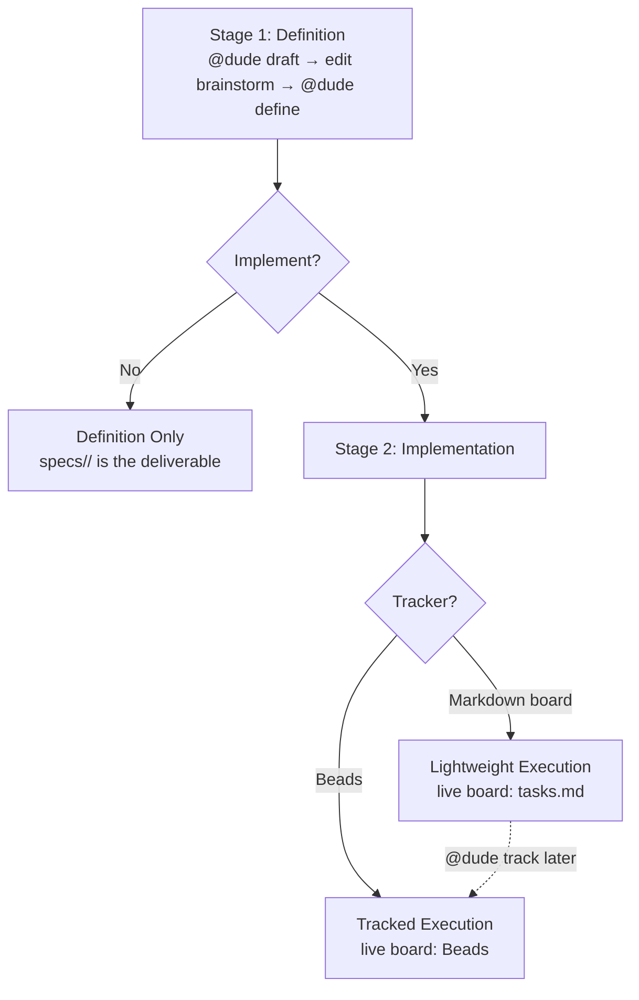

# Dude Coder

A markdown-only multi-agent development bundle for turning a feature idea into a
reusable definition package, then optionally into a first-class markdown
execution board in `tasks.md` or Tracked Execution in Beads.

The default path is intentionally simple: draft one feature into
`brainstorm/<slug>.md`, let Dude define it into `specs/<feature>/`, and keep
moving from the markdown board in `tasks.md` without Beads until you actually
want tracked execution in Beads.

## Mental Model

Dude works across four layers:

| Layer                      | Purpose                               | Who edits it                          | When it is live                                |
| -------------------------- | ------------------------------------- | ------------------------------------- | ---------------------------------------------- |
| `brainstorm/<slug>.md`     | Working feature ledger                | You + Dude                            | Before definition                              |
| `specs/<feature>/`         | Generated definition package          | Dude refreshes it from the brainstorm | After `@dude define`                           |
| `specs/<feature>/tasks.md` | Live markdown execution board without Beads | Dude + specialists                    | During Lightweight Execution before `@dude track` |
| Beads                      | Live execution board                  | Dude + specialists                    | After `@dude track`                            |

Key terms:

- `guardrails` — durable project rules that planning and execution must respect.
- `spec_path` — the brainstorm pointer to `specs/<feature>/spec.md`; Dude uses
  it to match a defined feature to Beads issues.
- durable task IDs — task keys such as `T001@a1b2c3d4` that help Lightweight
  Execution history survive re-define and later Beads handoff.
- task states — `[ ]` not started, `[~]` in progress, `[!]` blocked, and `[x]`
  done.
- generated board view — Dude may add `## Ready Now`, `## In Progress`,
  `## Blocked`, and `## Done` sections inside `tasks.md` as a derived view over
  the canonical phased task units. The region is fenced by
  `<!-- dude:board:start -->` / `<!-- dude:board:end -->` and is regenerated
  wholesale on every refresh — do not hand-edit inside the fence. The matching
  brainstorm fences use `<!-- dude:managed:start -->` / `<!-- dude:managed:end -->`.
- deferred clarifications — the brainstorm `## Deferred Clarifications` section
  holds questions that did not make the spec's 3-marker cap, so nothing gets
  silently dropped. Dude re-ranks them on every `define` and asks before
  promoting.
- coordinator log — the brainstorm `## Coordinator Log` (legacy name:
  `## Definition Record`) is an append-only audit trail of coordinator-owned
  mutations. Use `@dude diff` to read recent entries or `@dude self-check` to
  verify the rules.
- lane banner — every reply that touches execution state opens with
  `Lane: <lane> · Live: <artifact>` so you always see which board is current.
- `@dude status` — read-only orientation across Definition Only, Lightweight
  Execution, and Tracked Execution.
- `@dude track` — handoff into tracked execution, not a compile step.

## Stages

There is one definition stage and then either you stop or you implement. If
you implement, you pick a tracker.



| Stage                    | What happens                                                              | Live artifact                | How to enter                  |
| ------------------------ | ------------------------------------------------------------------------- | ---------------------------- | ----------------------------- |
| Stage 1: Definition      | Draft a brainstorm, then generate `specs/<feature>/` (spec, plan, tasks). | `brainstorm/<slug>.md` then `specs/<feature>/` | `@dude draft` then `@dude define` |
| Definition Only          | Stop after Stage 1. Keep the definition package as a reusable artifact.   | `specs/<feature>/` (frozen)  | Choose "just define" up front, or simply stop after `@dude define` |
| Lightweight Execution    | Implement directly from `tasks.md` as a markdown board. No external tracker. | `specs/<feature>/tasks.md`   | Continue from `tasks.md` after `@dude define` |
| Tracked Execution        | Import tasks into Beads. Beads becomes the live board.                    | Beads issues                 | `@dude track` (now or later from Lightweight) |

Notes:

- Stage 1 is always required. You cannot implement without first defining.
- Definition Only and Implementation are mutually exclusive for a given pass,
  but Lightweight → Tracked is a one-way upgrade you can take at any time.
- Once `@dude track` runs, Beads is the only live board and `tasks.md` becomes
  reference-only.
- `@dude status` is read-only and works in any stage.
- Use `@dude flag ...` if execution uncovers a definition or planning gap.

## Quick Start

Start with the simple no-Beads path unless you already know you want a live
execution board.

1. Tell Dude whether this is one feature or several separate outcomes.
2. Say either `just define` or `implement now`.
3. State only the hard constraints that materially affect scope, compliance,
   approvals, or routing.
4. Run `@dude draft <feature>`.
5. Edit `brainstorm/<slug>.md`.
6. Run `@dude define <feature>`.
7. If you are stopping at Definition Only, read `spec.md` first, then
  `plan.md`.
8. If you are implementing now without Beads, go straight to `tasks.md`, start
  with the generated board view when present, then use `spec.md` and `plan.md`
  as reference context.
9. Continue from `tasks.md` with `@dude status` and
  `@dude implement the next task for <feature> without Beads`.
10. Only add `@dude track` later if you decide you want Beads.

Minimal example:

```text
@dude I have one feature and want to implement now without Beads
@dude draft expense-entry
@dude define expense-entry
@dude status
@dude implement the next task for expense-entry without Beads
```

If you ever want to see what Dude changed or verify it followed its own rules,
run `@dude diff` or `@dude self-check` — both are read-only.

If the repo has no active `brainstorm/` or `specs/` workflow artifacts yet,
Dude should treat that as the first-session fast path and open with the three
questions above.

The short rule is:

- `draft` creates or refreshes `brainstorm/<slug>.md`
- `define` creates or refreshes `specs/<feature>/`
- stop after `define` for Definition Only
- continue from `tasks.md` for Lightweight Execution
- run `@dude track` only when you want Beads to become the live board

## Repository Layout

```text
.
├── .github/   # portable Dude Coder bundle
├── docs/      # detailed guides and reference material
└── README.md  # short entrypoint and default quick start
```

- `.github/` is the portable bundle you copy into another repository.
- `docs/` is the repo-local documentation set for deeper workflow details.

## When To Add Beads

Stay in Lightweight Execution by default. Add Beads only when you want issue-
level tracked execution, richer multi-user history, or longer-running work that
benefits from a dedicated external board.

If you are not there yet, keep using `tasks.md` as the live markdown execution
board with its derived `Ready / In Progress / Blocked / Done` view and avoid
the extra setup overhead.

## Detailed Docs

- [Docs index](docs/README.md) — recommended reading order across the detailed guides.
- [Setup and first feature](docs/setup.md) — prerequisites, guardrails, advanced setup, roster changes, and workflow boundaries.
- [Workflow modes and lifecycle](docs/workflow.md) — lane behavior, live artifacts, migration, and manual import.
- [Commands and prompt shapes](docs/commands.md) — command reference and example prompt forms.
- [Starting from a PRD draft](docs/prd-drafts.md) — PRD intake and package generation flow.
- [Detailed walkthrough](docs/walkthrough.md) — guided end-to-end example from draft through execution.
- [Definition and execution reference](docs/reference.md) — deeper package, execution, and design-constraint reference.