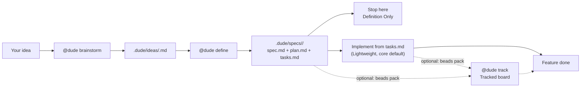

# Dude

Dude is a markdown bundle for working with GitHub Copilot on one feature
at a time.

Start with `@dude brainstorm <idea>`. The lifecycle is
`brainstorm -> idea -> define -> spec -> work`:

1. You describe the feature informally.
2. Brainstorm writes one flat `.dude/ideas/<slug>.md` collaboration file and
  does not create a spec package.
3. Define turns that idea into a spec, plan, and task list.
4. You either stop there or implement from the task list.

You do not need extra setup or a big process to start. The lean core handles
the whole flow — brainstorm an idea, define it, then implement straight from `tasks.md`.
When you want more — a tracked issue board, release tooling, web specialists, or
tests-first discipline — you add an optional **pack**. Nothing domain-specific
is loaded until you ask for it.

## The Whole Flow



The core default is **Lightweight Execution**: implement straight from
`tasks.md`. A tracked issue board is optional and comes from the **beads pack**
(`@dude add pack beads`); it is not required to finish a feature.

One rule keeps the workflow clear: there is only one authoritative live place at
a time. When a tracked board is live, Dude may still keep `tasks.md` updated as a
portable mirror, but that mirror does not decide what is ready or done.

| If you are here | The live place is | What you do |
|---|---|---|
| Shaping the idea | `.dude/ideas/<slug>.md` | Review `## Idea`, edit it if needed, and answer questions |
| Defined, not implementing | `.dude/specs/<feature>/` | Read the spec and plan |
| Implementing (core default) | `.dude/specs/<feature>/tasks.md` | Ask Dude for the next task |
| Implementing on a tracked board (beads pack) | the tracked board | Track the same work as issues until done; `tasks.md` may mirror it for fallback |

## Quick Start

Use this path for your first feature.

1. Tell Dude whether this is one feature and whether you want to implement now.
2. Write your idea in chat or in a markdown file.
3. Run `@dude brainstorm <idea>` to capture it without creating a spec package.
4. Open `.dude/ideas/<slug>.md`, read the user-controlled `## Idea`, then either
  revise it or answer the active `## Open Questions` immediately below it.
5. Define the feature. A defined feature is the "formalized" version of your idea and creates `spec.md`, `plan.md`, and `tasks.md` in a new folder under `.dude/specs/`.
6. If you want implementation, ask for the next task.

Writing your idea in a file is often the best way to start. Sit with it, add
rough notes, examples, questions, and constraints, then ask Dude to brainstorm
from that file. Dude will turn it into one flat `.dude/ideas/<slug>.md` file.
Informal, typo-heavy, or speech-to-text input is welcome: on initial capture,
Dude may conservatively clean spelling, grammar, punctuation, transcription
errors, filler, or repetition without changing meaning, tone, uncertainty,
incomplete thought, or creative intent.

The idea review is important too. Read `## Idea` first, then either change it
directly or answer Dude's questions in the visible
`**Your answer:**` slots. Use the same pass to correct bad assumptions and
describe the feature in more detail. Rerunning brainstorm preserves `## Idea`
and other user edits unless you supply or request a revision. The better the idea, the better the
formal spec, plan, and tasks will be.

Minimal example:

```text
# Write your rough input in notes/expense-entry.md first.
@dude brainstorm notes/expense-entry.md
# Open .dude/ideas/expense-entry.md, then read the idea and answer the prompts.
@dude define expense-entry
@dude status
@dude work expense-entry --max 3
```

If you only want a plan, use this instead:

```text
@dude I have one feature: expense entry. Just define it for now.
# You can brainstorm from a feature name or from a markdown file you wrote first.
@dude brainstorm notes/expense-entry.md
# Review .dude/ideas/expense-entry.md before formalizing the feature.
@dude define expense-entry
```

Inline prompts still work:

```text
@dude brainstorm expense-entry
```

But a file can be better when you want room to think.

## What Dude Creates

For a feature named `expense-entry`, Dude creates files like this:

```text
.dude/ideas/expense-entry.md
.dude/specs/001-expense-entry/
  spec.md
  plan.md
  tasks.md
```

In plain English:

- `.dude/ideas/...` is the pre-spec collaboration file between you and Dude.
- `spec.md` says what the feature must do.
- `plan.md` says how the project should build it.
- `tasks.md` is the work list for Lightweight Execution (the core default), and
  a non-authoritative mirror when a tracked board (beads pack) is active.

You control `## Idea`, open-question answers, assumptions, and deferred
questions. Dude maintains `## Normalized Intent`, `status: draft|defined`, the
exact `spec_path:` to `spec.md`, generated board sections, task checkboxes, and
the append-only `## Coordinator Log`. Define consumes the idea by slug, updates
that same file to `status: defined` with the exact path, and writes the package.
When intent changes, edit `## Idea` and rerun define instead of editing generated
spec artifacts as the source of intent.

## Commands You Will Actually Use

| Command | Use it when |
|---|---|
| `@dude brainstorm <idea-or-file.md>` | Create or refresh one flat idea file without creating a spec package |
| `@dude define <slug>` | Turn the matching idea into spec, plan, and tasks |
| `@dude status` | See where you are and what is live |
| `@dude work [<feature>] [--max N]` | Keep going: run the next few ready tasks in whichever lane is already live |
| `@dude list packs` | See available and installed optional packs |
| `@dude add pack <name>` | Install an optional capability (e.g. `beads`, `release`, `web`, `practices`) |
| `@dude track` | Move work onto a tracked board (requires the `beads` pack) |
| `@dude sync Beads to tasks.md` | Refresh the markdown mirror from the tracked board (beads pack) |
| `@dude flag <problem>` | Send a blocker or bad assumption back to the right place |

`@dude status`, `@dude diff`, and `@dude self-check` are read-only orientation
commands. They are safe to run when you are unsure.

## Repository Layout

```text
.
├── .github/   # VS Code/Copilot-discovered Dude engine and configuration
├── .dude/     # project work, memory, state, and bundle metadata
├── library/   # optional pack catalog (install with @dude add pack)
├── docs/      # detailed guides and reference material
└── README.md  # short entrypoint and default quick start
```

The sole bundle manifest is `.dude/metadata/bundle-manifest.md`. Current source
dogfood and release bundles do not generate a manifest under `.github/`.

- `.github/` contains only engine/configuration artifacts that VS Code or Copilot discovers: agents, skills, instructions, and workflows where applicable.
- `.dude/` is the canonical project workspace: `ideas/`, `specs/`, `memory/`, `state/`, and `metadata/`.
- `library/packs/` is the catalog of optional packs you install on demand.
- `docs/` is the repo-local documentation set for deeper workflow details.

## Updating Dude Later

You can update the Dude bundle without touching your product code or active
feature work.

```text
@dude upgrade --dry-run
@dude upgrade
@dude upgrade --rollback
```

The safe path is preview, apply, rollback only if needed. Details like
manifest metadata and the namespace convention for base ownership live in
[docs/upgrading.md](docs/upgrading.md).

## Packs (Optional Expansions)

The engine under `.github/` ships only the lean core — the feature workflow that
every project needs. Everything domain- or workflow-specific lives in the
catalog at [library/packs/](library/packs/README.md) and installs only when you
ask. Think of it as a small baseplate with bricks you snap on as needed.

| Pack | Adds | Install when |
|---|---|---|
| `beads` | a tracked issue board (import, claim/close, mirror) | you want issue-level tracking instead of `tasks.md` |
| `release` | a release-manager agent + tag / pipeline-parity / write-back skills | you ship versioned releases |
| `web` | backend and frontend specialist agents | you build web apps (APIs + UI) |
| `practices` | a tests-first (TDD) workflow skill | you want tests-first discipline |

```text
@dude list packs
@dude add pack beads
@dude remove pack beads
```

Installed packs use the reserved `dude-pack-*` namespace and are **preserved**
across `@dude upgrade` — a core refresh never deletes what you installed.

### When to add the beads pack

Stay in Lightweight Execution by default. Add the `beads` pack only when you
want issue-level tracked execution, richer multi-user history, or longer-running
work that benefits from a dedicated external board. If you are not there yet,
keep using `tasks.md` as the live board with its derived
`Ready / In Progress / Blocked / Done` view and avoid the extra setup overhead.

When the beads pack is active, the tracked board stays authoritative. Dude
mirrors successful closes back into `tasks.md` when the task key maps cleanly,
and you can run `@dude sync Beads to tasks.md` before switching machines or
falling back to Lightweight Execution. `@dude status` can verify whether the
mirror is current, but it stays read-only and never performs the sync for you.

### Optional: keep working

Use `@dude work` when you want Dude to run the next few ready tasks without
re-issuing one verb per task. It is not a new lane — it runs inside whichever
execution lane is already live (Lightweight from `tasks.md`, or a tracked board
when the beads pack is installed) and stops on the first natural boundary (no
ready task, a real blocker, failed verification, or the configured limit).
Default cap is `--max 3`. The full verb is documented in
[docs/commands.md](docs/commands.md#dude-work).

```text
@dude work expense-entry --max 3
@dude work --until blocked
```

## Detailed Docs

Read these only when you need more than the quick start:

- [Docs index](docs/README.md) — where to go next.
- [Setup and first feature](docs/setup.md) — first-time install, guardrails, and roster customization.
- [Workflow modes and lifecycle](docs/workflow.md) — what changes when you stop, use `tasks.md`, or move to Beads.
- [Commands and prompt shapes](docs/commands.md) — full command reference.
- [Starting from a PRD draft](docs/prd-drafts.md) — use a longer product draft as input.
- [Definition and execution reference](docs/reference.md) — advanced details and ownership rules.
- [Pack catalog](library/packs/README.md) — optional expansions and how to install them.
- [Upgrading the bundle](docs/upgrading.md) — update Dude itself safely.
