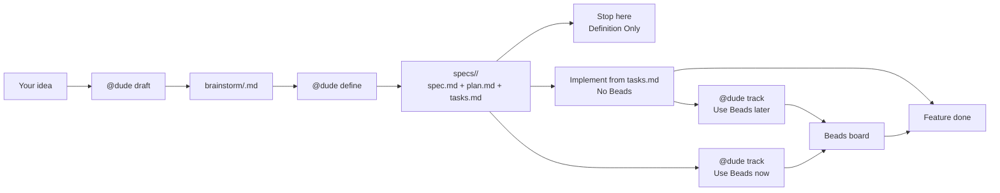

# Dude Coder

Dude Coder is a markdown bundle for working with GitHub Copilot on one feature
at a time.

The simple idea:

1. You describe the feature.
2. Dude writes a brainstorm file you can edit.
3. Dude turns that brainstorm into a spec, plan, and task list.
4. You either stop there or implement from the task list.

You do not need Beads, extra setup, or a big process to start. Use Beads later
only when you want a real issue tracker.

## The Whole Flow



Beads is not the destination. It is only an optional tracking board. You can
finish the feature through `tasks.md` without ever using Beads.

One rule keeps the workflow clear: there is only one authoritative live place at
a time. When Beads is live, Dude may still keep `tasks.md` updated as a
portable mirror, but that mirror does not decide what is ready or done.

| If you are here | The live place is | What you do |
|---|---|---|
| Shaping the idea | `brainstorm/<feature>.md` | Review the draft, edit it if needed, and answer questions |
| Defined, not implementing | `specs/<feature>/` | Read the spec and plan |
| Implementing without Beads | `specs/<feature>/tasks.md` | Ask Dude for the next task |
| Implementing with Beads | Beads | Track the same work as issues until it is done; `tasks.md` may mirror Beads for fallback |

## Quick Start

Use this path for your first feature.

1. Tell Dude whether this is one feature and whether you want to implement now.
2. Write your idea in chat or in a markdown file.
3. Draft the feature from that idea.
4. Open `brainstorm/<feature>.md`, read the `## User Draft`, then either improve the draft or answer the `## Open Questions` prompts below it.
5. Define the feature. A defined feature is the "formalized" version of your idea and creates `spec.md`, `plan.md`, and `tasks.md` in a new folder under `specs/`.
6. If you want implementation, ask for the next task.

Writing your idea in a file is often the best way to start. Sit with it, add
rough notes, examples, questions, and constraints, then ask Dude to draft from
that file. Dude will turn it into `brainstorm/<feature>.md`.

The brainstorm review is important too. Read your original draft first, then
either change it directly or answer Dude's questions in the visible
`**Your answer:**` slots. Use the same pass to correct bad assumptions and
describe the feature in more detail. The better the brainstorm, the better the
formal spec, plan, and tasks will be.

Minimal example:

```text
# Write your rough idea in ideas/expense-entry.md first.
@dude draft ideas/expense-entry.md
# Open brainstorm/expense-entry.md, then read the draft and answer the prompts.
@dude define expense-entry
@dude status
@dude implement the next task for expense-entry without Beads
```

If you only want a plan, use this instead:

```text
@dude I have one feature: expense entry. Just define it for now.
# You can draft from a feature name or from a markdown file you wrote first.
@dude draft ideas/expense-entry.md
# Review brainstorm/expense-entry.md before formalizing the feature.
@dude define expense-entry
```

Inline prompts still work:

```text
@dude draft expense-entry
```

But a file can be better when you want room to think.

## What Dude Creates

For a feature named `expense-entry`, Dude creates files like this:

```text
brainstorm/expense-entry.md
specs/001-expense-entry/
  spec.md
  plan.md
  tasks.md
```

In plain English:

- `brainstorm/...` is the living document, a working note between you and Dude.
- `spec.md` says what the feature must do.
- `plan.md` says how the project should build it.
- `tasks.md` is the work list if you choose to implement without Beads, and a
  non-authoritative mirror when Beads is active.

Let Dude maintain workflow bookkeeping like `status:`, `spec_path:`, generated
board sections, and task checkboxes. You edit the idea and answers; Dude keeps
the workflow state tidy.

## Commands You Will Actually Use

| Command | Use it when |
|---|---|
| `@dude draft <feature-or-file.md>` | Start or refresh the brainstorm from a feature name, description, or markdown file |
| `@dude define <feature>` | Turn the brainstorm into spec, plan, and tasks |
| `@dude status` | See where you are and what is live |
| `@dude implement the next task for <feature> without Beads` | Keep going from `tasks.md` |
| `@dude track` | Move work into Beads when you want issue tracking |
| `@dude sync Beads to tasks.md` | Refresh the markdown mirror from Beads before fallback or after manual Beads changes |
| `@dude flag <problem>` | Send a blocker or bad assumption back to the right place |

`@dude status`, `@dude diff`, and `@dude self-check` are read-only orientation
commands. They are safe to run when you are unsure.

## Repository Layout

```text
.
├── .github/   # portable Dude Coder bundle
├── docs/      # detailed guides and reference material
└── README.md  # short entrypoint and default quick start
```

- `.github/` is the portable bundle you copy into another repository.
- `docs/` is the repo-local documentation set for deeper workflow details.

## Updating Dude Later

You can update the Dude bundle without touching your product code or active
feature work.

```text
@dude upgrade --dry-run
@dude upgrade
@dude upgrade --rollback
```

The safe path is preview, apply, rollback only if needed. Details like
manifest metadata and the namespace convention for base ownership live in
[docs/upgrading.md](docs/upgrading.md).

## When To Add Beads

Stay in Lightweight Execution by default. Add Beads only when you want issue-
level tracked execution, richer multi-user history, or longer-running work that
benefits from a dedicated external board.

If you are not there yet, keep using `tasks.md` as the live markdown execution
board with its derived `Ready / In Progress / Blocked / Done` view and avoid
the extra setup overhead.

If you do use Beads, Beads stays authoritative. Dude mirrors successful Beads
closes back into `tasks.md` when the task key maps cleanly, and you can run
`@dude sync Beads to tasks.md` before switching machines or falling back to
Lightweight Execution. `@dude status` can verify whether the mirror is current,
but it stays read-only and never performs the sync for you.

## Detailed Docs

Read these only when you need more than the quick start:

- [Docs index](docs/README.md) — where to go next.
- [Setup and first feature](docs/setup.md) — first-time install, guardrails, and roster customization.
- [Workflow modes and lifecycle](docs/workflow.md) — what changes when you stop, use `tasks.md`, or move to Beads.
- [Commands and prompt shapes](docs/commands.md) — full command reference.
- [Starting from a PRD draft](docs/prd-drafts.md) — use a longer product draft as input.
- [Definition and execution reference](docs/reference.md) — advanced details and ownership rules.
- [Upgrading the bundle](docs/upgrading.md) — update Dude itself safely.
