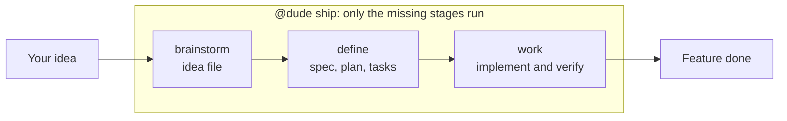

# Dude

Dude is a set of markdown files that GitHub Copilot discovers in your
repository: a coordinator agent, a small set of specialist agents, and the
skills and instructions they follow. Together they give Copilot one workflow for
building a feature: record the idea, turn it into a spec, plan, and task list,
then implement the tasks and verify each one before marking it done.

Everything Dude produces is markdown committed next to your code. The core needs
no service, database, or build step. Dude requires GitHub Copilot in VS Code or
the Copilot CLI; Node.js 20 or later is needed only by the bundle's own
maintenance scripts.

## Install

A release bundle contains `.github/` and a seeded `.dude/metadata/`. Unpack it,
then copy both directories into the repository you want to work in:

```bash
# from the unpacked release bundle
cp -r .github .dude my-project/
```

Add `library/` from this repository if you also want the optional pack catalog.
Reload VS Code afterwards so Copilot picks up the new agents and skills.
[docs/setup.md](docs/setup.md) covers prerequisites and first-run details.

## Your First Feature

Start with the idea, in whatever words you have. `@dude brainstorm` records it in
one file, and every later stage reads from what you wrote:

```text
@dude brainstorm expense entry with receipt upload and manager approval
```

Dude writes `.dude/ideas/expense-entry.md`, restates the idea under `## Idea`,
and lists the questions it still needs answered. Read the restatement, correct it
if it drifted, and answer what you can in the `**Your answer:**` slots. Rough
input is fine: first capture fixes obvious spelling, grammar, and transcription
errors and leaves your meaning, tone, and uncertainty alone. When the notes are
already written down, hand over the file instead:

```text
@dude brainstorm notes/expense-entry.md
```

Brainstorm stops there and creates no spec package, so nothing is generated from
an idea you have not read yet.

Once the idea file reads correctly, one verb carries it the rest of the way:

```text
@dude ship expense-entry
```

`expense-entry` is the slug Dude derived from your idea, and it names every file
the feature writes from now on.


```mermaid
flowchart LR
  IDEA["Your idea"]
  subgraph SHIP["@dude ship: only the missing stages run"]
    direction LR
    BRAINSTORM["brainstorm<br/>idea file"] --> DEFINE["define<br/>spec, plan, tasks"] --> WORK["work<br/>implement and verify"]
  end
  DONE["Feature done"]
  IDEA --> BRAINSTORM
  WORK --> DONE
```

The idea already exists, so this run starts at define. Dude stops and waits when
it needs something from you: a question about what the feature has to do, or
approval of a project rule it proposes to follow from then on. Answer in chat and
it continues.

`@dude ship [<target>]` takes exactly one optional target and no flags, and it
advances until the work is done or an existing Work stop fires. Ship performs no
automatic Git or release action, and it never promises unconditional completion.

Ship also runs in a repository with nothing on disk. There is no idea file to
read then, so the name becomes the whole idea, and Dude has to interview you
before it can define anything. Two lines of your own words get you further. Use a
bare name to resume a feature that already has an idea or a spec package rather
than to start one.

## What Dude Writes

Once the first two stages finish, the feature looks like this on disk:

```text
.dude/ideas/expense-entry.md          # the idea in your words, plus Dude's questions
.dude/specs/001-expense-entry/
  spec.md                             # what the feature must do
  plan.md                             # how this project will build it
  tasks.md                            # the ordered task list Dude implements from
```

The split decides which file to edit when something needs to change:

- You own the idea file: `## Idea`, your answers to open questions, your
  assumptions, and anything you defer. Change what the feature means there.
- Dude owns the spec package and the workflow metadata: `## Normalized Intent`,
  `status: draft|defined`, the exact `spec_path:` to `spec.md`, task checkboxes,
  generated board sections, and the append-only `## Coordinator Log`.

After editing the idea, run `@dude define expense-entry` to rebuild the package
rather than editing `spec.md` or `plan.md` by hand.

## How Much To Drive It

Ship is a shortcut over three verbs. Run them separately to read the spec before
any code exists, or to set your own budgets:

```text
@dude brainstorm expense-entry
@dude define expense-entry
@dude work expense-entry
```

| | `@dude ship <slug>` | `@dude define` then `@dude work` |
|---|---|---|
| Stages per command | every stage still missing | one |
| Task budget | unlimited | three by default |
| Pauses between stages | no | yes |

`@dude work` implements but never defines. Given only an idea file, it finds no
live execution lane, refuses, and points you at `@dude define`. The manual path
is three verbs, not two. Neither verb adds a lane of its own; both run inside
whichever execution lane is already live.

Ship runs autonomously with an unlimited budget, authorizing the next attempt
itself at recoverable checkpoints. `@dude work` stays guarded by default and is
the advanced form when you want to set budgets, recovery, or policy yourself.

Brainstorm and define are also the only way to change intent, since Ship never
refreshes a package behind your back.

## Orientation And Blockers

```text
@dude status
```

`@dude status` reports the current lane, the live artifact, and the next step.
`@dude diff` summarizes what Dude changed since your last message, and
`@dude self-check` verifies that Dude followed its own rules. All three are
read-only.

When implementation runs into a wrong assumption or a missing decision, report
it instead of patching the spec by hand:

```text
@dude flag the spec does not say which currencies are allowed
```

Dude classifies the blocker and routes it to whoever owns that decision.

## Commands

| Command | Purpose |
|---|---|
| `@dude ship [<target>]` | Run the lifecycle stages a feature still needs, then implement it |
| `@dude brainstorm <name-or-file.md>` | Create or refresh the idea file, without creating a spec package |
| `@dude define <slug>` | Build or refresh the spec package from the matching idea |
| `@dude work [<feature>]` | Implement ready tasks with your own budgets and policy |
| `@dude status` | Report the current lane, live artifact, and next step |
| `@dude flag <problem>` | Route a blocker or wrong assumption to its owner |
| `@dude remember: <fact>` | Record a durable project rule, decision, or constraint |
| `@dude list packs` / `@dude add pack <name>` | List or install optional capability packs |

Full grammar, illustrative results, and the maintenance verbs are in
[docs/commands.md](docs/commands.md).

## Packs (Optional Expansions)

The core covers the feature workflow. Domain- and workflow-specific material
lives in the catalog at [library/packs/](library/packs/README.md) and loads only
after you install it.

| Pack | Adds | Install when |
|---|---|---|
| `beads` | a tracked issue board (import, claim/close, mirror) | you want issue-level tracking instead of `tasks.md` |
| `release` | a release-manager agent plus tag, pipeline-parity, and write-back skills | you publish versioned releases |
| `web` | backend and frontend specialist agents | you build web apps (APIs and UI) |
| `practices` | a tests-first (TDD) workflow skill | you want tests-first discipline |

```text
@dude list packs
@dude add pack beads
@dude remove pack beads
```

The catalog holds 16 packs. Installed packs use the reserved `dude-pack-*`
namespace and survive `@dude upgrade`, so a core refresh never removes what you
installed.

### When To Add A Tracked Board

Dude implements straight from `tasks.md`, which is enough to finish a feature.
Add the `beads` pack when you want issue-level tracking, richer multi-user
history, or long-running work that deserves a dedicated board:

```text
@dude add pack beads
@dude track
@dude sync Beads to tasks.md
```

Exactly one place is authoritative at a time. Before `@dude track`, `tasks.md`
decides what is ready and done. After it, the tracked board decides and
`tasks.md` becomes a one-way mirror you can refresh before switching machines.
`@dude status` reports whether that mirror is current but never syncs it for you.

## Repository Layout

```text
.
├── .github/   # VS Code/Copilot-discovered Dude engine and configuration
├── .dude/     # project work, memory, state, and bundle metadata
├── library/   # optional pack catalog (install with @dude add pack)
├── docs/      # detailed guides and reference material
└── README.md  # this file
```

The sole bundle manifest is `.dude/metadata/bundle-manifest.md`. Current source
dogfood and release bundles do not generate a manifest under `.github/`.

- `.github/` contains only engine/configuration artifacts that VS Code or Copilot discovers: agents, skills, instructions, and workflows where applicable.
- `.dude/` is the canonical project workspace: `ideas/`, `specs/`, `memory/`, `state/`, and `metadata/`.
- `library/packs/` is the catalog of optional packs you install on demand.
- `docs/` is the repo-local documentation set for deeper workflow details.

## Updating Dude

Updating the bundle leaves your product code and active feature work in place.

```text
@dude upgrade --dry-run
@dude upgrade
@dude upgrade --rollback
```

Preview first, then apply, and roll back only if you need to. Manifest metadata
and the namespace convention for base ownership are described in
[docs/upgrading.md](docs/upgrading.md).

## Detailed Docs

Read these when you need more than the first-feature path:

- [Docs index](docs/README.md) — where to go next.
- [Setup and first feature](docs/setup.md) — first-time install, guardrails, and roster customization.
- [Commands and prompt shapes](docs/commands.md) — full command reference.
- [Workflow modes and lifecycle](docs/workflow.md) — what changes when you stop at the plan, use `tasks.md`, or move to a tracked board.
- [Detailed walkthrough](docs/walkthrough.md) — one feature end to end.
- [Starting from a PRD draft](docs/prd-drafts.md) — use a longer product draft as input.
- [Definition and execution reference](docs/reference.md) — advanced details and ownership rules.
- [Pack catalog](library/packs/README.md) — optional expansions and how to install them.
- [Upgrading the bundle](docs/upgrading.md) — update Dude itself safely.
- [Repository development workflow](docs/commands.md#repository-development-workflow) — core, pack, project-local, and docs-only changes.
