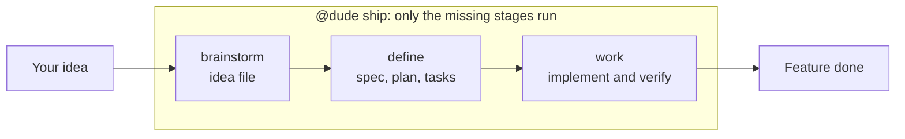

# Dude

Dude is spec-driven development for GitHub Copilot.

Start with a rough idea. Dude turns it into an inspectable specification, an
implementation plan, and an ordered task list. It then coordinates the coding,
testing, and review work, and requires fresh evidence before a task is marked
done.

The whole workflow lives in your repository as Markdown. You can read every
decision, correct the intent, and resume work without depending on a hosted
service or hidden project state. The core stays small; optional packs add domain
specialists, visual systems, release tooling, tracked work, and other
capabilities when a project needs them.

Dude requires GitHub Copilot in VS Code or the Copilot CLI. Node.js 20 or later
is needed only by the bundle's maintenance scripts.

## Install

Download the latest `dude-bundle-*.zip` from
[GitHub Releases](https://github.com/E-G-C/dude/releases/latest). Unpack it,
then copy its `.github/` and `.dude/` directories into the repository you want
to work in:

```bash
# from the unpacked release bundle
cp -r .github .dude my-project/
```

Reload VS Code so Copilot picks up the new agents and skills. The core can
brainstorm and define any feature. Before implementing software, add the coding
pack so Dude has a coder, tester, architect, and code reviewer:

```text
@dude add pack coding
```

Pack commands fetch from the bundle's configured catalog source. Copy
`library/` from this repository only when you want a vendored or offline
catalog. [docs/setup.md](docs/setup.md) covers prerequisites and first-run
details.

## Your First Feature

Start with the idea, in whatever words you have. `@dude brainstorm` records it in
one file, and every later stage reads from what you wrote:

```text
@dude brainstorm expense entry with receipt upload and manager approval
```

Dude writes `.dude/ideas/001-expense-entry.md`, restates the idea under
`## Idea`, and lists the questions it still needs answered. At first brainstorm,
it assigns the next permanent three-digit lifecycle number. That number orders
the idea inventory by capture time, is reused for the feature package, and is
never reused. It does not indicate priority, dependency, or execution order.

The exact unnumbered slug, `expense-entry`, remains the command selector. Read
the restatement, correct it if it drifted, and answer what you can in the
`**Your answer:**` slots. Rough input is fine: first capture fixes obvious
spelling, grammar, and transcription errors and leaves your meaning, tone, and
uncertainty alone. When the notes are already written down, hand over the file
instead:

```text
@dude brainstorm notes/expense-entry.md
```

Brainstorm stops there and creates no spec package, so nothing is generated from
an idea you have not read yet.

Once the idea file reads correctly, one verb carries it the rest of the way:

```text
@dude ship expense-entry
```

`expense-entry` is the exact unnumbered slug Dude derived from your idea. It
remains the semantic selector even though the physical idea ledger and package
carry the lifecycle number.


```mermaid
flowchart LR
  IDEA["Your idea"]
  subgraph SHIP["@dude ship: only the missing stages run"]
    direction LR
    BRAINSTORM["brainstorm<br/>idea file"] --> DEFINE["define<br/>spec, plan, tasks"] --> WORK["work<br/>implement and verify"]
  end
  DONE["Feature done"]
  IDEA --> BRAINSTORM
  WORK --> DONE
```

`@dude ship [<target>]` takes exactly one optional target and no flags, and it
runs until done unless an existing Work stop fires. Ship performs no automatic
Git or release action. A missing decision, evidence, or authority still stops
for your input. See the complete [Ship policy](docs/commands.md#dude-ship).

Ship also runs in a repository with nothing on disk. There is no idea file to
read then, so the name becomes the whole idea, and Dude has to interview you
before it can define anything. Two lines of your own words get you further. Use a
bare name to resume a feature that already has an idea or a spec package rather
than to start one.

## Why Specs Come First

Coding starts after the feature has a durable shape. The idea file preserves
what you meant, including uncertainty. The specification says what must be true.
The plan records how this repository will deliver it, and `tasks.md` becomes the
execution contract.

That separation keeps product decisions out of implementation guesses. When
code exposes a missing decision, Dude routes the gap back to the artifact and
owner responsible for it. When work finishes, tests and independent review
provide the evidence for closing the task.

After Dude successfully closes one or more targets, the same final response
contains one proportional `Completion Closeout:`. A bounded task usually needs
only its closed scope and freshly observed worktree and branch state. Feature
and release closeouts can also include evidenced delivery identities and actual
URLs, exact optional cleanup that was not run, and learning already retained or
proposed. Ship closeouts scale the same way. Empty categories are omitted, and a
mixed result covers only the successful closures.

The closeout is read-only, writes no state or report artifact, and works without
optional packs. Pack advice already available may supply evidence, but cannot
delay reporting or change who has authority.

You can stop after definition and use the package as a plan, or let Dude
continue through implementation:

```text
idea -> spec -> plan -> tasks -> code -> verification
```

## Extend Dude With Packs

The core owns the spec-driven workflow. Packs add capabilities without loading
every project with every specialist, instruction, or tool. The catalog lives at
[library/packs/](library/packs/README.md), and each pack is installed only where
it is useful.

| Pack | Adds | Install when |
|---|---|---|
| `coding` | coder, tester, architect, and code reviewer | you want Dude to implement software |
| `beads` | a tracked issue board | you need issue-level tracking beyond `tasks.md` |
| `web` | backend and frontend specialists | you are building a web application |
| `clearline` | the Clearline visual system | the project selects Clearline for one or more surfaces |
| `release` | release engineering and versioning guidance | you publish versioned releases |

```text
@dude list packs
@dude add pack clearline
@dude remove pack clearline
```

Packs are ordinary, independent capabilities. Installing one makes it available;
the request or project guidance decides when it applies. Projects can keep local
rules under `dude-local-*`, including path-scoped choices that use different
visual systems in different parts of one repository.

For a focused catalog query:

```bash
node .github/skills/dude-compose/compose.mjs list --use-case ui --json
```

`--use-case <id>` returns exact matches. JSON pack objects include `use_cases`;
a pack without a declaration returns `[]`. The catalog currently holds 17
packs. Installed pack files use the reserved `dude-pack-*` namespace and survive
core upgrades.

## What Dude Writes

Once the first two stages finish, the feature looks like this on disk:

```text
.dude/ideas/001-expense-entry.md      # the idea in your words, plus Dude's questions
.dude/specs/001-expense-entry/
  spec.md                             # what the feature must do
  plan.md                             # how this project will build it
  tasks.md                            # the ordered task list Dude implements from
```

The split decides which file to edit when something needs to change:

- You own the idea file: `## Idea`, your answers to open questions, your
  assumptions, and anything you defer. Change what the feature means there.
- Dude owns the spec package and the workflow metadata: `## Normalized Intent`,
  `status: draft|defined|resolved`, the exact `spec_path:` to `spec.md`, task checkboxes,
  generated board sections, and the append-only `## Coordinator Log`.

A `resolved` idea is terminal and package-less: it records an outcome completed
without ever owning a `.dude/specs/**` package. Its `spec_path:` is empty, it
never resolves as a defined owner, and the backlog places a valid resolved idea
in Completed with no task counts. A routine `@dude brainstorm` refresh leaves
exact `status: resolved` and an empty `spec_path:` intact; it never returns the
ledger to draft. Reopening requires an explicit `@dude brainstorm <slug>`
lifecycle request. Until a reopen request arrives, `@dude define` and
`@dude ship` refuse to create a package.

After editing the idea, run `@dude define expense-entry` to rebuild the package
rather than editing `spec.md` or `plan.md` by hand.

The derived backlog pair, `.dude/backlog.md` and `.dude/backlog.html`, refreshes
after guarded task `set --write`, guarded batch `apply-states --write`, and a
successful autonomous Lightweight task application. It is not continuously
synchronized: Coordinator Log-only, lifecycle, and backlog-order changes still
need a coordinator backlog generation. A failed derived refresh never rolls back
committed task state; the freshness check detects the stale pair.

## How Much To Drive It

Ship is a shortcut over three verbs. Run them separately to read the spec before
any code exists, or to set your own budgets:

```text
@dude brainstorm expense-entry
@dude define expense-entry
@dude work expense-entry
```

| | `@dude ship <slug>` | `@dude define` then `@dude work` |
|---|---|---|
| Stages per command | every stage still missing | one |
| Task budget | unlimited | three by default |
| Pauses between stages | no | yes |

`@dude work` implements but never defines. Given only an idea file, it finds no
live execution lane, refuses, and points you at `@dude define`. The manual path
is three verbs, not two. Neither verb adds a lane of its own; both run inside
whichever execution lane is already live.

Ship runs autonomously with an unlimited budget, authorizing the next attempt
itself at recoverable checkpoints. `@dude work` stays guarded by default and is
the advanced form when you want to set budgets, recovery, or policy yourself.

### How Ship Handles Checkpoints

During an explicit Ship run, the existing pre-Work stage owner applies its
eligibility, prerequisite, authority, and safety gates before answerability. A
checkpoint label alone does not stop Ship. When the accepted intent and evidence
support one clearly dominant conservative disposition, that owner can continue
without asking the user. Dude pauses when the choice remains consequential or
uncertain. The complete rules are in the
[Ship command reference](docs/commands.md#dude-ship).

Brainstorm and define are also the only way to change intent, since Ship never
refreshes a package behind your back.

## Orientation And Blockers

```text
@dude status
```

`@dude status` reports the current lane, the live artifact, and the next step.
`@dude diff` summarizes what Dude changed since your last message, and
`@dude self-check` verifies that Dude followed its own rules. All three are
read-only.

When implementation runs into a wrong assumption or a missing decision, report
it instead of patching the spec by hand:

```text
@dude flag the spec does not say which currencies are allowed
```

Dude classifies the blocker and routes it to whoever owns that decision.

## Commands

| Command | Purpose |
|---|---|
| `@dude ship [<target>]` | Run the lifecycle stages a feature still needs, then implement it |
| `@dude brainstorm <name-or-file.md>` | Create or refresh the idea file, without creating a spec package |
| `@dude define <slug>` | Build or refresh the spec package from the matching idea |
| `@dude work [<feature>]` | Implement ready tasks with your own budgets and policy |
| `@dude status` | Report the current lane, live artifact, and next step |
| `@dude flag <problem>` | Route a blocker or wrong assumption to its owner |
| `@dude remember: <fact>` | Record a durable project rule, decision, or constraint |
| `@dude list packs` / `@dude add pack <name>` | List or install optional capability packs |

Full grammar, illustrative results, and the maintenance verbs are in
[docs/commands.md](docs/commands.md).

## GitHub Issue Input

One explicit GitHub issue can provide raw material for an ordinary request:

```text
@dude brainstorm E-G-C/dude#20
@dude brainstorm https://github.com/E-G-C/dude/issues/20
@dude ship issue 20
```

A bare number resolves only in the current repository. To name an issue
elsewhere, use `owner/repository#number` or a URL; Dude has no
default-repository setting and does not search across repositories.

A reference supplies input only. It does not authorize work. Asking what an
issue says gets a direct answer and admits no work; capture or execution asks
Dude to classify it. Merely discovering or displaying an issue does not
authorize execution.

Some issue execution takes a shorter route than the feature lifecycle:
`@dude ship issue <number>` fetches, classifies, and executes through the
existing route for the issue. The [issue intake decision model](docs/workflow.md#github-issue-intake)
explains when to inspect, ship, define a feature, run bounded work, flag an
active-work blocker, or answer one classification question.

## When To Add A Tracked Board

Dude implements straight from `tasks.md`, which is enough to finish a feature.
Add the `beads` pack when you want issue-level tracking, richer multi-user
history, or long-running work that deserves a dedicated board:

```text
@dude add pack beads
@dude track
@dude sync Beads to tasks.md
```

Exactly one place is authoritative at a time. Before `@dude track`, `tasks.md`
decides what is ready and done. After it, the tracked board decides and
`tasks.md` becomes a one-way mirror you can refresh before switching machines.
`@dude status` reports whether that mirror is current but never syncs it for you.

## Repository Layout

```text
.
├── .github/   # VS Code/Copilot-discovered Dude engine and configuration
├── .dude/     # project work, memory, state, and bundle metadata
├── library/   # optional pack catalog (install with @dude add pack)
├── docs/      # detailed guides and reference material
└── README.md  # this file
```

The sole bundle manifest is `.dude/metadata/bundle-manifest.md`. Current source
dogfood and release bundles do not generate a manifest under `.github/`.

- `.github/` contains only engine/configuration artifacts that VS Code or Copilot discovers: agents, skills, instructions, and workflows where applicable.
- `.dude/` is the canonical project workspace: `ideas/`, `specs/`, `memory/`, `state/`, and `metadata/`.
- `library/packs/` is the catalog of optional packs you install on demand.
- `docs/` is the repo-local documentation set for deeper workflow details.

## Updating Dude

Updating the bundle leaves your product code and active feature work in place.

```text
@dude upgrade --dry-run
@dude upgrade
@dude upgrade --rollback
```

Preview first, then apply, and roll back only if you need to. Manifest metadata
and the namespace convention for base ownership are described in
[docs/upgrading.md](docs/upgrading.md).

## Detailed Docs

Read these when you need more than the first-feature path:

- [Docs index](docs/README.md) — where to go next.
- [Setup and first feature](docs/setup.md) — first-time install, guardrails, and roster customization.
- [Commands and prompt shapes](docs/commands.md) — full command reference.
- [Workflow modes and lifecycle](docs/workflow.md) — what changes when you stop at the plan, use `tasks.md`, or move to a tracked board.
- [Detailed walkthrough](docs/walkthrough.md) — one feature end to end.
- [Starting from a PRD draft](docs/prd-drafts.md) — use a longer product draft as input.
- [Definition and execution reference](docs/reference.md) — advanced details and ownership rules.
- [Pack catalog](library/packs/README.md) — optional expansions and how to install them.
- [Upgrading the bundle](docs/upgrading.md) — update Dude itself safely.
- [Repository development workflow](docs/commands.md#repository-development-workflow) — core, pack, project-local, and docs-only changes.
