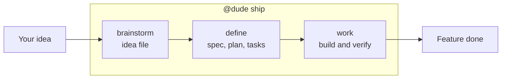

# Dude

Dude is a markdown bundle for building one feature at a time with GitHub
Copilot. You describe what you want; Dude captures the idea, turns it into a
spec and a task list, then works through that list with you.

## Start Here

Name the feature you want:

```text
@dude ship expense-entry
```

That is the whole first run. Ship skips no stage: it brainstorms your input into
`.dude/ideas/expense-entry.md`, defines the spec, plan, and tasks from it, then
works through those tasks. It pauses whenever it needs an answer from you.


```mermaid
flowchart LR
  YOU["Your idea"]
  subgraph SHIP["@dude ship"]
    direction LR
    BRAINSTORM["brainstorm<br/>idea file"] --> DEFINE["define<br/>spec, plan, tasks"] --> WORK["work<br/>build and verify"]
  end
  DONE["Feature done"]
  YOU --> BRAINSTORM
  WORK --> DONE
```

Only the missing stages run, so pointing Ship at an idea you already brainstormed
starts at define, and pointing it at a defined feature goes straight to building.

`@dude ship [<target>]` takes exactly one optional target and no flags, and it
advances until the work is done or an existing Work stop fires. Ship performs no
automatic Git or release action, and it never promises unconditional completion.
Questions about the feature, and approval of project rules Dude wants to keep
respecting, still pause and wait for your reply.

### Review the idea before the spec

Ship pauses for open questions, but it does not wait for you to read the whole
idea file before it writes the spec. Run brainstorm yourself when you want that
review, or when you would rather write your input down than type it into chat:

```text
@dude brainstorm notes/expense-entry.md
```

That writes one flat `.dude/ideas/expense-entry.md` collaboration file and
nothing else. Read the `## Idea` section first, correct anything Dude misread,
and answer the questions below it in the visible `**Your answer:**` slots.
Informal, typo-heavy, or dictated input is welcome: on first capture Dude may
clean up clear spelling, grammar, and transcription errors without changing your
meaning, tone, uncertainty, or intent.

When the idea reads right, hand it back:

```text
@dude ship expense-entry
```

The idea is already captured, so Ship picks up at define. The better the idea
file, the better the spec, plan, and tasks.

### Check where you are

```text
@dude status
```

`@dude status`, `@dude diff`, and `@dude self-check` are read-only. Run them any
time you are unsure what is live.

## What Dude Creates

For a feature named `expense-entry`, Dude creates files like this:

```text
.dude/ideas/expense-entry.md
.dude/specs/001-expense-entry/
  spec.md
  plan.md
  tasks.md
```

In plain English:

- `.dude/ideas/...` is the pre-spec collaboration file between you and Dude.
- `spec.md` says what the feature must do.
- `plan.md` says how the project should build it.
- `tasks.md` is the work list Dude implements from.

You control `## Idea`, open-question answers, assumptions, and deferred
questions. Dude maintains `## Normalized Intent`, `status: draft|defined`, the
exact `spec_path:` to `spec.md`, generated board sections, task checkboxes, and
the append-only `## Coordinator Log`. When the feature should do something
different, edit `## Idea` and rerun define instead of editing the generated spec
files.

## When You Want More Control

Ship is a shortcut over three verbs you can run yourself:

```text
# Capture or refresh the idea file, and create no spec package
@dude brainstorm expense-entry
# Turn that idea into spec.md, plan.md, and tasks.md
@dude define expense-entry
# Run the next few ready tasks
@dude work expense-entry
```

Run them separately when you want to review the idea before any spec exists,
refresh a package after the intent changed, or stop at the plan and implement
nothing. Explicit `brainstorm` and `define` are also the only way to change
intent, because Ship never refreshes a package behind your back.

Ship runs autonomously with an unlimited budget, so at recoverable checkpoints it
authorizes the next attempt itself. `@dude work` stays guarded by default and is
the advanced form when you want explicit budgets, recovery settings, or a
different policy. Both run inside whichever execution lane is already live, and
neither adds a lane of its own.

When implementation hits a bad assumption or a missing decision, send it back to
the right owner instead of patching the spec by hand:

```text
@dude flag the spec does not say which currencies are allowed
```

## Commands

| Command | Use it when |
|---|---|
| `@dude ship [<target>]` | One verb: run the stages your target still needs, then build it |
| `@dude status` | See where you are and what is live |
| `@dude brainstorm <idea-or-file.md>` | Create or refresh one flat idea file without creating a spec package |
| `@dude define <slug>` | Turn the matching idea into spec, plan, and tasks |
| `@dude work [<feature>]` | Run the next few ready tasks with your own budgets and policy |
| `@dude flag <problem>` | Send a blocker or bad assumption back to the right place |
| `@dude remember: <fact>` | Save a durable project rule, constraint, or decision |
| `@dude list packs` | See available and installed optional packs |
| `@dude add pack <name>` | Install an optional capability (e.g. `beads`, `release`, `web`, `practices`) |

Full grammar, illustrative results, and the maintenance verbs are in
[docs/commands.md](docs/commands.md).

## Packs (Optional Expansions)

The core covers the whole feature workflow on its own. Anything domain- or
workflow-specific lives in the catalog at
[library/packs/](library/packs/README.md) and loads only after you install it,
so nothing you did not ask for is in the way.

| Pack | Adds | Install when |
|---|---|---|
| `beads` | a tracked issue board (import, claim/close, mirror) | you want issue-level tracking instead of `tasks.md` |
| `release` | a release-manager agent plus tag, pipeline-parity, and write-back skills | you publish versioned releases |
| `web` | backend and frontend specialist agents | you build web apps (APIs and UI) |
| `practices` | a tests-first (TDD) workflow skill | you want tests-first discipline |

```text
@dude list packs
@dude add pack beads
@dude remove pack beads
```

Sixteen packs are available. Installed packs use the reserved `dude-pack-*`
namespace and survive `@dude upgrade`, so a core refresh never deletes what you
installed.

### When to add a tracked board

Dude implements straight from `tasks.md` by default, which is enough to finish a
feature. Add the `beads` pack when you want issue-level tracking, richer
multi-user history, or long-running work that deserves a dedicated board:

```text
@dude add pack beads
@dude track
@dude sync Beads to tasks.md
```

Only one place is authoritative at a time. Before `@dude track`, `tasks.md`
decides what is ready and done. After it, the tracked board decides and
`tasks.md` becomes a one-way mirror you can refresh before switching machines.
`@dude status` reports whether that mirror is current but never syncs it for you.

## Repository Layout

```text
.
├── .github/   # VS Code/Copilot-discovered Dude engine and configuration
├── .dude/     # project work, memory, state, and bundle metadata
├── library/   # optional pack catalog (install with @dude add pack)
├── docs/      # detailed guides and reference material
└── README.md  # short entrypoint and the ship path
```

The sole bundle manifest is `.dude/metadata/bundle-manifest.md`. Current source
dogfood and release bundles do not generate a manifest under `.github/`.

- `.github/` contains only engine/configuration artifacts that VS Code or Copilot discovers: agents, skills, instructions, and workflows where applicable.
- `.dude/` is the canonical project workspace: `ideas/`, `specs/`, `memory/`, `state/`, and `metadata/`.
- `library/packs/` is the catalog of optional packs you install on demand.
- `docs/` is the repo-local documentation set for deeper workflow details.

## Updating Dude Later

You can update the Dude bundle without touching your product code or active
feature work.

```text
@dude upgrade --dry-run
@dude upgrade
@dude upgrade --rollback
```

The safe path is preview, apply, rollback only if needed. Details like
manifest metadata and the namespace convention for base ownership live in
[docs/upgrading.md](docs/upgrading.md).

## Detailed Docs

Read these when you need more than the path above:

- [Docs index](docs/README.md) — where to go next.
- [Setup and first feature](docs/setup.md) — first-time install, guardrails, and roster customization.
- [Commands and prompt shapes](docs/commands.md) — full command reference.
- [Workflow modes and lifecycle](docs/workflow.md) — what changes when you stop at the plan, use `tasks.md`, or move to a tracked board.
- [Detailed walkthrough](docs/walkthrough.md) — one feature end to end.
- [Starting from a PRD draft](docs/prd-drafts.md) — use a longer product draft as input.
- [Definition and execution reference](docs/reference.md) — advanced details and ownership rules.
- [Pack catalog](library/packs/README.md) — optional expansions and how to install them.
- [Upgrading the bundle](docs/upgrading.md) — update Dude itself safely.
- [Repository development workflow](docs/commands.md#repository-development-workflow) — core, pack, project-local, and docs-only changes.
