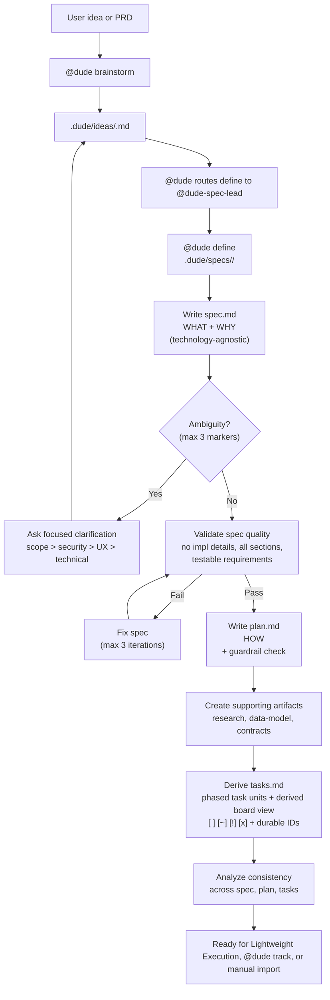
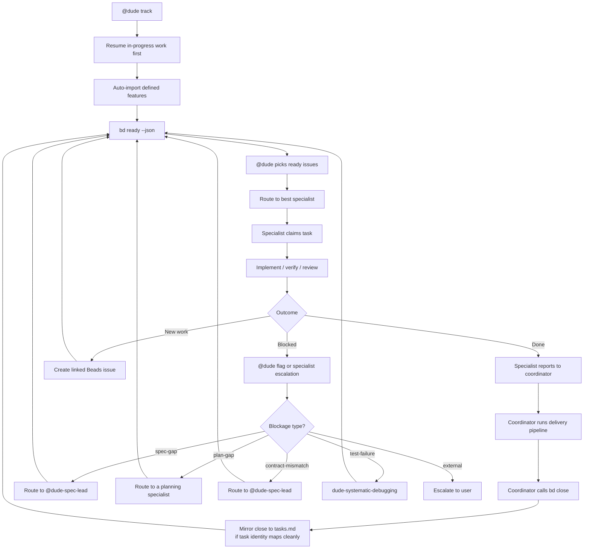
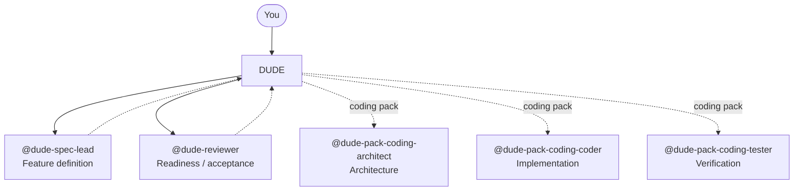

# Definition And Execution Reference

[Back to root README](../README.md) | [Docs index](README.md) | [Workflow modes](workflow.md)

## Feature Definition Workflow

`@dude brainstorm <idea>` asks `@dude-spec-lead` to keep pre-spec collaboration
in one flat `.dude/ideas/<slug>.md` file without creating a spec package.
`@dude define <slug>` then consumes that idea and creates a reusable definition
package under `.dude/specs/<feature>/`. This is the
`brainstorm -> idea -> define -> spec -> work` lifecycle. Use
[Workflow modes and lifecycle](workflow.md) for the first-run lane choice, file
lifecycle, and rerun expectations; this page is the deeper reference.



### Definition Package Structure

A feature directory may include these artifacts when they materially apply to
the feature:

```text
.dude/specs/
└── 001-authentication/
    ├── spec.md            # WHAT + WHY (technology-agnostic)
    ├── plan.md            # HOW (tech stack, architecture, phases)
    ├── research.md        # Technical decisions and unknowns
    ├── data-model.md      # Entities and relationships
    ├── quickstart.md      # Feature smoke-test steps and manual verification flows
    ├── tasks.md           # Phased, traceable, parallel-safe tasks
    ├── contracts/
    │   ├── api.md         # Endpoint shapes and methods
    │   └── schemas.md     # Shared data contracts
    └── checklists/        # Domain-specific quality checks
```

### Definition Rules

- `.dude/ideas/<slug>.md` is the only pre-spec collaboration ledger. Idea files
  are direct `.md` children; nested idea directories are not part of the model.
- An idea begins with `# Idea: <title>`. Its frontmatter uses only
  `status: draft|defined`; `spec_path:` is empty before definition and becomes
  the exact workspace-relative path to the package's `spec.md` afterward.
- `## Idea` is user-controlled. Active `## Open Questions` belong immediately
  after it, followed by user-editable assumptions or deferred questions when
  those sections have content.
- Dude-managed fences contain `## Normalized Intent`, `## Constraints`,
  `## Definition Checklist`, and the append-only `## Coordinator Log` when
  applicable. Dude also maintains `status:` and `spec_path:`.
- Initial capture may conservatively clean clear spelling, grammar, punctuation,
  transcription, filler, or accidental repetition in informal, typo-heavy, or
  speech-to-text input. It must preserve meaning, tone, uncertainty, incomplete
  thought, and creative intent.
- Brainstorm reruns preserve `## Idea`, answered or resolved questions,
  assumptions, and user edits unless the user supplies or requests a revision.
- Define consumes an idea by slug, updates that same idea to `status: defined`
  with its exact `spec_path:`, appends the definition event to the Coordinator
  Log, and writes the generated package. Later intent changes return to
  `## Idea`; rerun define instead of editing generated artifacts as the source.
- `spec.md` defines WHAT to build and WHY — no implementation details.
- `plan.md` defines HOW — tech stack, architecture, project structure.
- `tasks.md` is derived from the plan, organized by phase and user story.
- New or refreshed task lines should prefer durable task IDs such as
  `T001@a1b2c3d4`.
- `tasks.md` may become the live markdown execution board only in Lightweight
  Execution before Beads import.
- After Beads import, Beads is authoritative and `tasks.md` may only be updated
  as a one-way, non-authoritative mirror from Beads.
- `tasks.md` may include a Dude-generated board region inside the same file
  with `## Ready Now`, `## In Progress`, `## Blocked`, and `## Done`. It is
  derived guidance, not a second board.
- Active `## Open Questions` belong immediately after `## Idea`, with
  each question formatted as `### QN. ...` followed by a visible
  `**Your answer:** _Type your answer here._` slot.
- `.dude/memory/guardrails.md` holds the project's durable guardrails. Dude
  may infer candidates once it understands what is being built, but
  project-specific entries are ratified by the user. If no new project-specific
  guardrails are inferred beyond bundle defaults, definition can continue
  without a separate guardrail pause.
- Only create supporting artifacts the feature actually needs.
- A lean package is valid; omit placeholder artifacts for domains that do not
  materially apply.
- During feature definition, `@dude-spec-lead` is the planning authority for the
  package.
- A planning specialist (from a domain pack such as coding) may review architecture sanity and implementation structure before
  import.
- `@dude-reviewer` may perform independent readiness review on the definition
  package.
- A verification specialist is not part of the definition path by default.
- Empty or missing `.dude/ideas/` and `.dude/specs/` directories are valid;
  Dude creates artifacts only when brainstorm or definition begins.

### Spec Structure

`spec.md` must include these sections in order:

1. **User Scenarios & Testing** — prioritized stories (P1, P2, P3), each with:
   - Why this priority
   - Independent test (verifiable in isolation)
   - Acceptance scenarios (Given/When/Then)
2. **Edge Cases** — boundary conditions and error scenarios
3. **Functional Requirements** — numbered (`FR-001`, `FR-002`, ...), each
   testable
4. **Key Entities** — domain objects and relationships (when data is involved)
5. **Success Criteria** — measurable, technology-agnostic (`SC-001`, `SC-002`,
   ...)
6. **Assumptions** — reasonable defaults for unspecified details

### Clarification Rules

- Mark genuine ambiguity with `[NEEDS CLARIFICATION: specific question]`.
- **Maximum 3 markers per spec.** Prioritize: scope > security/privacy > UX >
  technical.
- For everything else, make an informed default and document it in Assumptions.
- All markers must be resolved before planning begins.
- Overflow questions beyond the 3-marker cap go into `## Deferred Clarifications`
  in `.dude/ideas/<slug>.md` so nothing is silently dropped. Promote them back
  into the active set on later `define` runs if their priority rises.

### Task Structure

Each canonical task header in `tasks.md` follows:

```text
- [ ] T001@a1b2c3d4 [P] [US1|Shared] Description with file paths
  deps: T000@e4f5g6h7, T002@91ac4e2f
  blocked-by: spec-gap: contract still needs a retry policy
```

- `T001` — sequential ID
- `@a1b2c3d4` — durable reconciliation key
- `[P]` — parallel-safe within the phase
- `[US1]` — traces to User Story 1
- `[Shared]` — cross-story setup, foundational, or polish work
- task-state glyphs are `[ ]`, `[~]`, `[!]`, and `[x]`
- `deps:` adds explicit blockers by durable task key
- `blocked-by:` summarizes a blocker when the task is `[!]`

During Lightweight Execution, task headers may move between `[ ]`, `[~]`,
`[!]`, and `[x]`. During Tracked Execution, the same glyphs may be updated only
as Beads-derived mirror state. Keep the durable task key stable where possible
so task state can survive a later `@dude define` refresh, Beads handoff, or
explicit Beads-to-markdown sync.

A bounded task may include closely related code, tests, and documentation when
one independent verification step proves the whole slice. Supporting checklist
files stay advisory during Lightweight Execution; `tasks.md` remains the single
live execution board before Beads import.

`tasks.md` may also include a generated board region, fenced by HTML comments
and maintained by Dude. Treat it as a convenience view over the canonical task
units rather than separate execution state.

Each `tasks.md` points its audit breadcrumb at the uniquely owning flat idea.
Resolve that companion by requiring exactly one `.dude/ideas/*.md` file with
`status: defined` whose exact `spec_path:` equals the sibling package path
`.dude/specs/<feature>/spec.md`; never infer ownership from a matching basename
or an alternate path. Missing or multiple exact matches block execution mutation.

Phases follow: Setup -> Foundational -> User Story (by priority) -> Polish. Each
story phase has a Goal, Independent Test, and Checkpoint.

Dependency rules for import:

- every task in a phase waits for the previous phase to complete
- non-`[P]` tasks depend on all earlier tasks in the same phase
- `[P]` tasks can start in parallel once the phase is unblocked
- `deps:` may add explicit blockers when phase order alone is not precise
  enough

### Quality Gate

Before `plan.md` can be written, `spec.md` is validated:

- No implementation details leaked into the spec
- All mandatory sections completed
- Requirements testable, success criteria measurable
- No unresolved clarification markers

If validation fails, the spec is fixed first (max 3 iterations).

## Execution Workflow

This section expands the Tracked Execution lane. Once tasks are imported, Beads
becomes the only live execution board and source of truth, and in normal use
`@dude track` performs the handoff automatically for defined features. `tasks.md`
may still be maintained as a one-way Beads-derived mirror for portability.



### Beads Rules

- `@dude track` is the normal automatic handoff into Beads.
- Import requires the same unique defined idea and exact `spec_path:` identity
  used by Lightweight Execution. Each imported issue carries
  `spec: <spec_path>` as its first description line.
- Use `bd ready --json` to find ready work.
- Claim before starting: `bd update <id> --claim --json`.
- Specialists report results to the coordinator — only the coordinator calls
  `bd close`.
- After `bd close` succeeds, the coordinator mirrors the result to `tasks.md`
  when the Beads issue maps to exactly one canonical task by durable task key.
  It refreshes any derived board region, records the write-back in the unique
  companion idea's append-only `## Coordinator Log`, and runs the Dude linter.
- Use `@dude sync Beads to tasks.md` to refresh the full markdown mirror after
  manual Beads changes or before a planned fallback to Lightweight Execution.
- Create discovered follow-up work in Beads.
- Use typed `@dude flag ...` escalation exactly as summarized in the workflow
  guide.
- `@dude status` is read-only and does not import or mutate work; it may still
  query Beads when tracked execution is already active.
- Dude handles parallel execution internally when multiple ready tasks are safe
  to fan out.
- Do not use `tasks.md` as the live board after import; it is only a
  non-authoritative Beads mirror when updated in this lane.

## Responsibility Map

Use the workflow guide for the short rule-of-thumb. This diagram is the roster
map.



The solid nodes are the lean generic **core** (`@dude-spec-lead` and
`@dude-reviewer` alongside the coordinator); dotted nodes come from packs.
Installing a pack adds specialists — the **coding** pack adds the coder / tester
/ architect / code-reviewer shown above, the **web** pack adds
`@dude-pack-web-backend` and `@dude-pack-web-frontend`, and the **release** pack
adds `@dude-pack-release-manager`.

The roster is dynamic: `@dude` updates routing as agents are added or removed,
so this map reflects the current default bundle but is not fixed. See
[`dude-team-expansion`](../.github/skills/dude-team-expansion/SKILL.md) and the
[`Routing Algorithm`](../.github/skills/dude-generic-routing/SKILL.md#routing-algorithm)
closed-roster procedure for how routing adapts.

## Design Constraints

- Do not introduce a second task system.
- Use `tasks.md` as the live markdown execution board only in Lightweight Execution.
- After Beads import, allow `tasks.md` updates only as one-way Beads-derived
  mirror writes or explicit `@dude sync Beads to tasks.md` results.
- A generated board region inside `tasks.md` is acceptable because it is
  derived from the canonical task units; a separate file is not.
- Do not introduce hidden state files when the idea ledger or Beads
  already carry the needed state.
- Do not track execution anywhere except Beads once imported; markdown mirror
  writes are snapshots, not a second task system.
- Do not turn `@dude status` into a mutating command.
- Do not skip clarification when the feature is materially ambiguous.
- Do not mix implementation code into feature-definition artifacts.
- Do not let `tasks.md` drift away from `spec.md` and `plan.md`.

## Runtime And Optional Engine Scripts

Dude itself is just markdown, skills, and agents. For the Definition Only
and Lightweight Execution lanes there is no dedicated service, daemon, or build
step: drop the files into a repo and move through `brainstorm`, `define`, and
optional execution from `tasks.md` with `@dude`.

The bundle does ship a small set of **optional, dependency-free Node (>= 20 LTS)
engine scripts** for the mechanical work that has to be exact — bundle hygiene
(`dude-lint`), pack install/verify (`dude-compose`), core upgrades
(`dude-bundle-upgrade`), the `tasks.md` board (`board.mjs`), agent/skill
scaffolding, import prep, and memory appends. They are additive helpers the
coordinator invokes; nothing runs as a background service. No language runtime is
installed on your behalf — the import flow only reads and writes files and never
triggers a Python, Node, or other runtime install for an imported artifact. See
[Engine scripts](commands.md#engine-scripts-deterministic-helpers) for the list.

If you choose the Tracked Execution lane, you still need Beads and, on some
setups, Dolt. See [Setup and first feature](setup.md) and
[Workflow modes and lifecycle](workflow.md) for that optional infrastructure
layer.