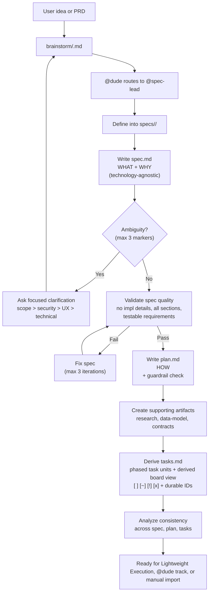
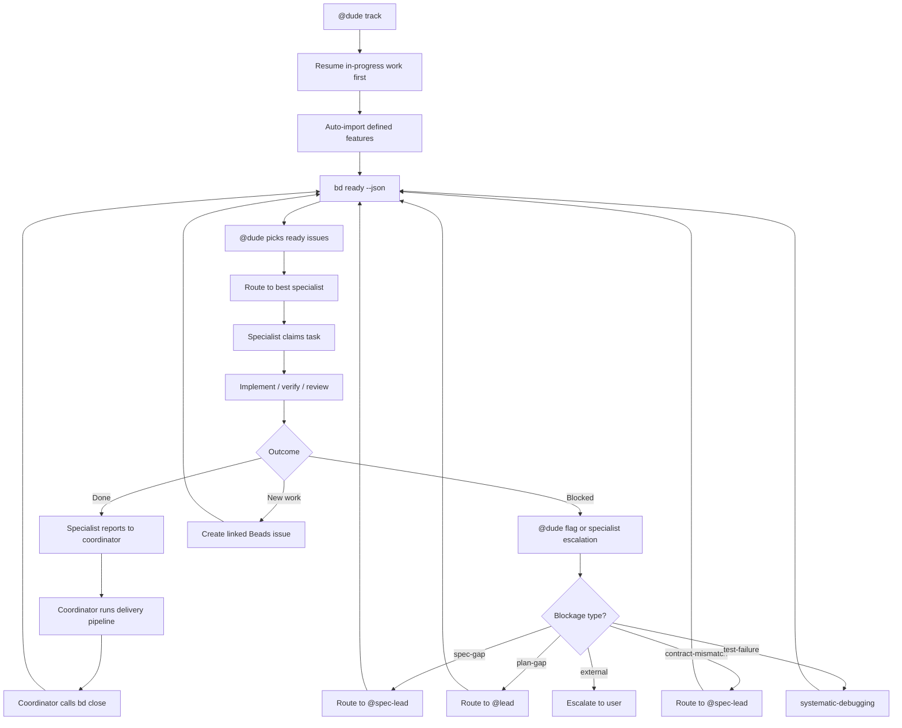
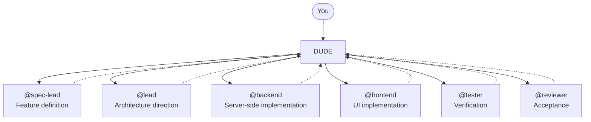

# Definition And Execution Reference

[Back to root README](../README.md) | [Docs index](README.md) | [Workflow modes](workflow.md)

## Feature Definition Workflow

`@spec-lead` keeps intake in `brainstorm/<slug>.md`, then creates a reusable
definition package under `specs/<feature>/` when you define it. Use
[Workflow modes and lifecycle](workflow.md) for the first-run lane choice, file
lifecycle, and rerun expectations; this page is the deeper reference.



### Definition Package Structure

A feature directory may include these artifacts when they materially apply to
the feature:

```text
specs/
└── 001-authentication/
    ├── spec.md            # WHAT + WHY (technology-agnostic)
    ├── plan.md            # HOW (tech stack, architecture, phases)
    ├── research.md        # Technical decisions and unknowns
    ├── data-model.md      # Entities and relationships
    ├── quickstart.md      # Feature smoke-test steps and manual verification flows
    ├── tasks.md           # Phased, traceable, parallel-safe tasks
    ├── contracts/
    │   ├── api.md         # Endpoint shapes and methods
    │   └── schemas.md     # Shared data contracts
    └── checklists/        # Domain-specific quality checks
```

### Definition Rules

- `brainstorm/<slug>.md` is the only pre-spec intake ledger.
- `spec.md` defines WHAT to build and WHY — no implementation details.
- `plan.md` defines HOW — tech stack, architecture, project structure.
- `tasks.md` is derived from the plan, organized by phase and user story.
- New or refreshed task lines should prefer durable task IDs such as
  `T001@a1b2c3d4`.
- `tasks.md` may become the live markdown execution board only in Lightweight
  Execution before Beads import.
- `tasks.md` may include a Dude-generated board region inside the same file
  with `## Ready Now`, `## In Progress`, `## Blocked`, and `## Done`. It is
  derived guidance, not a second board.
- `.github/dudestuff/guardrails.md` holds the project's durable guardrails. Dude
  may infer candidates once it understands what is being built, but
  project-specific entries are ratified by the user. If no new project-specific
  guardrails are inferred beyond bundle defaults, definition can continue
  without a separate guardrail pause.
- Only create supporting artifacts the feature actually needs.
- A lean package is valid; omit placeholder artifacts for domains that do not
  materially apply.
- During feature definition, `@spec-lead` is the planning authority for the
  package.
- `@lead` may review architecture sanity and implementation structure before
  import.
- `@reviewer` may perform independent readiness review on the definition
  package.
- `@tester` is not part of the definition path by default.

### Spec Structure

`spec.md` must include these sections in order:

1. **User Scenarios & Testing** — prioritized stories (P1, P2, P3), each with:
   - Why this priority
   - Independent test (verifiable in isolation)
   - Acceptance scenarios (Given/When/Then)
2. **Edge Cases** — boundary conditions and error scenarios
3. **Functional Requirements** — numbered (`FR-001`, `FR-002`, ...), each
   testable
4. **Key Entities** — domain objects and relationships (when data is involved)
5. **Success Criteria** — measurable, technology-agnostic (`SC-001`, `SC-002`,
   ...)
6. **Assumptions** — reasonable defaults for unspecified details

### Clarification Rules

- Mark genuine ambiguity with `[NEEDS CLARIFICATION: specific question]`.
- **Maximum 3 markers per spec.** Prioritize: scope > security/privacy > UX >
  technical.
- For everything else, make an informed default and document it in Assumptions.
- All markers must be resolved before planning begins.
- Overflow questions beyond the 3-marker cap go into `## Deferred Clarifications`
  in `brainstorm/<slug>.md` so nothing is silently dropped. Promote them back
  into the active set on later `define` runs if their priority rises.

### Task Structure

Each canonical task header in `tasks.md` follows:

```text
- [ ] T001@a1b2c3d4 [P] [US1|Shared] Description with file paths
  deps: T000@e4f5g6h7, T002@91ac4e2f
  blocked-by: spec-gap: contract still needs a retry policy
```

- `T001` — sequential ID
- `@a1b2c3d4` — durable reconciliation key
- `[P]` — parallel-safe within the phase
- `[US1]` — traces to User Story 1
- `[Shared]` — cross-story setup, foundational, or polish work
- task-state glyphs are `[ ]`, `[~]`, `[!]`, and `[x]`
- `deps:` adds explicit blockers by durable task key
- `blocked-by:` summarizes a blocker when the task is `[!]`

During Lightweight Execution, task headers may move between `[ ]`, `[~]`,
`[!]`, and `[x]`. Keep the durable task key stable where possible so task state
can survive a later `@dude define` refresh or Beads handoff.

Legacy `T001` lines without a durable suffix remain acceptable during
migration, but refreshed packages should upgrade them.

A bounded task may include closely related code, tests, and documentation when
one independent verification step proves the whole slice. Supporting checklist
files stay advisory during Lightweight Execution; `tasks.md` remains the single
live execution board before Beads import.

`tasks.md` may also include a generated board region, fenced by HTML comments
and maintained by Dude. Treat it as a convenience view over the canonical task
units rather than separate execution state.

Phases follow: Setup -> Foundational -> User Story (by priority) -> Polish. Each
story phase has a Goal, Independent Test, and Checkpoint.

Dependency rules for import:

- every task in a phase waits for the previous phase to complete
- non-`[P]` tasks depend on all earlier tasks in the same phase
- `[P]` tasks can start in parallel once the phase is unblocked
- `deps:` may add explicit blockers when phase order alone is not precise
  enough

### Quality Gate

Before `plan.md` can be written, `spec.md` is validated:

- No implementation details leaked into the spec
- All mandatory sections completed
- Requirements testable, success criteria measurable
- No unresolved clarification markers

If validation fails, the spec is fixed first (max 3 iterations).

## Execution Workflow

This section expands the Tracked Execution lane. Once tasks are imported, Beads
becomes the only live execution board, and in normal use `@dude track`
performs the handoff automatically for defined features.



### Beads Rules

- `@dude track` is the normal automatic handoff into Beads.
- Use `bd ready --json` to find ready work.
- Claim before starting: `bd update <id> --claim --json`.
- Specialists report results to the coordinator — only the coordinator calls
  `bd close`.
- Create discovered follow-up work in Beads.
- Use typed `@dude flag ...` escalation exactly as summarized in the workflow
  guide.
- `@dude status` is read-only and does not import or mutate work; it may still
  query Beads when tracked execution is already active.
- Dude handles parallel execution internally when multiple ready tasks are safe
  to fan out.
- Do not use `tasks.md` as the live board after import.

## Responsibility Map

Use the workflow guide for the short rule-of-thumb. This diagram is the roster
map.



## Design Constraints

- Do not introduce a second task system.
- Use `tasks.md` as the live markdown execution board only in Lightweight Execution.
- A generated board region inside `tasks.md` is acceptable because it is
  derived from the canonical task units; a separate file is not.
- Do not introduce hidden state files when the brainstorm ledger or Beads
  already carry the needed state.
- Do not track execution anywhere except Beads once imported.
- Do not turn `@dude status` into a mutating command.
- Do not skip clarification when the feature is materially ambiguous.
- Do not mix implementation code into feature-definition artifacts.
- Do not let `tasks.md` drift away from `spec.md` and `plan.md`.

## No Dedicated Runtime Required

Dude Coder itself is just markdown, skills, and agents. For the Definition Only
and Lightweight Execution lanes, there is no dedicated service, build step, or
package manager to run: drop the files into a repo and move through `draft`,
`define`, and optional execution from `tasks.md` with `@dude`.

If you choose the Tracked Execution lane, you still need Beads and, on some
setups, Dolt. See [Setup and first feature](setup.md) and
[Workflow modes and lifecycle](workflow.md) for that optional infrastructure
layer.