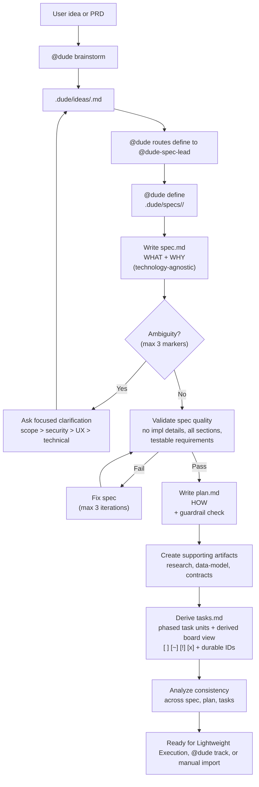
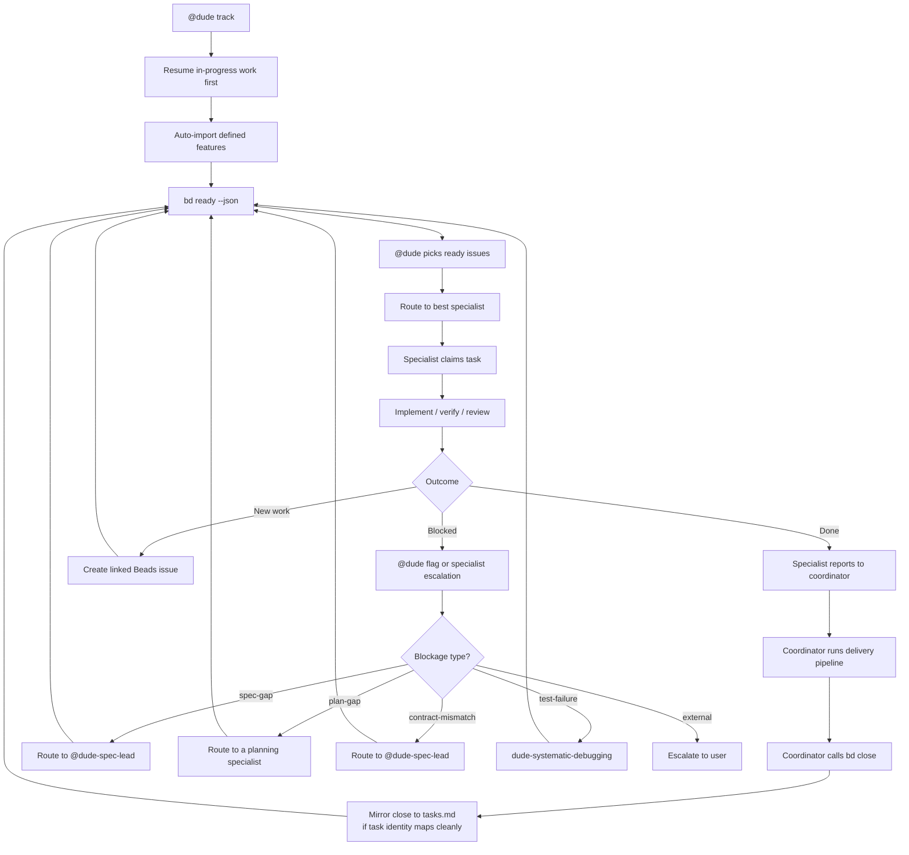
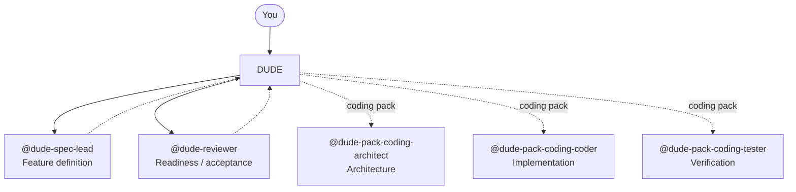

# Definition And Execution Reference

[Back to root README](../README.md) | [Docs index](README.md) | [Workflow modes](workflow.md)

## Feature Definition Workflow

`@dude brainstorm <idea>` asks `@dude-spec-lead` to keep pre-spec collaboration
in one flat `.dude/ideas/<slug>.md` file without creating a spec package.
`@dude define <slug>` then consumes that idea and creates a reusable definition
package under `.dude/specs/<feature>/`. This is the
`brainstorm -> idea -> define -> spec -> work` lifecycle. Use
[Workflow modes and lifecycle](workflow.md) for the first-run lane choice, file
lifecycle, and rerun expectations; this page is the deeper reference.

`@dude ship [<target>]` is a convenience verb over that same lifecycle. It takes
exactly one optional target and no flags, invokes only the existing `brainstorm`
and `define` routes its target is still missing, and then advances until the work
is done or an existing Work stop fires. It creates no definition authority of its
own: `@dude-spec-lead` still owns every definition artifact, `status:`, the exact
`spec_path:`, managed regions, and definition log events. Changed intent goes
back through an explicit `@dude brainstorm`, and a deliberate package refresh
goes through an explicit `@dude define`.

On explicit Ship, an existing pre-Work stage owner applies its normal gates before
answerability. Eligible definition dispositions remain with the definition owner
as Ship-authorized actions, not direct user ratification. The command reference
defines the qualifying cases and stops.

### GitHub Issue Intake

Use the [six-outcome issue intake decision model](workflow.md#github-issue-intake)
to choose between inspection, Ship, feature definition, bounded direct work,
active-work flagging, and one-question ambiguity. This section records the
reference and retrieval rules behind that model.

Dude treats an issue body and its comments as one raw input. No label, author,
comment age, or position has priority. The surrounding request controls
classification and handoff: a question about an issue stays a direct answer, and
only a capture or execution request follows an existing route.

If retrieval fails, intake stops with an actionable error that identifies the
submitted reference and reason. It offers no paste-in substitute. When the
combined material remains unclear during interactive intake, Dude asks exactly
one classification question and leaves the issue unadmitted without an answer.


```mermaid
flowchart TD
  A["User idea or PRD"] --> BS["@dude brainstorm"]
  BS --> B[".dude/ideas/<slug>.md"]
  B --> C["@dude routes define to @dude-spec-lead"]
  C --> D["@dude define <slug>\n.dude/specs/<feature>/"]
    D --> E["Write spec.md\nWHAT + WHY\n(technology-agnostic)"]
    E --> CL{"Ambiguity?\n(max 3 markers)"}
    CL -->|Yes| Q["Ask focused clarification\nscope > security > UX > technical"]
    Q --> B
    CL -->|No| VAL["Validate spec quality\nno impl details, all sections,\ntestable requirements"]
    VAL -->|Fail| FIX["Fix spec\n(max 3 iterations)"]
    FIX --> VAL
    VAL -->|Pass| F["Write plan.md\nHOW\n+ guardrail check"]
    F --> G["Create supporting artifacts\nresearch, data-model, contracts"]
    G --> H["Derive tasks.md\nphased task units + derived board view\n[ ] [~] [!] [x] + durable IDs"]
    H --> I["Analyze consistency\nacross spec, plan, tasks"]
    I --> J["Ready for Lightweight Execution, @dude track, or manual import"]
```

### Definition Package Structure

A feature directory may include these artifacts when they materially apply to
the feature:

```text
.dude/specs/
└── 001-authentication/
    ├── spec.md            # WHAT + WHY (technology-agnostic)
    ├── plan.md            # HOW (tech stack, architecture, phases)
    ├── research.md        # Technical decisions and unknowns
    ├── data-model.md      # Entities and relationships
    ├── quickstart.md      # Feature smoke-test steps and manual verification flows
    ├── tasks.md           # Phased, traceable tasks
    ├── contracts/
    │   ├── api.md         # Endpoint shapes and methods
    │   └── schemas.md     # Shared data contracts
    └── checklists/        # Domain-specific quality checks
```

### Definition Rules

- `.dude/ideas/<slug>.md` is the only pre-spec collaboration ledger. Idea files
  are direct `.md` children; nested idea directories are not part of the model.
- An idea begins with `# Idea: <title>`. Its frontmatter uses only
  `status: draft|defined|resolved`. A draft has an empty `spec_path:` before
  definition; a defined ledger carries the exact workspace-relative path to the
  package's `spec.md`.
- A `resolved` ledger is terminal and package-less: it marks an outcome
  completed with no `.dude/specs/**` package ever owned by the idea. Its
  `spec_path:` is empty, and it never resolves as a defined owner. The backlog
  places a valid resolved ledger in Completed with no task counts only when its
  status scalar is exactly `resolved`, its unnormalized `spec_path:` is exactly
  empty, it has no owner claim, and it has no owner or metadata diagnostic. Any
  other resolved-shaped ledger is unavailable, not Completed.
- `## Idea` is user-controlled. Active `## Open Questions` belong immediately
  after it, followed by user-editable assumptions or deferred questions when
  those sections have content.
- Dude-managed fences contain `## Normalized Intent`, `## Constraints`,
  `## Definition Checklist`, and the append-only `## Coordinator Log` when
  applicable. Dude also maintains `status:` and `spec_path:`.
- Initial capture may conservatively clean clear spelling, grammar, punctuation,
  transcription, filler, or accidental repetition in informal, typo-heavy, or
  speech-to-text input. It must preserve meaning, tone, uncertainty, incomplete
  thought, and creative intent.
- Brainstorm reruns preserve `## Idea`, answered or resolved questions,
  assumptions, and user edits unless the user supplies or requests a revision.
- A normal `@dude brainstorm` rerun keeps exact `status: resolved` and its
  empty `spec_path:`; refreshed prose does not reopen it or return it to draft.
  Only an explicit `@dude brainstorm <slug>` lifecycle request reopens it.
  Package creation through `@dude define` or `@dude ship` remains refused
  before reopening.
- Define consumes an idea by slug, updates that same idea to `status: defined`
  with its exact `spec_path:`, appends the definition event to the Coordinator
  Log, and writes the generated package. Later intent changes return to
  `## Idea`; rerun define instead of editing generated artifacts as the source.
- `spec.md` defines WHAT to build and WHY — no implementation details.
- `plan.md` defines HOW — tech stack, architecture, project structure.
- `tasks.md` is derived from the plan, organized by phase and user story.
- New or refreshed task lines should prefer durable task IDs such as
  `T001@a1b2c3d4`.
- `tasks.md` may become the live markdown execution board only in Lightweight
  Execution before Beads import.
- After Beads import, Beads is authoritative and `tasks.md` may only be updated
  as a one-way, non-authoritative mirror from Beads.
- `tasks.md` may include a Dude-generated board region inside the same file
  with `## Ready Now`, `## In Progress`, `## Blocked`, and `## Done`. It is
  derived guidance, not a second board.
- Active `## Open Questions` belong immediately after `## Idea`, with
  each question formatted as `### QN. ...` followed by a visible
  `**Your answer:** _Type your answer here._` slot.
- `.dude/memory/guardrails.md` holds the project's durable guardrails. Outside
  explicit Ship, Dude may infer candidates once it understands what is being
  built, but project-specific entries are ratified by the user. If no new
  project-specific guardrails are inferred beyond bundle defaults, definition can
  continue without a separate guardrail pause. During explicit Ship, the
  definition owner may apply qualifying candidates as a Ship-authorized action;
  the detailed limits remain in the command reference.
- Only create supporting artifacts the feature actually needs.
- A lean package is valid; omit placeholder artifacts for domains that do not
  materially apply.
- During feature definition, `@dude-spec-lead` is the planning authority for the
  package.
- A planning specialist (from a domain pack such as coding) may review architecture sanity and implementation structure before
  import.
- `@dude-reviewer` may perform independent readiness review on the definition
  package.
- A verification specialist is not part of the definition path by default.
- Empty or missing `.dude/ideas/` and `.dude/specs/` directories are valid;
  Dude creates artifacts only when brainstorm or definition begins.

### Spec Structure

`spec.md` must include these sections in order:

1. **User Scenarios & Testing** — prioritized stories (P1, P2, P3), each with:
   - Why this priority
   - Independent test (verifiable in isolation)
   - Acceptance scenarios (Given/When/Then)
2. **Edge Cases** — boundary conditions and error scenarios
3. **Functional Requirements** — numbered (`FR-001`, `FR-002`, ...), each
   testable
4. **Key Entities** — domain objects and relationships (when data is involved)
5. **Success Criteria** — measurable, technology-agnostic (`SC-001`, `SC-002`,
   ...)
6. **Assumptions** — reasonable defaults for unspecified details

### Clarification Rules

- Mark genuine ambiguity with `[NEEDS CLARIFICATION: specific question]`.
- **Maximum 3 markers per spec.** Prioritize: scope > security/privacy > UX >
  technical.
- For everything else, make an informed default and document it in Assumptions.
- All markers must be resolved before planning begins.
- Overflow questions beyond the 3-marker cap go into `## Deferred Clarifications`
  in `.dude/ideas/<slug>.md` so nothing is silently dropped. Promote them back
  into the active set on later `define` runs if their priority rises.

### Task Structure

Each canonical task header in `tasks.md` follows:

```text
- [ ] T001@a1b2c3d4 [P] [US1|Shared] Description with file paths
  deps: T000@e4f5g6h7, T002@91ac4e2f
  blocked-by: spec-gap: contract still needs a retry policy
```

- `T001` — sequential ID
- `@a1b2c3d4` — durable reconciliation key
- `[P]` — independence candidate only; it neither proves safety nor authorizes fan-out
- `[US1]` — traces to User Story 1
- `[Shared]` — cross-story setup, foundational, or polish work
- task-state glyphs are `[ ]`, `[~]`, `[!]`, and `[x]`
- `deps:` adds explicit blockers by durable task key
- `blocked-by:` summarizes a blocker when the task is `[!]`

During Lightweight Execution, task headers may move between `[ ]`, `[~]`,
`[!]`, and `[x]`. During Tracked Execution, the same glyphs may be updated only
as Beads-derived mirror state. Keep the durable task key stable where possible
so task state can survive a later `@dude define` refresh, Beads handoff, or
explicit Beads-to-markdown sync.

A bounded task may include closely related code, tests, and documentation when
one independent verification step proves the whole slice. Supporting checklist
files stay advisory during Lightweight Execution; `tasks.md` remains the single
live execution board before Beads import.

`tasks.md` may also include a generated board region, fenced by HTML comments
and maintained by Dude. Treat it as a convenience view over the canonical task
units rather than separate execution state.

The committed `.dude/backlog.md` and `.dude/backlog.html` are another derived
view. They refresh after guarded `set --write`, guarded `apply-states --write`,
and a successful autonomous Lightweight application, but not after board
rendering, reads, dry runs, or refused mutations. A failed refresh keeps the
canonical task commit; an autonomous result keeps its existing receipt, while
`backlog.mjs check` reports the stale pair. Log-only, lifecycle, and order
updates require procedural backlog generation.

Each `tasks.md` points its audit breadcrumb at the uniquely owning flat idea.
Resolve that companion by requiring exactly one `.dude/ideas/*.md` file with
`status: defined` whose exact `spec_path:` equals the sibling package path
`.dude/specs/<feature>/spec.md`; never infer ownership from a matching basename
or an alternate path. Missing or multiple exact matches block execution mutation.

Phases follow: Setup -> Foundational -> User Story (by priority) -> Polish. Each
story phase has a Goal, Independent Test, and Checkpoint.

Dependency rules for import:

- every task in a phase waits for the previous phase to complete
- non-`[P]` tasks depend on all earlier tasks in the same phase
- `[P]` tasks omit synthetic sibling dependencies unless `deps:` or the source
  text records a real blocker; import metadata does not authorize dispatch
- `deps:` may add explicit blockers when phase order alone is not precise
  enough

### Quality Gate

Before `plan.md` can be written, `spec.md` is validated:

- No implementation details leaked into the spec
- All mandatory sections completed
- Requirements testable, success criteria measurable
- No unresolved clarification markers

If validation fails, the spec is fixed first (max 3 iterations).

## Execution Workflow

This section expands the Tracked Execution lane. Once tasks are imported, Beads
becomes the only live execution board and source of truth, and in normal use
`@dude track` performs the handoff automatically for defined features. `tasks.md`
may still be maintained as a one-way Beads-derived mirror for portability.

`@dude work` is an accelerator inside the active Lightweight or Tracked lane,
not another lane or authority. It inspects exact target history before a start
or resume and after a block or failure. Ordinary Work reports the post-block
inspection and stops; only explicit bounded recovery can authorize a retry.
Feature-only inspection remains read-only, and unavailable optional session
history alone is nonblocking. All non-owner admitted evidence remains complete.
An owner-log item carries exact owner identity, complete-log digest, byte length,
and event-count metadata with the maximal whole-event suffix for that fresh
packet; omitted owner events are not inspected text. Overflow permits only a
descriptor report, no model call, no recovery, and no evidence splitting or
batching.

Work is sequential and processes one task at a time. Users do not configure
concurrency. Outside `@dude work`, internal coordinator dispatch may fan out
only when existing dependency, blocker, and known-disjoint-write checks prove
it safe.

`@dude ship` reaches execution through this same owner. After lifecycle
resolution it hands the resolved target to Work under a fixed autonomous,
numerically unlimited policy, so imported tracked work keeps precedence, lane
detection still runs once, and every stop, verification, review, ownership,
reconciliation, close, audit, and reporting rule documented here is the one that
applies. Ship adds no lane, board, state file, or second execution policy, and
`@dude work` is still the advanced form whenever you need to set those limits
yourself.

Overall `--max` and exact-target recovery `--recovery-cycles` budgets are
independent; each may be finite or `unlimited`, and `unlimited` never bypasses
no-progress or hard intent, approval, authority, or safety stops.

One evidence-bound Assessment carries its Inspection's `evidenceHash`. Work
freshly re-inspects before authorization, and drift refuses without changing
counters or workflow state.

Recovery never bypasses no-progress, intent, approval, dependency, identity,
reconciliation, authority, safety, verification, review, lane-state, or close
boundaries. Under explicit `--policy autonomous` Work with recovery opted in,
the only definition exception is an atomic unchanged-intent repair in an
existing Lightweight package across exactly four paths: the exact owner idea
ledger plus sibling `spec.md`, `plan.md`, and `tasks.md`, with complete
user-owned Idea, Open Questions, and Assumptions content preserved. Supporting
contracts remain an explicit-definition concern. Tracked definition recovery is
inspection-first: only after a fresh Inspection and Assessment validation does
it refuse as unsupported, before any write. Findings are transient unless the
current memory or skill owner freshly inspects its artifacts, duplicates,
overlaps, and destination before durable retention; caller claims are not
authority. See the [Work command reference](commands.md#dude-work) for usage
and the [Work skill](../.github/skills/dude-work/SKILL.md) for the owning
protocol.

Ordinary Work reaches its runtime through one host adapter boundary. Recovery is
accepted only for persistent-shell death and replaceable adapter-worker death,
and only while the active coordinator turn supervising the invocation and its
independently retained invocation identity both survive; losing that supervisor,
its coordinator context, or that identity is a hard stop. Cross-conversation,
VS Code restart, machine restart, and cross-machine resume are out of scope, and
the age of a claim or checkpoint never authorizes takeover.

For autonomous Lightweight work the host adapter also composes the lane effect:
it prepares the projection, issues the permit, applies exactly one permit-bound
mutation through the lane's own owner, commits the receipt, and derives a
read-only run audit. No board command line and no direct file edit is reachable
from that path. The bridge is the single narrow exception and carries one
ordinary accepted completion; every other permit, close, and governance boundary
is unchanged.

The adapter exposes exactly ten semantic operations, and the production runner
constructs only the four learning-governance actions `review-learning`,
`bind-alternative`, `verify-no-progress`, and `controlled-end`. Completion and
hard stops still return through the runner terminal result path.

Autonomous attestation is cooperative, not cryptographic. The adapter builds
both trusted captures from the sole Tester and Reviewer results returned by
their actual dispatches, using target, attempt, source-revision, dispatch, and
chronology facts it derives from accepted state. A request cannot supply a
trusted identity, a semantic override, a dispatch fact, a verification capture,
or a low-level route. What that records is a cooperative assertion: nothing
detects a change made to a result before it reaches the boundary.

When the host adapter corrects a host incident automatically it reports one
typed inline notice: the incident class, the preserved accepted state, and the
resumed operation. That notice renders exactly once, on the first successful
corrected or resumed outcome, and a run whose first successful outcome is an end
omits it.

Stale ownership claims and checkpoints are cleaned up by hand. The refusal names
the bounded ownership-claim and checkpoint pair for its canonical
workspace-target key. Confirm independently that no invocation remains for that
key, remove only that pair, and let the next load and claim preflight prove both
artifacts absent before a fresh claim. Partial cleanup, a changed artifact,
reappearance, or failed absence validation is a hard stop that keeps blocking
replacement work.

An `autonomous` run ends only on a stop condition from the list in the
[Work command reference](commands.md#dude-work). Surfacing progress is not one,
so the loop continues through remaining ready work. A halt carries one named
reason plus the affected target, the specific condition behind it, and the
action left to the owner; where any of that detail cannot be established from
evidence, the halt is reported unresolved instead. Guarded runs are unaffected.

Under `autonomous`, a deterministically repeated result or approach on one task
requires learning before that task may be retried, escalated, blocked, closed,
or called no progress. Learning evidence, its retention, and the run audit reuse
the existing current-run and lane-history surfaces, so no second ledger, lane,
command, or post-stop scheduler appears. A terminal hard stop is reported
through the runner with its named reason or an explicit unresolved report. Work
stays sequential, and guarded and non-Work behavior is unchanged.


```mermaid
flowchart TD
    START["@dude track"] --> RESUME["Resume in-progress work first"]
    RESUME --> IMPORT["Auto-import defined features"]
    IMPORT --> READY["bd ready --json"]
    READY --> PICK["@dude picks ready issues"]
    PICK --> ROUTE["Route to best specialist"]
    ROUTE --> CLAIM["Specialist claims task"]
    CLAIM --> WORK["Implement / verify / review"]
    WORK --> RESULT{"Outcome"}
    RESULT -->|Done| REPORT["Specialist reports to coordinator"]
    RESULT -->|Blocked| FLAG["@dude flag or specialist escalation"]
    RESULT -->|New work| NEW["Create linked Beads issue"]
    REPORT --> PIPELINE["Coordinator runs delivery pipeline"]
    PIPELINE --> CLOSE["Coordinator calls bd close"]
    CLOSE --> MIRROR["Mirror close to tasks.md\nif task identity maps cleanly"]
    FLAG --> ESCALATE{"Blockage type?"}
    ESCALATE -->|spec-gap| SPECFIX["Route to @dude-spec-lead"]
    ESCALATE -->|plan-gap| LEADFIX["Route to a planning specialist"]
    ESCALATE -->|contract-mismatch| CONTRACT["Route to @dude-spec-lead"]
    ESCALATE -->|test-failure| DEBUG["dude-systematic-debugging"]
    ESCALATE -->|external| USER["Escalate to user"]
    SPECFIX --> READY
    LEADFIX --> READY
    CONTRACT --> READY
    DEBUG --> READY
    MIRROR --> READY
    NEW --> READY
```

### Beads Rules

- `@dude track` is the normal automatic handoff into Beads.
- Import requires the same unique defined idea and exact `spec_path:` identity
  used by Lightweight Execution. Each imported issue carries
  `spec: <spec_path>` as its first description line.
- Use `bd ready --json` to find ready work.
- Claim before starting: `bd update <id> --claim --json`.
- Specialists report results to the coordinator — only the coordinator calls
  `bd close`.
- After `bd close` succeeds, the coordinator mirrors the result to `tasks.md`
  when the Beads issue maps to exactly one canonical task by durable task key.
  It refreshes any derived board region, records the write-back in the unique
  companion idea's append-only `## Coordinator Log`, and runs the Dude linter.
- Use `@dude sync Beads to tasks.md` to refresh the full markdown mirror after
  manual Beads changes or before a planned fallback to Lightweight Execution.
- Create discovered follow-up work in Beads.
- Use typed `@dude flag ...` escalation exactly as summarized in the workflow
  guide.
- `@dude status` is read-only and does not import or mutate work; it may still
  query Beads when tracked execution is already active.
- Generic dispatch follows the Work distinction above; `[P]` alone authorizes
  nothing.
- Do not use `tasks.md` as the live board after import; it is only a
  non-authoritative Beads mirror when updated in this lane.

### Objective Registry Inspection Evidence

The objective registry is definition-compiled and plan-owned. It is embedded in
the feature `plan.md`, keyed by durable task keys, and read only through the
autonomous `definition-plan` evidence item. Inspection validates the registry
and its evaluation contracts; runtime prose never supplies or infers them.

The marker spellings are shown as placeholders only, so these docs never
activate a registry:

```text
<OBJECTIVE_REGISTRY_START>
<CANONICAL_OBJECTIVE_REGISTRY_JSON>
<OBJECTIVE_REGISTRY_END>
```

Registry acquisition is inspection evidence, not an execution engine. Production
Work does not execute objective candidates, checkpoint them, run retention gates
or comparisons, settle sequences, or create an evaluation sequence. A missing
registry yields `registryHash: null` and follows the same ordinary autonomous
route.

Existing optional evaluation-sequence and learning-review references in
`RunState` remain validated and carried. Learning governance may bind one
already-valid uniquely matching sequence but does not create one. Ordinary
versioned audit, learning-review projection, lane effects, and terminal stop
reporting remain unchanged.

## Responsibility Map

Use the workflow guide for the short rule-of-thumb. This diagram is the roster
map.


```mermaid
graph TB
    USER(["You"]) --> DUDE
    DUDE --> SPEC["@dude-spec-lead\nFeature definition"]
    DUDE --> REVIEWER["@dude-reviewer\nReadiness / acceptance"]
    DUDE -.->|coding pack| ARCH["@dude-pack-coding-architect\nArchitecture"]
    DUDE -.->|coding pack| CODER["@dude-pack-coding-coder\nImplementation"]
    DUDE -.->|coding pack| TESTER["@dude-pack-coding-tester\nVerification"]
    SPEC -.-> DUDE
    REVIEWER -.-> DUDE
```

The solid nodes are the lean generic **core** (`@dude-spec-lead` and
`@dude-reviewer` alongside the coordinator); dotted nodes come from packs.
Installing a pack adds specialists — the **coding** pack adds the coder / tester
/ architect / code-reviewer shown above, the **web** pack adds
`@dude-pack-web-backend` and `@dude-pack-web-frontend`, and the **release** pack
adds `@dude-pack-release-manager`.

The roster is dynamic: `@dude` updates routing as agents are added or removed,
so this map reflects the current default bundle but is not fixed. See
[`dude-team-expansion`](../.github/skills/dude-team-expansion/SKILL.md) and the
[`Routing Algorithm`](../.github/skills/dude-generic-routing/SKILL.md#routing-algorithm)
closed-roster procedure for how routing adapts.

## Agent Records And Model Classes

Agent sources live in `src/agents/` for the core roster and
`library/packs/<pack>/agents/` for pack rosters. A source states intent and never
a concrete model. It carries `name`, `description`, `tools`, and `model-class`,
plus the optional `agents` delegation roster, `user-invocable`, and
`argument-hint`. A source that declares `model`, `effort`, or `reasoningEffort`
is rejected at build time.

### Model Classes

`model-class` is required on every agent source and takes one of five values:

| Class | Intent |
|---|---|
| `inherit` | Use whatever model the session already runs. Requests no effort level. |
| `fast` | Cheap, quick, mechanical work. Lowest effort level. |
| `balanced` | Ordinary implementation and drafting work. Middle effort level. |
| `reasoning` | Analysis, review, architecture, and design work. High effort level. |
| `visual` | UI, visual, and presentation-layer surfaces. Highest effort level. |

Concrete model identifiers and class effort live only in
`src/config/agent-models.json`. Builds validate that file through an explicit
absolute path before changing output, then copy its bytes unchanged to
`.github/skills/dude-engine/config/agent-models.json`. Installed compose, lint,
and pack scaffolding receive the absolute packaged path. Agent sources and
documentation never name a concrete model.

Class effort is validated intent. The current Copilot profile format does not
emit it.

### Composite Agents

`agents` is the only composite declaration. If it is omitted, the source is a
leaf. If present, it must be a non-empty list of unique stable filename stems,
with no display names, self-reference, or unresolved entries. Only the `dude`
source may use `["*"]`, and that wildcard cannot be mixed with explicit stems.

Validation is deliberately bounded. A build validates the complete core set,
and compose validates the complete incoming set for one pack. Neither operation
claims repository-wide delegation across unrelated packs.

### Generated Copilot Profile

Each source produces one generated profile:
`.github/agents/<stem>.agent.md`. It carries `name`, `description`, `tools`, the
body prompt, and optional `agents`, `user-invocable`, and `argument-hint`
fields. The renderer resolves `model-class` to `model`; it emits neither
`model-class` nor effort.

Generated profiles are output, not authority. Edit core or pack sources and
regenerate them. For an installed pack, run `compose refresh <pack>`.

### Documentation-Only Future Adapter Contracts

These documentation-only future contracts define no current output, command,
linting, ownership, or live effort emission; they are not executable adapter
behavior. A future implementation would need a production renderer, an explicit
configuration target, tool and field mappings, destination ownership, tests,
and build and compose callers.

| Documentation-only future source concept | Documentation-only prospective Claude correspondence | Documentation-only prospective SDK correspondence |
|---|---|---|
| identity | A future Claude adapter would use the stable stem as its `name` and would have no separate display-name field. | A future SDK adapter would use the stable stem for `name` and source `name` for the display name. |
| `description` | A future Claude adapter would map `description` to Claude `description`. | A future SDK adapter would map `description` to SDK `description`. |
| body | A future Claude adapter would retain the markdown prompt body. | A future SDK adapter would map the body to the SDK prompt string. |
| `tools` | A future Claude adapter would require an explicit Copilot-to-Claude selector mapping. | A future SDK adapter would require an explicit Copilot-to-SDK selector mapping. |
| `agents`, `user-invocable`, `argument-hint` | A future Claude adapter would omit these unsupported fields unless a future Claude host contract adds them. | A future SDK adapter would omit these unsupported fields unless a future SDK host contract adds them. |
| `model-class` | A future Claude adapter would resolve `model-class` to its host model and never emit `model-class`. | A future SDK adapter would resolve `model-class` to its host model and never emit `model-class`. |
| class effort | A future Claude adapter would map class effort to Claude `effort`; with `inherit`, it would omit the model and `effort`. | A future SDK adapter would map class effort to SDK `reasoningEffort`; with `inherit`, it would omit the model and `reasoningEffort`. |

### Ownership Of Generated Paths

| Tier | Stem under `.github/agents/` | What `@dude upgrade` does |
|---|---|---|
| Core | `dude`, `dude-<slug>` | Overwrites it, and removes it when upstream stops shipping it |
| Pack | `dude-pack-<pack>-<slug>` | Nothing. `dude-compose` adds and removes these. |
| Local | `dude-local-<slug>` | Nothing. Project-owned. |
| Project | any other stem | Nothing. Project-owned. |

`dude-lint` warns about a project-tier agent under `.github/agents/` so you can
rename it before a future upstream artifact claims the same name.

### Specialist Visibility

Only the coordinator `dude` declares `user-invocable: true`. Every specialist
declares `user-invocable: false`. That is how the bundle asks a host that reads
the field to keep its agent picker to one entry instead of the whole roster;
whether a given host honors the request is up to that host.

The flag is a menu preference, not a boundary. Specialists stay fully delegable:
`@dude` dispatches them as subagents, and you can still address one directly by
name. The flag grants and removes no authority, permission, or access, and no
artifact should describe it as a security control.

## Design Constraints

- Do not introduce a second task system.
- Use `tasks.md` as the live markdown execution board only in Lightweight Execution.
- After Beads import, allow `tasks.md` updates only as one-way Beads-derived
  mirror writes or explicit `@dude sync Beads to tasks.md` results.
- A generated board region inside `tasks.md` is acceptable because it is
  derived from the canonical task units; a separate file is not.
- Do not introduce hidden state files when the idea ledger or Beads
  already carry the needed state.
- Do not track execution anywhere except Beads once imported; markdown mirror
  writes are snapshots, not a second task system.
- Do not turn `@dude status` into a mutating command.
- Do not skip clarification when the feature is materially ambiguous.
- Do not mix implementation code into feature-definition artifacts.
- Do not let `tasks.md` drift away from `spec.md` and `plan.md`.

## Runtime And Optional Engine Scripts

Dude itself is just markdown, skills, and agents. For the Definition Only
and Lightweight Execution lanes there is no dedicated service, daemon, or build
step: drop the files into a repo and move through `brainstorm`, `define`, and
optional execution from `tasks.md` with `@dude`.

The bundle does ship a small set of **optional, dependency-free Node (>= 20 LTS)
engine scripts** for the mechanical work that has to be exact — bundle hygiene
(`dude-lint`), pack install/verify (`dude-compose`), core upgrades
(`dude-bundle-upgrade`), the `tasks.md` board (`board.mjs`), agent/skill
scaffolding, import prep, and memory appends. They are additive helpers the
coordinator invokes; nothing runs as a background service. No language runtime is
installed on your behalf — the import flow only reads and writes files and never
triggers a Python, Node, or other runtime install for an imported artifact. See
[Engine scripts](commands.md#engine-scripts-deterministic-helpers) for the list.

If you choose the Tracked Execution lane, you still need Beads and, on some
setups, Dolt. See [Setup and first feature](setup.md) and
[Workflow modes and lifecycle](workflow.md) for that optional infrastructure
layer.
