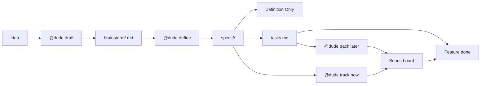

# Workflow Modes And Lifecycle

[Back to root README](../README.md) | [Docs index](README.md) | [Commands](commands.md)

## Simple Model

Dude always starts the same way: turn one idea into one defined package.

After `@dude define`, choose one of three paths:

| Path | Use it when | Live place |
|---|---|---|
| Definition Only | You only need the plan | `specs/<feature>/` |
| Lightweight Execution | You want to implement without an issue tracker | `specs/<feature>/tasks.md` |
| Tracked Execution | You want Beads issue tracking | Beads |



Key rules:

- `@dude draft` creates or refreshes the brainstorm.
- `@dude define` creates or refreshes the package.
- Beads is an optional tracker, not the final destination.
- Lightweight Execution can finish the feature without Beads.
- `tasks.md` is live only before Beads.
- Once `@dude track` runs, Beads is live and authoritative.
- While Beads is live, `tasks.md` may be kept as a one-way mirror for portability, but it is not used to choose ready work or decide completion.
- `@dude status` is always read-only.

## Who Owns What

| Part | Owns | Plain-English version |
|---|---|---|
| **@dude** | routing, handoff, memory, team management | the coordinator |
| **@dude-spec-lead** | brainstorm and definition package | what to build |
| **@dude-lead** | architecture and execution tradeoffs | how to build after Beads import |
| **Specialists** | implementation, verification, review | the actual work |
| **`.github/dudestuff/guardrails.md`** | durable project rules | rules Dude should keep respecting |

During `@dude define`, Dude may pause if it finds new project guardrails that
need your approval. Reply `accept`, `edit`, `reject`, or `skip` to continue.

When execution finds a broken assumption or missing definition, use
`@dude flag ...` to route the problem back to the right owner. `@dude status` is
read-only and can orient you in any lane; once tracked execution has started,
it also reports Beads state without mutating it.

### File lifecycle and rerun model

| Artifact                                         | Purpose                      | Human edits                                                               | Dude maintains                                                                                                     | How to keep it fresh                                            |
| ------------------------------------------------ | ---------------------------- | ------------------------------------------------------------------------- | ------------------------------------------------------------------------------------------------------------------ | --------------------------------------------------------------- |
| `brainstorm/<slug>.md`                           | Working feature ledger                     | `## User Draft`, `**Your answer:**` slots in `## Open Questions`, assumption overrides, and items in `## Deferred Clarifications`     | Content inside `<!-- dude:managed:start --> ... <!-- dude:managed:end -->` fences (`## Normalized Intent`, `## Constraints`, `## Definition Checklist`, `## Coordinator Log`), plus `status` and `spec_path` | Rerun `@dude draft` or `@dude define` after edits                                      |
| `specs/<feature>/spec.md`, `plan.md`             | Generated definition package               | Prefer editing the brainstorm instead of hand-editing these files             | the definition package contents                                                                                    | Rerun `@dude define <feature>` when scope or assumptions change                        |
| `specs/<feature>/tasks.md`                       | Canonical phased task units plus a derived board view; live in Lightweight Execution and mirrored from Beads in Tracked Execution | Do not self-check `[x]`; let Dude mutate task state after routed outcomes and verification. Avoid rewriting task meaning by hand or editing the generated board region directly. | task selection via the generated board view when live, durable-key-first reconciliation, optional `deps:` metadata, coordinator-owned state updates in Lightweight Execution, and one-way Beads-derived mirror writes in Tracked Execution | Rerun `@dude define <feature>` when scope changes; preserve durable task keys and surviving task state when tasks still mean the same work. Use `@dude sync Beads to tasks.md` to refresh the mirror from Beads. |
| Beads issues                                     | Live execution state after import          | through Dude's execution flow                                                 | issue state, dependencies, close decisions, and authoritative state while tracked execution is active                                                                     | Use `@dude track`, `@dude status`, `@dude sync Beads to tasks.md`, and Beads commands                                  |

`spec_path`, `status`, and `## Coordinator Log` (legacy name: `## Definition
Record`) are workflow metadata. Let Dude maintain them so define and track
stay consistent.

### Ownership and escalation

- During definition, `@dude-spec-lead` owns what to build.
- In Lightweight Execution, `specs/<feature>/tasks.md` is the live markdown
  execution board and implementation specialists work from it under Dude's
  coordination. Dude owns canonical task-state updates (`[~]`, `[!]`, `[x]`)
  after routed outcomes and verification.
- After `@dude track`, `@dude-lead` owns how to build it and implementation
  specialists own domain work inside their scope.
- After import, `spec.md`, `plan.md`, and `tasks.md` remain reference artifacts;
  Beads becomes the live execution board. `tasks.md` may receive one-way mirror
  updates from Beads, but Beads remains the authority.
- If execution uncovers a real definition problem, use `@dude flag ...` instead
  of patching spec artifacts silently. Typed blockage prefixes are preferred,
  but plain-language flagging is valid when the blocker is obvious.
- `@dude-reviewer` owns independent readiness judgment when that role is present.
- Only `@dude` closes Beads work, after implementation evidence and any required
  verification or review.

### Definition Only

Use this lane when you want a brainstorm and a reusable definition package, but
you do not want Beads execution tracking yet.

1. Copy the `.github/` bundle into the target repository.

```bash
cp -r .github/ my-project/.github/
cd my-project
```

```powershell
Copy-Item -Path .github -Destination my-project -Recurse
Set-Location my-project
```

2. Draft the feature.

```text
@dude draft authentication
```

This creates or refreshes `brainstorm/authentication.md`. If the brainstorm
already exists, `draft` re-normalizes it in place and preserves `## User Draft`.

If you want Dude to restate where you are before editing, run:

```text
@dude status
```

At this point, it should point you to `brainstorm/authentication.md` as the live
collaboration surface.

Inside `brainstorm/<slug>.md`:

- read `## User Draft` first, then edit it if the desired outcome changed
- answer each `## Open Questions` prompt by replacing its `**Your answer:** _Type your answer here._` placeholder
- update `## Assumptions` only when you want to override a default
- promote items from `## Deferred Clarifications` back into the active set when their priority rises
- leave anything inside `<!-- dude:managed:start --> ... <!-- dude:managed:end -->` fences (`## Normalized Intent`, `## Constraints`, `## Definition Checklist`, `## Coordinator Log`), as well as `status` and `spec_path`, to Dude. Hand-edits inside the fences will be reset on the next `draft` or `define`.

To answer clarifications, edit `brainstorm/<slug>.md` directly: replace the
`**Your answer:**` placeholder below each relevant question or adjust
`## Assumptions`, then rerun
`@dude draft <feature>` to re-normalize the file or `@dude define <feature>` to
continue.

3. Define the feature package.

```text
@dude define authentication
```

This creates or refreshes `specs/<feature>/`. If you edit the brainstorm and run
`define` again, Dude re-reads the draft and resumes the definition workflow
instead of starting over.

For Definition Only, read `spec.md` first, then `plan.md`. Move to `tasks.md`
only if you want execution context. If you are continuing in Lightweight
Execution, reverse that order: use `tasks.md` as the live markdown execution
board and read
`spec.md` and `plan.md` for context.

Two normal outcomes are possible:

- If guardrails are already ratified, or bundle defaults are acceptable for this
  feature, Dude completes the definition package and you can stop here,
  continue in Lightweight Execution, or continue to `@dude track`.
- If project-specific guardrails still need approval, Dude pauses at the normal
  checkpoint before `plan.md`. The pause reply will literally say "This is a
  normal checkpoint, not an error." Reply `accept`, `edit`, `reject`, or `skip`
  to continue.

If you respond in the same conversation, Dude can continue the paused definition
immediately. If you return later, rerun `@dude define <feature>` to resume.

If you are unsure whether the live artifact is still the brainstorm or the
generated package, run `@dude status` here. After a completed definition pass,
it should report Definition Only with `specs/<feature>/` as the live artifact
until you choose Lightweight Execution or `@dude track`.

4. Once definition is complete, stop here if you only want the reusable package
   under `specs/<feature>`, or continue to Lightweight Execution or Tracked
   Execution.

### Lightweight Execution

Use this lane when you want implementation to continue from the defined package,
but Beads is unavailable or you do not want it yet.

1. Complete the Definition Only lane first.
2. Treat `specs/<feature>/tasks.md` as the live markdown execution board.

In this lane:

- task headers may use `[ ]`, `[~]`, `[!]`, and `[x]`
- new or refreshed task headers should prefer durable IDs such as
  `T001@a1b2c3d4`
- optional indented `deps:` lines add explicit blockers by durable task key
- optional indented `blocked-by:` lines summarize blockers when tasks are `[!]`
- Dude owns task-state changes in the file after routed outcomes, and marks
  `[x]` only after implementation evidence and any required verification or
  review
- if you self-check `[x]` by hand without verification evidence on record, Dude
  will downgrade it back to `[~]` on the next pass and post a one-line note. To
  accept your manual completion, say so explicitly ("I verified this manually")
  so Dude can record the evidence in `## Coordinator Log` (legacy name:
  `## Definition Record`).
- `tasks.md` may include a Dude-generated board region inside the same file,
  fenced by `<!-- dude:board:start -->` / `<!-- dude:board:end -->`, with
  `## Ready Now`, `## In Progress`, `## Blocked`, and `## Done`. The fenced
  region is regenerated wholesale on every refresh; do not hand-edit inside it.
- `spec.md`, `plan.md`, and related artifacts stay as reference context
- supporting checklist files stay advisory reference instead of becoming a
  second execution board
- if you rerun `@dude define <feature>`, surviving `[x]`, `[~]`, or `[!]`
  state should be preserved by durable task key when the task still means the
  same work, or by task ID, story label, and core intent when the durable key
  is absent
- if a non-open task was split, merged, or materially re-scoped, Dude posts a
  reconciliation table (kept / changed / dropped / new) before writing the new
  file. If any dropped row previously held `[x]`, `[~]`, or `[!]` state, Dude
  pauses and asks you to confirm before discarding that history.
- one bounded task may still include closely related code, tests, and docs when
  one verification step proves the slice

3. Continue execution from the ready-now task or parallel-safe ready set, or
   resume any existing `[~]` task first.

Illustrative prompts:

```text
@dude status
@dude implement the next task for authentication without Beads
```

`@dude status` should now report Lightweight Execution with
`specs/<feature>/tasks.md` as the live artifact, plus counts for not started,
in progress, blocked, and done tasks, along with the ready-now task or ready
set.

4. Use `@dude flag ...` for real blockers or definition gaps.

In this lane, `@dude flag ...` still routes `spec-gap`, `plan-gap`,
`contract-mismatch`, `test-failure`, and `external-dependency` to the right
owner. It does not create a Beads issue. The blocked task stays unchecked until
the blocker is resolved or the plan changes. Typed prefixes are preferred for
predictability, but plain-language blocker reports are valid when the intended
type is clear.

5. If you later want Beads-backed tracking, switch to Tracked Execution.

Run `@dude track` only after Beads is ready. Checked `- [x]` tasks stay in
`tasks.md` as completion history; `[ ]`, `[~]`, and `[!]` work should move into
Beads with matching state and dependency data. After import, Dude should report
how many task units moved into Beads by state and how many completed tasks were
skipped as Lightweight Execution history.

### Tracked Execution

Use this lane when you want Dude to import defined features into Beads and track
implementation there.

This lane is optional. Definition Only and Lightweight Execution work without
Beads or Dolt.

1. Complete the Definition Only lane first. You can come here directly after
   definition or after some Lightweight Execution if you later decide you want
   Beads.
2. Initialize Beads in the target repository.

If you are on macOS/Linux, or plain `bd init` already works in your Windows
environment, use:

```bash
bd init
```

If you are on Windows and want the shortest reliable path, start with server
mode instead of retrying plain `bd init` after embedded-Dolt or CGO failures:

```powershell
dolt sql-server -H 127.0.0.1 -P 3308 --data-dir "$HOME\.beads\shared-server\dolt"
bd init --server --server-host 127.0.0.1 --server-port 3308 --non-interactive
```

Keep the Dolt server running while you initialize and use the Beads-backed repo.

Quick Windows troubleshooting:

- If `bd init` fails with an embedded-Dolt or CGO error, use the server-mode
  commands above instead of retrying plain `bd init`.
- If `bd init --server ...` says the server is unreachable, confirm the Dolt
  process is still running and verify the port with
  `Test-NetConnection 127.0.0.1 -Port 3308`.
- If `bd init --shared-server` says `dolt` is not installed or not on `PATH`,
  either add `dolt.exe` to `PATH` or keep using the explicit
  `dolt sql-server ...` process.

3. Start or continue tracked execution.

```text
@dude track
@dude status
```

`@dude track` means resume or import tracked execution work, not compile the
app. It resumes in-progress work first, imports defined features that are not
yet in Beads, and routes the next ready task. Follow with `@dude status` when
you want an explicit confirmation that Beads is now the live board and to see
what is ready next without mutating anything.

### After `@dude track`: what changes?

- Beads is now the live board and source of truth for execution state.
- If you were using Lightweight Execution first, checked tasks remain in
  `tasks.md` as history and only remaining open work should have moved into
  Beads.
- After Dude closes Beads work, Dude mirrors the result back to the matching
  canonical task unit in `tasks.md` when the task key maps cleanly, preferring
  durable keys and falling back only to unambiguous legacy task IDs. It then
  regenerates any derived board region, records the sync in `## Coordinator Log`,
  and runs the Dude linter.
- `tasks.md` is a portability mirror in this lane. It is not used to choose ready
  work, override Beads, or decide completion while tracked execution is active.
- The import should report imported open-task count and skipped completed-task
  count so the migration is explicit.
- If checked Lightweight history no longer maps one-to-one to the current task
  keys after a re-define, Dude should pause import, report which checked IDs
  still survive versus which are changed or ambiguous, and ask you to confirm
  which completions still count before creating more Beads work. If a durable
  key is absent, Dude should fall back to task ID, story label, and core
  intent.
- `spec.md`, `plan.md`, `tasks.md`, and related artifacts stay as reference
  context.
- If the intended feature meaning changes, update the brainstorm and rerun
  `@dude define <feature>` before another import or reconciliation step.
- If execution reveals a missing requirement or mismatch, use `@dude flag ...`
  so the issue routes back to the right owner.

### Beads-To-Markdown Sync

Dude mirrors Beads state back to `tasks.md` after coordinator-owned Beads closes.
If Beads was changed manually, or you want to switch machines before continuing
without Beads, run:

```text
@dude sync Beads to tasks.md
```

That command is mutating. It reads Beads issues grouped by their `spec:` prefix,
maps unambiguous task keys back to canonical task units, updates glyphs, refreshes
the derived board region, records Coordinator Log entries, and reports anything
that could not be mapped safely. Durable keys are preferred; legacy task IDs are
accepted only when the story label and core task intent make the match clear.
`@dude status` never performs this sync.

If Beads is unavailable and you already have a recent mirror, you can choose to
resume Lightweight Execution from that snapshot. Dude should tell you that the
snapshot is only as current as the last successful mirror or sync.

### Before you run `@dude track`

- The current answers live in `brainstorm/<slug>.md`, not only in chat.
- `brainstorm/<slug>.md` shows `status: defined` and a populated `spec_path:`.
- If the brainstorm changed, rerun `@dude define <feature>` first so the
  generated package is fresh.
- If you are switching from Lightweight Execution, `tasks.md` accurately marks
  task state with `[ ]`, `[~]`, `[!]`, and `[x]`, and any durable task keys
  still reflect the surviving task meanings.
- If you are switching back from Beads to Lightweight Execution, run
  `@dude sync Beads to tasks.md` first while Beads is still available.
- If `spec_path` or task meaning changed materially during re-define,
  reconcile that before import instead of carrying stale completion history.
- If Dude cannot reconcile checked history one-to-one after a re-define, expect
  `@dude track` to pause and ask which completions survive.
- On Windows, you already know whether you are taking the plain `bd init` path
  or the Dolt server-mode path.
- You are ready for Beads to become the live execution board after import.

### Quick answers for common stalls

- `@dude draft` looked like a no-op: check `brainstorm/`; if the file already
  existed, Dude re-normalized it in place.
- `@dude define` paused before `plan.md`: see [Setup and first feature](setup.md);
  that checkpoint is normal, not a failure.
- `spec.md` changed but `plan.md` or `tasks.md` did not: rerun
  `@dude define <feature>` to refresh the generated package.
- You do not have Beads yet: stay in Lightweight Execution and use `tasks.md` as
  the live markdown execution board until you are ready for `@dude track`.
- `@dude track` did not compile anything: that is expected; see [Commands and prompt shapes](commands.md).
- `@dude track` imported work but `tasks.md` is still present: that is expected;
  see `After @dude track: what changes?` above.
- You used Beads on one machine but need to continue without it elsewhere: run
  `@dude sync Beads to tasks.md` before leaving the Beads-capable machine, then
  continue in Lightweight Execution from the mirrored snapshot.
- `bd init` failed on Windows: use the manual Dolt server-mode path in
  `Tracked Execution` instead of retrying plain `bd init`.

## Advanced: Manual Import

Manual import requires an existing defined brainstorm file. If you want to
bypass the normal automatic handoff in `@dude track`, you can import a spec
package directly:

```text
@dude import tasks from specs/<feature>/ into Beads
```

The coordinator resolves the brainstorm file whose `spec_path` matches the
selected feature. If no defined brainstorm exists, you'll be asked to run
`@dude draft <feature>` and `@dude define <feature>` first.

If you are switching from Lightweight Execution to Beads later, import the
remaining `[ ]`, `[~]`, and `[!]` task units. Checked `[x]` tasks stay in
`tasks.md` as completion history, and any generated board region stays derived
and non-canonical.