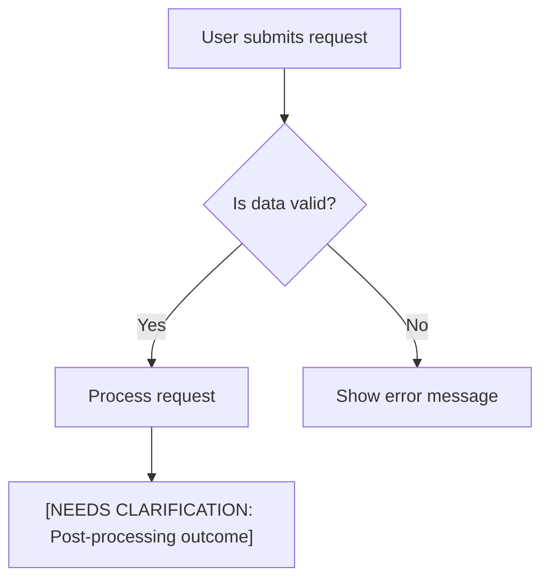
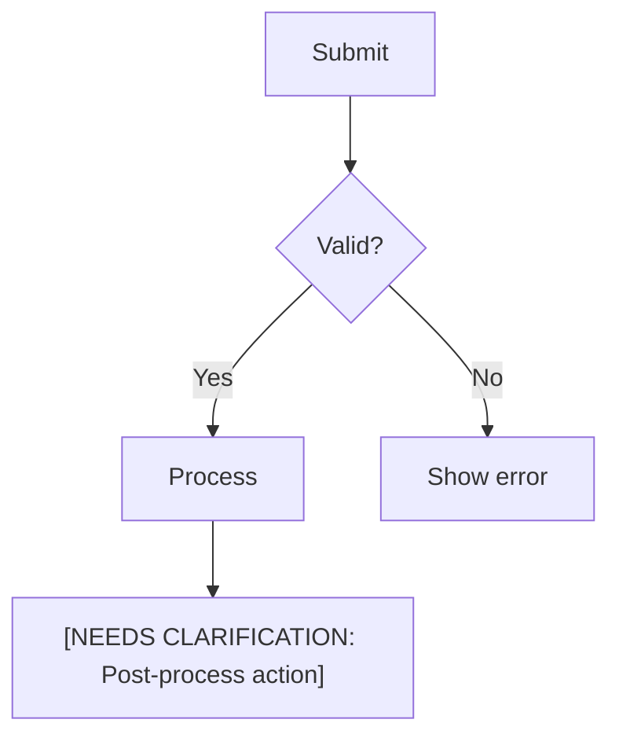

# Mermaid Diagrams — Complete Reference

## Purpose

Decide when a described flow earns a Mermaid diagram, pick the diagram type that
serves it, and keep the rendered diagram valid and traceable.
`dude-pack-technical-docs-reviewer` applies this skill when it inserts diagrams
into a draft, so the rules read against the evidence ledger: a diagram depicts a
flow the source material already supports, and every node and edge traces back to
a ledger entry or an explicit placeholder. The integrity and parse-stability
rules below prevent the broken-diagram failures that Mermaid reports at render
time.

**Failure to comply invalidates the output.** You MUST diagram every described qualifying non-linear flow and, when the source material supports it, produce MULTIPLE diagrams (>=2) in the final document. Purely linear diagrams are prohibited: if a flow is only A to B to C with no branch, decision, alternate path, loop, merge, exception, or parallel routing, present it as prose, a numbered procedure, or a table instead. When rules appear to conflict, always prioritize (1) valid Mermaid syntax, (2) traceability or explicit placeholders for every node/edge, (3) meaningful non-linear structure, (4) clarity of the flow, and only then (5) brevity or stylistic preferences.

## Diagram Generation Requirements

1. **You MUST Generate Diagrams for Non-Linear Flows**: A document is incomplete when it omits a Mermaid diagram for a qualifying non-linear flow. If the source contains only linear procedures or straight-through exchanges, do not force a diagram.
2. **When to Create a Diagram**: You MUST create a diagram for any process, workflow, or interaction that involves:
   - A decision with branches (e.g., "if/then", "approved/rejected").
  - An alternate or exception path (e.g., fallback, retry, escalation, skipped processing).
  - Parallel actions or routing that splits and later rejoins.
  - A state lifecycle with a branch, loop, retry, or more than one terminal outcome.
  - A multi-actor interaction with conditional outcomes, escalation, retry, parallel handoffs, or exception handling.
3. **Default to Diagrams (for genuine non-linear processes)**: If you are unsure whether a *non-linear process or flow* qualifies, prefer creating a diagram. This bias does NOT apply to simple ordered steps, static lists, taxonomies, or field sets; see **What Does NOT Qualify**. Use a `graph TD` (top-down) layout by default.
4. **Use Skeletons for Gaps**: If non-linear logic is clearly present but details for a diagram are incomplete, you MUST still create a "skeleton" diagram. Use placeholders like `[NEEDS CLARIFICATION: ...]` for any unknown branches, outcomes, or logic. Do not create a skeleton for a flow that is merely linear.

## Required Conditions (Generate a Diagram When Any Apply)

- Decision with branches (e.g., approval vs rejection).
- Alternate, exception, retry, escalation, or fallback paths.
- Parallel work streams or routing that splits and rejoins.
- State changes with branching, loops, or multiple terminal outcomes.
- Interaction between a user and a system, or between two systems, only when the interaction includes conditional outcomes, escalation, retry, parallel handoffs, or exception handling.

## No Linear Diagrams

Do NOT emit a Mermaid diagram whose structure is only a straight line. A diagram is linear when each node has at most one incoming edge and at most one outgoing edge, with no decision node, branch label that changes the path, loop, merge, parallel split, alternate outcome, or exception path. Linear diagrams add visual weight without adding understanding.

Forbidden examples include:

- A flowchart that only shows `Start --> Step 1 --> Step 2 --> End`.
- A `sequenceDiagram` that only shows request, validation, response, and confirmation in order.
- A `stateDiagram-v2` that only shows `Draft --> Pending --> Approved --> Complete`.
- A user-system exchange where every message has exactly one next message and no alternate result.

Use a numbered list, procedure, table, or short paragraph for linear material. If the only available source detail is linear, omit the diagram rather than padding the document.

## What Does NOT Qualify (Do Not Diagram These)

A diagram must depict a **flow** — movement through steps, branches, states, or actors. Static structure is not a flow. Do NOT create a diagram that merely re-expresses content that is already best shown as a table or list:

- **Simple linear procedures** (e.g., "open the form, enter details, submit, receive confirmation"). Use numbered steps.
- **Pure sequence-only interactions** with no alternate, exception, retry, escalation, loop, or parallel path. Use prose or a compact procedure.
- **Straight state chains** with no branch, retry, loop, or multiple terminal outcomes. Use prose or a table of states.
- **Taxonomies and category lists** (e.g. "the four expense categories are A, B, C, D"). Use a table or list.
- **Field or attribute lists** (e.g. the fields of a form, an email, or a record). If a table already lists them, do not mirror that table as a node tree.
- **Role rosters** (who does what) — unless you are showing an *interaction* between the roles, not just listing their duties.
- **Pure definitions or glossaries.**

When the same content would appear as both a table and a diagram, that is duplication: keep the clearer form (usually the table) and drop the diagram. Needing contrived edges, or a loop back to the root node, to make nodes connect is a sign the content is not a real flow — do not force it. A useful test: if a reader cannot trace a path through it, it is not a diagram. This rule overrides the "default to a diagram" bias, which applies only to genuine processes whose flow is ambiguous.

## Diagram Type Selection

Choose the diagram type that best serves clarity and comprehension:

- **Flowchart (`graph TD` / `graph LR`)**: For decision trees, approval workflows, or branching logic.
- **Sequence Diagram (`sequenceDiagram`)**: Only for user-system interactions or multi-actor exchanges that include meaningful non-linear behavior, such as `alt`, `opt`, `par`, `loop`, escalation, retry, or exception handling. Do not use `sequenceDiagram` for straight request/response chains.
- **State Diagram (`stateDiagram-v2`)**: For entities that transition through defined states only when the lifecycle includes branches, retries, loops, or multiple terminal outcomes.
- **Entity Relationship Diagram (`erDiagram`)**: Only if the source material explicitly discusses data entities and their relationships.

When in doubt, default to a **flowchart** for process clarity.

### Examples across source kinds

Repository documentation commonly yields genuine non-linear flows worth
diagramming: a request path with validation and error branches and retries
(flowchart), an entity state lifecycle with more than one terminal outcome (state
diagram), or a multi-service interaction with escalation or exception handling
(sequence diagram). The bar does not change with the source kind. Only diagram a
genuinely non-linear flow; a straight request/response exchange or a simple
linear procedure stays prose, numbered steps, or a table.

## Default & Fallback Rules

- **Default Layout**: Use `graph TD` unless a different type improves clarity.
- **Skeletons for Gaps**: Incomplete non-linear logic is still rendered; unknown nodes/edges replaced with `[NEEDS CLARIFICATION: ...]`.
- **Uncertainty Bias**: If unsure whether a non-linear flow qualifies, render a diagram, but ensure every node and edge is either directly supported by a ledger entry or represented as a `[NEEDS CLARIFICATION: ...]` placeholder. If unsure whether the flow is non-linear at all, do not render it.
- **Placement**: Put each diagram in the most relevant part of the document, near the narrative that describes the corresponding flow. Do not cluster all diagrams at the end without context; each diagram should appear close to the text that explains it.

## Minimum Diagram Count

- When the source material clearly describes two or more distinct qualifying non-linear flows, interactions, lifecycles, or decision sequences, the final output MUST contain at least **two** Mermaid diagrams.
- If only one qualifying non-linear flow is discernible, render a detailed diagram for that flow. If you can clearly identify a subordinate non-linear sub-flow within the same described process (e.g., validation exception handling vs fulfillment exception handling), you MAY render a second diagram for that sub-flow.
- If the source contains no qualifying non-linear flow, do not add a Mermaid diagram and do not add a placeholder note solely to satisfy a diagram count.
- **Mandatory Per-Flow Rendering**: For every described non-linear process, decision, interaction, or state transition you MUST generate a diagram, even if incomplete. Use placeholders for missing branch logic instead of omitting the diagram.
- **No Skipping on Non-Linear Ambiguity**: Ambiguous or partially described non-linear flows STILL get skeleton diagrams with placeholders. Ambiguous linear-only material does not get a diagram.

## Diagram Titles and Separation

When the output contains more than one Mermaid diagram:

- **Per-Diagram Title or Caption**: Precede each diagram with a clear markdown heading or caption that identifies the flow, for example:
  - `#### Diagram 1 – Order Submission and Validation`
  - `#### Diagram 2 – Order Fulfillment Exception Handling`
- **Visual Separation**: Ensure that each diagram block is visually separated from others by at least one blank line **and** its own ` ```mermaid ` code fence. Diagrams MUST NOT share a single Mermaid code block.
- **One Flow per Block**: Each diagram code block MUST represent exactly one flow or lifecycle. Do not concatenate multiple unrelated flows inside the same ` ```mermaid ` section.
- **Traceable Names**: Titles/captions should reference the corresponding process or flow name used in the document so readers can easily map each diagram to its narrative description.

## Traceability Rule

Every node, edge, condition, or message must trace to a ledger entry in `dude-pack-technical-docs-evidence-ledger` or be an explicit `[NEEDS CLARIFICATION: ...]` placeholder. No speculative states, actors, or transitions. Because each ledger entry already carries its own `source-ref` back to the source it came from, a traceable diagram maps end to end: node -> ledger id -> source.

## Example Skeleton



## Diagram Integrity Rules (Prevent Broken Diagrams)

- **No Empty Nodes**: Never emit a node with an empty label (e.g., `J[""]`). If the branch outcome is unknown, use a placeholder: `[NEEDS CLARIFICATION: missing step after <condition>]`. Unknown text MUST be expressed as a placeholder, never left blank.
- **Decision Shape, Syntax & Branch Completeness**: Use brace syntax for decision nodes (e.g., `C{"Does user have access?"}` or `C{"Access granted?"}`) and ensure all logically stated branches (e.g., Yes/No, Approved/Rejected) lead to a meaningful action node or a placeholder node — no dangling arrows.
- **Converging Paths**: When multiple branches reconverge (e.g., both Yes/No leading to a review step), merge them into a single clearly labeled convergence node (e.g., `F[Review complete]`) and avoid duplicate unlabeled or parallel edges that can confuse rendering.
- **Unique, Stable Node IDs**: Each node ID (A, B, C, A1, B2, ...) uniquely identifies a logical step within the diagram. Reuse the same ID only when intentionally referring to the same step; do **not** create visually identical nodes with different IDs.
- **Consistent Labeling**: Prefer `Node[Action description]` with no extra outer quotes. Only include quotes inside labels when quoting a short verbatim phrase. Avoid mixing styles that add extra `"` wrapping around every label.
- **Placeholder Discipline**: Any missing detail inside a node or edge must appear explicitly as a `[NEEDS CLARIFICATION: ...]` fragment — never leave labels empty or partially specified.
- **No Placeholder Merge Nodes with Empty Labels**: Do not use visually empty placeholder nodes as merge points (e.g., `L[""]` or `L[]`). If a branch needs a merge node, give it a meaningful or placeholder label.
- **Label Safety (No HTML/Raw Quotes)**: Do not embed HTML tags (e.g., `<br/>`, `<i>`) inside labels; use `\n` for line breaks or create additional nodes instead. Avoid unescaped double quotes inside labels; prefer parentheses or single quotes, or escape the quotes.
- **Placeholder Brackets**: When a label itself is a placeholder, keep the brackets as the whole label (e.g., `[NEEDS CLARIFICATION: rejection handling]`). Do not nest additional square brackets inside a label body.
- **One Edge per Line**: Write each edge on its own line. Do not chain multiple `-->` expressions on a single line (e.g., `A --> B --> C`); instead, write `A --> B` on one line and `B --> C` on the next.
- **Fallback for Missing or Unclear Branch Outcomes**: If a branch condition is mentioned but its consequence is absent or unclear, create a skeleton node such as `[NEEDS CLARIFICATION: outcome of <branch>]` rather than duplicating another path or leaving it blank.
- **Avoid Redundant Parallel Edges**: Do not emit the same edge twice (e.g., `H --> K` plus another identical `H --> K`). Emit one edge and, if necessary, clarify convergence via a shared labeled node.
- **Preview / Confirmation Explicitness**: Preview or confirmation steps must be explicit labeled nodes (e.g., `I[Preview changes]`, `J[User confirms submission]`), not implied by unlabeled references.
- **Optional End Node**: For multi-branch or iterative flows, add an `End` node (e.g., `Z[End]`) to make termination explicit when it improves clarity.
- **Internal Audit (Do NOT Emit)**: Before output, validate internally that (a) there are zero empty labels, (b) every decision has all required branches, (c) each node or edge traces to a ledger entry or an explicit placeholder, and (d) there are no orphan nodes unreachable from the start.

## Mermaid Parse Stability Addendum (Failure Prevention)

Prevents common Mermaid parse errors (e.g., `Expecting 'SEMI'`) and subtle integrity defects. Apply these rules together with the Diagram Integrity Rules above:

- **Label at First Use**: Assign the final label when a node ID first appears (e.g., `G2 --> I2["Preview"]`). Do not reference unlabeled nodes and relabel them later.
- **Standalone Comment Lines**: Put `%%` comments on their own line; never place comments at the end of an edge line that ends with `;` or a newline.
- **Clean Edge Termination**: Each edge line ends with a newline or `;` only — no extra tokens (comments or stray text) afterward.
- **Loopbacks Without Inline Commentary**: Express iteration edges plainly (e.g., `G --> B`). If explanation is needed, put it in a separate `%%` comment line above.
- **Converge Skipped Paths**: Branches that skip processing (e.g., on validation failure) reconnect at the next decision or an `End` node; avoid orphan paths.
- **Explicit Preview / Confirmation Nodes**: Always label preview/confirmation steps as explicit nodes — no deferred or implied labeling.
- **Optional End Node**: Use an explicit `End` node for iterative or multi-branch flows when it makes the termination clearer.
- **Immediate Placeholders**: Unknown outcomes get a labeled placeholder node at first mention using the `[NEEDS CLARIFICATION: ...]` pattern.
- **No Trailing Inline Comments**: Do not append inline comments after edge statements; convert them into standalone `%%` comment lines.
- **Prefer Explicitness Over Brevity**: When uncertain, choose clearer, more explicit labeling and structure over shorter but ambiguous expressions.

## Minimal Integrity Example



## Internal Compliance Checklist (Do NOT emit)

Before emitting the final document, silently check:

- **Diagram Coverage**: Every distinct qualifying non-linear flow has a Mermaid diagram, with a goal of at least two diagrams overall when the source material supports multiple non-linear flows. No Mermaid diagram is required when the source contains only linear material.
- **Non-Linear Value**: No Mermaid diagram is a pure straight-line sequence; every diagram contains a decision, branch, loop, merge, exception path, parallel split, or other meaningful non-linear structure.
- **Placeholder Usage**: All missing or uncertain details are clearly marked using `[NEEDS CLARIFICATION: ...]` placeholders.
- **Branching Logic**: No undocumented branching logic; all decisions and their branches are explicitly represented and lead to nodes.

If any doubt remains, choose the safer and more explicit representation that reduces the chance of Mermaid syntax errors and preserves traceability to the source.
